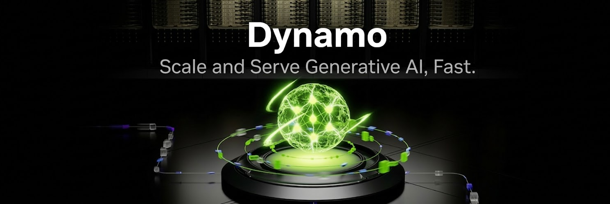

<!--
SPDX-FileCopyrightText: Copyright (c) 2024-2026 NVIDIA CORPORATION & AFFILIATES. All rights reserved.
SPDX-License-Identifier: Apache-2.0

Licensed under the Apache License, Version 2.0 (the "License");
you may not use this file except in compliance with the License.
You may obtain a copy of the License at

http://www.apache.org/licenses/LICENSE-2.0

Unless required by applicable law or agreed to in writing, software
distributed under the License is distributed on an "AS IS" BASIS,
WITHOUT WARRANTIES OR CONDITIONS OF ANY KIND, either express or implied.
See the License for the specific language governing permissions and
limitations under the License.
-->



[](https://opensource.org/licenses/Apache-2.0)
[](https://github.com/ai-dynamo/dynamo/releases/latest)
[](https://pypi.org/project/ai-dynamo/)
[](https://deepwiki.com/ai-dynamo/dynamo)
[](https://discord.gg/D92uqZRjCZ)


| **[Docs](https://docs.nvidia.com/dynamo/)** | **[Roadmap](https://github.com/ai-dynamo/dynamo/issues/5506)** | **[Recipes](https://github.com/ai-dynamo/dynamo/tree/main/recipes)** | **[Examples](https://github.com/ai-dynamo/dynamo/tree/main/examples)** | **[Prebuilt Containers](https://catalog.ngc.nvidia.com/orgs/nvidia/teams/ai-dynamo/collections/ai-dynamo)** | **[Blog](https://developer.nvidia.com/blog/nvidia-dynamo-1-production-ready/)** | **[Design Proposals](https://github.com/ai-dynamo/enhancements)** | **[How to Contribute](#community-and-contributing)** |

# Dynamo

**The open-source, datacenter-scale inference stack.** Dynamo is the orchestration layer above inference engines — it doesn't replace SGLang, TensorRT-LLM, or vLLM, it turns them into a coordinated multi-node inference system. Disaggregated serving, intelligent routing, multi-tier KV caching, and automatic scaling work together to maximize throughput and minimize latency for LLM, reasoning, multimodal, and video generation workloads.

Built in Rust for performance, Python for extensibility.

## When to use Dynamo

- You're serving LLMs across **multiple GPUs or nodes** and need to coordinate them
- You want **KV-aware routing** to avoid redundant prefill computation
- You need to **independently scale prefill and decode** (disaggregated serving)
- You want **automatic scaling** that meets latency SLAs at minimum total cost of ownership (TCO)
- You need **fast cold-starts** when spinning up new replicas

If you're running a single model on a single GPU, your inference engine alone is probably sufficient.

**Feature support at a glance:**

| | [SGLang](https://docs.nvidia.com/dynamo/backends/sg-lang) | [TensorRT-LLM](https://docs.nvidia.com/dynamo/backends/tensor-rt-llm) | [vLLM](https://docs.nvidia.com/dynamo/backends/v-llm) |
|---|:----:|:----------:|:--:|
| [**Disaggregated Serving**](https://docs.nvidia.com/dynamo/design-docs/disaggregated-serving) | ✅ | ✅ | ✅ |
| [**KV-Aware Routing**](https://docs.nvidia.com/dynamo/components/router) | ✅ | ✅ | ✅ |
| [**SLA-Based Planner**](https://docs.nvidia.com/dynamo/components/planner/planner-guide) | ✅ | ✅ | ✅ |
| [**KVBM**](https://docs.nvidia.com/dynamo/components/kvbm) | 🚧 | ✅ | ✅ |
| [**Multimodal**](https://docs.nvidia.com/dynamo/user-guides/multimodal) | ✅ | ✅ | ✅ |
| [**Tool Calling**](https://docs.nvidia.com/dynamo/user-guides/tool-calling) | ✅ | ✅ | ✅ |

> **[Full Feature Matrix →](https://docs.nvidia.com/dynamo/resources/feature-matrix)** — LoRA, request migration, speculative decoding, and feature interactions.

## Key Results

| Result | Context |
|--------|---------|
| **7x** higher throughput per GPU | DeepSeek R1 on GB200 NVL72 w/ Dynamo vs B200 without ([InferenceX](https://inferencex.semianalysis.com/)) |
| **7x** faster model startup | ModelExpress weight streaming (DeepSeek-V3 on H200) |
| **2x** faster time to first token | KV-aware routing, Qwen3-Coder 480B ([Baseten benchmark](https://www.baseten.co/blog/how-baseten-achieved-2x-faster-inference-with-nvidia-dynamo/)) |
| **80%** fewer SLA breaches | Planner autoscaling at 5% lower TCO ([Alibaba APSARA 2025 @ 2:50:00](https://yunqi.aliyun.com/2025/session?agendaId=6062)) |
| **750x** higher throughput | DeepSeek-R1 on GB300 NVL72 ([InferenceXv2](https://inferencex.semianalysis.com/)) |


## What Dynamo Does

Most inference engines optimize a single GPU or a single node. Dynamo is the **orchestration layer above them** — it turns a cluster of GPUs into a coordinated inference system.

<p align="center">
  
</p>

**[Architecture Deep Dive →](https://docs.nvidia.com/dynamo/design-docs/overall-architecture)**

### Core Capabilities

| Capability | What it does | Why it matters |
|------------|-------------|----------------|
| [**Disaggregated Prefill/Decode**](https://docs.nvidia.com/dynamo/design-docs/disaggregated-serving) | Separates prefill and decode into independently scalable GPU pools | Maximizes GPU utilization; each phase runs on hardware tuned for its workload |
| [**KV-Aware Routing**](https://docs.nvidia.com/dynamo/components/router) | Routes requests based on worker load and KV cache overlap | Eliminates redundant prefill computation — 2x faster TTFT |
| [**KV Block Manager (KVBM)**](https://docs.nvidia.com/dynamo/components/kvbm) | Offloads KV cache across GPU → CPU → SSD → remote storage | Extends effective context length beyond GPU memory |
| [**ModelExpress**](https://github.com/ai-dynamo/modelexpress) | Streams model weights GPU-to-GPU via NIXL/NVLink | 7x faster cold-start for new replicas |
| [**Planner**](https://docs.nvidia.com/dynamo/components/planner/planner-guide) | SLA-driven autoscaler that profiles workloads and right-sizes pools | Meets latency targets at minimum total cost of ownership (TCO) |
| [**Grove**](https://github.com/ai-dynamo/grove) | K8s operator for topology-aware gang scheduling (NVL72) | Places workloads optimally across racks, hosts, and NUMA nodes |
| [**AIConfigurator**](https://github.com/ai-dynamo/aiconfigurator) | Simulates 10K+ deployment configs in seconds | Finds optimal serving config without burning GPU-hours |
| [**Fault Tolerance**](https://docs.nvidia.com/dynamo/user-guides/fault-tolerance/request-migration) | Canary health checks + in-flight request migration | Workers fail; user requests don't |

### New in 1.0

- **Zero-config deploy ([DGDR](https://docs.nvidia.com/dynamo/kubernetes-deployment/deployment-guide/deploying-your-first-model))** *(beta):* Specify model, HW, and SLA in one YAML — AIConfigurator auto-profiles the workload, Planner optimizes the topology, and Dynamo deploys
- **Agentic inference:** Per-request hints for latency priority, expected output length, and cache pinning TTL. [LangChain](https://docs.langchain.com/oss/python/integrations/chat/nvidia_ai_endpoints#use-with-nvidia-dynamo) + [NeMo Agent Toolkit](https://github.com/NVIDIA/NeMo-Agent-Toolkit) integrations
- **Multimodal E/P/D:** Disaggregated encode/prefill/decode with embedding cache — 30% faster TTFT on image workloads
- **Video generation:** Native [FastVideo](https://github.com/hao-ai-lab/FastVideo) + [SGLang Diffusion](https://lmsys.org/blog/2026-02-16-sglang-diffusion-advanced-optimizations/) support — real-time 1080p on single B200
- **K8s Inference Gateway plugin:** KV-aware routing inside the standard Kubernetes gateway
- **Storage-tier KV offload:** S3/Azure blob support + global KV events for cluster-wide cache visibility

## Quick Start

### Option A: Container (fastest)

```bash
# Pull a prebuilt container (SGLang example)
docker run --gpus all --network host --rm -it nvcr.io/nvidia/ai-dynamo/sglang-runtime:1.0.1

# Inside the container — start frontend and worker
python3 -m dynamo.frontend --http-port 8000 --discovery-backend file > /dev/null 2>&1 &
python3 -m dynamo.sglang --model-path Qwen/Qwen3-0.6B --discovery-backend file &

# Send a request
curl -s localhost:8000/v1/chat/completions -H "Content-Type: application/json" -d '{
  "model": "Qwen/Qwen3-0.6B",
  "messages": [{"role": "user", "content": "Hello!"}],
  "max_tokens": 100
}' | jq
```

Also available: [`tensorrtllm-runtime:1.0.1`](https://docs.nvidia.com/dynamo/resources/release-artifacts) and [`vllm-runtime:1.0.1`](https://docs.nvidia.com/dynamo/resources/release-artifacts).

### Option B: Install from PyPI

Install [uv](https://github.com/astral-sh/uv) (`curl -LsSf https://astral.sh/uv/install.sh | sh`), then:

```bash
uv pip install --prerelease=allow "ai-dynamo[sglang]"   # or [vllm]
```

> **Note:** TensorRT-LLM requires `pip` with `--extra-index-url https://pypi.nvidia.com`. See the [install guide](docs/getting-started/local-installation.md) for TRT-LLM-specific instructions.

Then start the frontend and a worker as shown above. See the [full installation guide](docs/getting-started/local-installation.md) for system dependencies and backend-specific notes.

### Option C: Kubernetes (recommended)

For production multi-node clusters, install the [Dynamo Platform](https://docs.nvidia.com/dynamo/kubernetes-deployment/deployment-guide) and deploy with a single manifest:

```yaml
# Zero-config deploy: specify model + SLA, Dynamo handles the rest
apiVersion: nvidia.com/v1beta1
kind: DynamoGraphDeploymentRequest
metadata:
  name: my-model
spec:
  model: Qwen/Qwen3-0.6B
  backend: vllm
  sla:
    ttft: 200.0   # ms
    itl: 20.0     # ms
  autoApply: true
```

Pre-built recipes for common models:

| Model | Framework | Mode | Recipe |
|-------|-----------|------|--------|
| Llama-3-70B | vLLM | Aggregated | [View](recipes/llama-3-70b/vllm/) |
| DeepSeek-R1 | SGLang | Disaggregated | [View](recipes/deepseek-r1/sglang/) |
| Qwen3-32B-FP8 | TensorRT-LLM | Aggregated | [View](recipes/qwen3-32b-fp8/trtllm/) |

See [recipes/](recipes/README.md) for the full list. Cloud-specific guides: [AWS EKS](examples/deployments/EKS/) · [Google GKE](examples/deployments/GKE/)

## Building from Source

For contributors who want to build and develop locally. See the [full build guide](docs/getting-started/building-from-source.md) for details.

```bash
# Install system deps (Ubuntu 24.04)
sudo apt install -y build-essential libhwloc-dev libudev-dev pkg-config libclang-dev protobuf-compiler python3-dev cmake

# Install Rust
curl --proto '=https' --tlsv1.2 -sSf https://sh.rustup.rs | sh && source $HOME/.cargo/env

# Create venv and build
uv venv dynamo && source dynamo/bin/activate
uv pip install pip maturin
cd lib/bindings/python && maturin develop --uv && cd $PROJECT_ROOT
uv pip install -e lib/gpu_memory_service
uv pip install -e .
```

> VSCode/Cursor users: see the [`.devcontainer`](.devcontainer/README.md) for a pre-configured dev environment.

## Community and Contributing

Dynamo is built in the open with an OSS-first development model. We welcome contributions of all kinds.

- **[Contribution Guide](https://docs.nvidia.com/dynamo/getting-started/contribution-guide)** — How to contribute code, docs, and recipes
- **[Design Proposals](https://github.com/ai-dynamo/enhancements)** — RFCs for major features
- **[Office Hours](https://www.youtube.com/playlist?list=PL5B692fm6--tgryKu94h2Zb7jTFM3Go4X)** — Biweekly calls
- **[Community Meetings](https://docs.google.com/document/d/1uR8xD_hlYGwV6QspvSc36k1H-wo1BUcVmFbHH9xlXd8/view)** – Weekly (Fri 2:30 PM PT) development community meetings
- **[Discord](https://discord.gg/D92uqZRjCZ)** — Chat with the team and community
- **[Dynamo Day Recordings](https://nvevents.nvidia.com/dynamoday)** — Deep dives from production users

## Latest News

- [03/15] [Dynamo 1.0 is here — production-ready with strong community adoption](https://developer.nvidia.com/blog/introducing-nvidia-dynamo-a-low-latency-distributed-inference-framework-for-scaling-reasoning-ai-models/)
- [03/15] [NVIDIA Blackwell Ultra sets new inference records in MLPerf](https://developer.nvidia.com/blog/nvidia-blackwell-ultra-sets-new-inference-records-in-mlperf-debut/)
- [03/15] [NVIDIA Blackwell leads on SemiAnalysis InferenceMax benchmarks](https://developer.nvidia.com/blog/nvidia-blackwell-leads-on-new-semianalysis-inferencemax-benchmarks/)
- [12/05] [Moonshot AI's Kimi K2 achieves 10x inference speedup with Dynamo on GB200](https://quantumzeitgeist.com/kimi-k2-nvidia-ai-ai-breakthrough/)
- [12/02] [Mistral AI runs Mistral Large 3 with 10x faster inference using Dynamo](https://www.marktechpost.com/2025/12/02/nvidia-and-mistral-ai-bring-10x-faster-inference-for-the-mistral-3-family-on-gb200-nvl72-gpu-systems/)
- [11/20] [Dell integrates PowerScale with NIXL for 19x faster TTFT](https://www.dell.com/en-us/dt/corporate/newsroom/announcements/detailpage.press-releases~usa~2025~11~dell-technologies-and-nvidia-advance-enterprise-ai-innovation.htm)

<details>
<summary>Older news</summary>

Dynamo provides comprehensive benchmarking tools:

- **[Benchmarking Guide](docs/benchmarks/benchmarking.md)** – Compare deployment topologies using AIPerf
- **[SLA-Driven Deployments](docs/components/planner/planner-guide.md)** – Optimize deployments to meet SLA requirements

## Frontend OpenAPI Specification

The OpenAI-compatible frontend exposes an OpenAPI 3 spec at `/openapi.json`. To generate without running the server:

```bash
cargo run -p dynamo-llm --bin generate-frontend-openapi
```

This writes to `docs/reference/api/openapi.json`.

## Service Discovery and Messaging

Dynamo uses TCP for inter-component communication. On Kubernetes, native resources ([CRDs + EndpointSlices](docs/kubernetes/service-discovery.md)) handle service discovery. External services are optional for most deployments:

| Deployment | etcd | NATS | Notes |
|------------|------|------|-------|
| **Local Development** | ❌ Not required | ❌ Not required | Pass `--discovery-backend file`; vLLM also needs `--kv-events-config '{"enable_kv_cache_events": false}'` |
| **Kubernetes** | ❌ Not required | ❌ Not required | K8s-native discovery; TCP request plane |

> **Note:** KV-Aware Routing requires NATS for prefix caching coordination.

For Slurm or other distributed deployments (and KV-aware routing):

- [etcd](https://etcd.io/) can be run directly as `./etcd`.
- [nats](https://nats.io/) needs JetStream enabled: `nats-server -js`.

To quickly setup both: `docker compose -f deploy/docker-compose.yml up -d`

## More News

- [11/20] [Dell integrates PowerScale with Dynamo's NIXL for 19x faster TTFT](https://www.dell.com/en-us/dt/corporate/newsroom/announcements/detailpage.press-releases~usa~2025~11~dell-technologies-and-nvidia-advance-enterprise-ai-innovation.htm)
- [11/20] [WEKA partners with NVIDIA on KV cache storage for Dynamo](https://siliconangle.com/2025/11/20/nvidia-weka-kv-cache-solution-ai-inferencing-sc25/)
- [11/13] [Dynamo Office Hours Playlist](https://www.youtube.com/playlist?list=PL5B692fm6--tgryKu94h2Zb7jTFM3Go4X)
- [10/16] [How Baseten achieved 2x faster inference with NVIDIA Dynamo](https://www.baseten.co/blog/how-baseten-achieved-2x-faster-inference-with-nvidia-dynamo/)
- [12/01] [InfoQ: NVIDIA Dynamo simplifies Kubernetes deployment for LLM inference](https://www.infoq.com/news/2025/12/nvidia-dynamo-kubernetes/)

</details>

## Reference

- **[Support Matrix](https://docs.nvidia.com/dynamo/resources/support-matrix)** — Hardware, OS, CUDA, and backend versions
- **[Feature Matrix](https://docs.nvidia.com/dynamo/resources/feature-matrix)** — Detailed backend compatibility
- **[Release Artifacts](https://docs.nvidia.com/dynamo/resources/release-artifacts)** — Containers, wheels, Helm charts
- **[Service Discovery](https://docs.nvidia.com/dynamo/kubernetes-deployment/deployment-guide/service-discovery)** — K8s-native vs etcd vs file-based discovery
- **[Benchmarking Guide](https://docs.nvidia.com/dynamo/user-guides/dynamo-benchmarking)** — Compare deployment topologies with AIPerf

<!-- Reference links for Feature Compatibility Matrix -->
[disagg]: docs/design-docs/disagg-serving.md
[kv-routing]: docs/components/router/README.md
[planner]: docs/components/planner/planner-guide.md
[kvbm]: docs/components/kvbm/README.md
[migration]: docs/fault-tolerance/request-migration.md
[lora]: examples/backends/vllm/deploy/lora/README.md
[tools]: docs/agents/tool-calling.md
