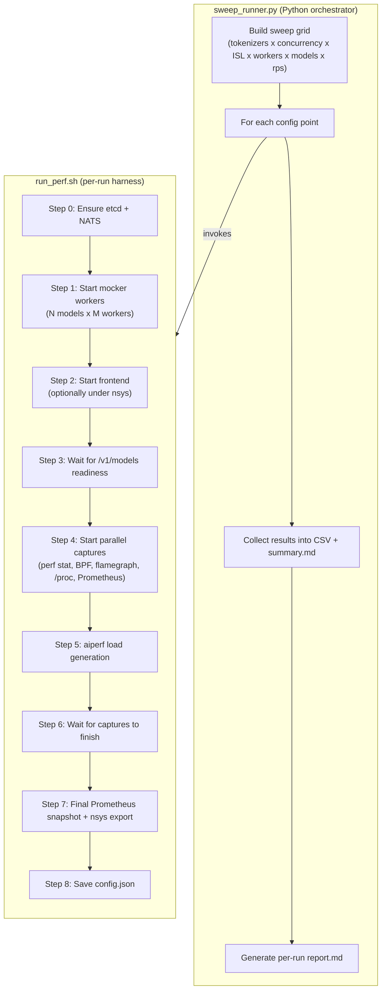
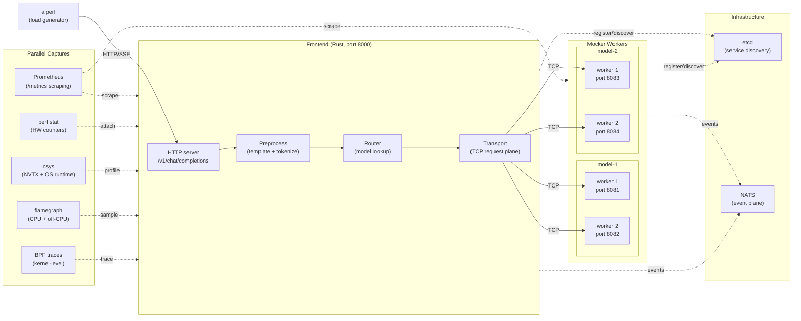

# Frontend Performance Profiling

Unified observability and benchmarking suite for Dynamo frontend performance.

## Quick Start

```bash
cd ~/dev/dynamo
source dynamo/bin/activate

# Single run (mocker + frontend + aiperf + Prometheus)
cd benchmarks/frontend/scripts
./run_perf.sh --model Qwen/Qwen3-0.6B --concurrency 32 --num-requests 640 \
    --speedup-ratio 1000000 --skip-bpf --skip-nsys --skip-flamegraph --skip-perf

# Sweep (multiple config points)
python3 sweep_runner.py --tokenizers hf --concurrency 32 --isl 512 \
    --benchmark-duration 30 --speedup-ratio 1000000 \
    -- --skip-bpf --skip-nsys --skip-flamegraph --skip-perf
```

## Architecture

The benchmarking suite has two layers: a Python sweep orchestrator that builds a grid of configurations, and a shell harness that executes each individual run.



### Runtime topology

During a benchmark run, the following processes are active. The frontend receives HTTP requests from aiperf, tokenizes the input, routes to a backend model via the request plane (TCP), and streams response tokens back to the client.



### Multi-model naming

When `--num-models` is 1, the served model name matches the HF model path (e.g., `Qwen/Qwen3-0.6B`). When `--num-models` is greater than 1, each model instance gets a synthetic name (`model-1`, `model-2`, ...) but all share the same underlying `--model-path` for weights and tokenizer config.

## Prerequisites

| Tool | Required | Install |
|------|----------|---------|
| etcd | Yes | `apt install etcd` or [releases](https://github.com/etcd-io/etcd/releases) |
| nats-server | Yes | `apt install nats-server` or [nats.io](https://nats.io/download/) |
| aiperf | Yes | `uv pip install "git+https://github.com/ai-dynamo/aiperf.git@main"` (in dynamo venv) |
| jq | Yes | `apt install jq` |
| perf | Optional | `apt install linux-tools-$(uname -r)` |
| bpftrace | Optional | `apt install bpftrace` (needs root or CAP_BPF + CAP_PERFMON) |
| inferno | Optional | `cargo install inferno` (for flamegraphs) |
| nsys | Optional | NVIDIA Nsight Systems |

## sweep_runner.py

The main entry point for running performance sweeps. Iterates over a grid of configurations and delegates each point to `run_perf.sh`.

### Basic Usage

```bash
# Smoke test (1 run)
python3 sweep_runner.py --tokenizers hf --concurrency 32 --isl 512 \
    --benchmark-duration 30 --speedup-ratio 1000000 \
    -- --skip-bpf --skip-nsys --skip-flamegraph --skip-perf

# Full tokenizer comparison
python3 sweep_runner.py --tokenizers hf,fastokens \
    --concurrency 32,64 --isl 512,1024,2048 \
    --benchmark-duration 60 --speedup-ratio 1000000

# Transport saturation (vary workers and request count)
python3 sweep_runner.py --tokenizers hf --concurrency 4096 \
    --num-requests 16384,32768 --workers 1,2,4,8 --speedup-ratio 1000000

# Preview sweep plan without running
python3 sweep_runner.py --dry-run --tokenizers hf,fastokens \
    --concurrency 32,64 --isl 512,1024
```

### Multi-Model and Worker Sweeps

The `--num-models` and `--workers` flags control how many model instances and backend workers per model are launched. These are the primary knobs for studying frontend scalability under multi-tenant and parallel-worker configurations.

#### Scaling models (fixed workers per model)

Useful for measuring how adding more served models affects frontend routing, transport fan-out, and per-model latency.

```bash
# Sweep across 1, 2, 3, 4 model instances, 1 worker each, at 75 rps
for m in 1 2 3 4; do
    python3 sweep_runner.py \
        --tokenizers hf \
        --concurrency 512 \
        --isl 512 \
        --workers 1 \
        --num-models $m \
        --rps 75 \
        --benchmark-duration 60 \
        --speedup-ratio 1000000 \
        --output-dir artifacts/sweep_models/m${m} \
        -- --skip-bpf
done

# Compare results
for m in 1 2 3 4; do
    echo "=== m=$m ==="
    cat artifacts/sweep_models/m${m}/summary.md
    echo
done
```

#### Scaling workers per model (fixed model count)

Useful for measuring whether adding more backend workers relieves transport bottlenecks for a single model under heavy load.

```bash
# Sweep across 1, 2, 4, 8 workers for a single model
python3 sweep_runner.py \
    --tokenizers hf \
    --concurrency 512 \
    --isl 512 \
    --workers 1,2,4,8 \
    --num-models 1 \
    --rps 75 \
    --benchmark-duration 60 \
    --speedup-ratio 1000000 \
    --output-dir artifacts/sweep_workers \
    -- --skip-bpf
```

#### Combined model + worker grid

For a full factorial sweep over both dimensions, supply multiple values for both flags. Each combination produces a separate run.

```bash
# 2x3 grid: (1 model, 2 models) x (1, 2, 4 workers)
python3 sweep_runner.py \
    --tokenizers hf \
    --concurrency 256 \
    --isl 512 \
    --workers 1,2,4 \
    --num-models 2 \
    --rps 50 \
    --benchmark-duration 60 \
    --speedup-ratio 1000000 \
    --output-dir artifacts/sweep_grid \
    -- --skip-bpf
```

> **Note:** `--num-models` is a single integer (not comma-separated). To sweep across model counts, loop externally as shown in the "Scaling models" example above.

#### What to look for in the results

| Metric | Where to find it | What it tells you |
|--------|-----------------|-------------------|
| Req/s and Tok/s | `summary.md` | Whether the frontend can sustain the target load |
| TTFT p50/p99 | `summary.md` | End-to-end first-token latency (includes preprocess + routing + transport) |
| `transport_roundtrip` p50 | `report.md` section 4 | Time spent in the TCP request plane; grows when workers are saturated |
| Tokio worker busy ratio | `report.md` section 7 | Fraction of time each async worker is busy; values above 0.95 indicate saturation |
| Event loop stalls | `report.md` section 7 | How often the Tokio runtime stalled; high counts suggest blocking work on the async executor |
| `preprocess.tokenize` | `report.md` section 5 (NVTX) | Per-request tokenization cost; varies by tokenizer backend |

### With Profilers

```bash
# With perf stat + flamegraphs (no root needed)
python3 sweep_runner.py --tokenizers hf --concurrency 64 --isl 1024 \
    --benchmark-duration 60 --speedup-ratio 1000000

# With everything including BPF (needs sudo)
sudo -E python3 sweep_runner.py --tokenizers hf --concurrency 64 --isl 1024 \
    --benchmark-duration 60 --speedup-ratio 1000000

# nsys profiling (needs nsys in PATH)
python3 sweep_runner.py --tokenizers hf --concurrency 64 --isl 1024 \
    --benchmark-duration 60 --speedup-ratio 1000000 \
    -- --nsys-path /opt/nvidia/nsight-systems/bin/nsys
```

Profiler controls are passed through to run_perf.sh after `--`:

| Flag | Effect |
|------|--------|
| `--skip-bpf` | Skip BPF tracing |
| `--skip-nsys` | Skip Nsight Systems |
| `--skip-flamegraph` | Skip CPU/off-CPU flamegraphs |
| `--skip-perf` | Skip perf stat hardware counters |

### All Options

| Option | Default | Description |
|--------|---------|-------------|
| `--model` | `Qwen/Qwen3-0.6B` | HF model path |
| `--backend` | `mocker` | Engine: `mocker` (synthetic) or `vllm` |
| `--tokenizers` | `hf,fastokens` | Comma-separated tokenizer backends |
| `--concurrency` | `50,100,200` | Comma-separated concurrency levels |
| `--isl` | `512,1024,2048` | Comma-separated input sequence lengths |
| `--osl` | `256` | Output sequence length |
| `--workers` | `2` | Comma-separated worker counts per model |
| `--num-models` | `1` | Number of model instances (each gets `--workers` workers) |
| `--rps` | - | Comma-separated target request rates (req/s) |
| `--aiperf-targets` | `first` | `first`: model-1 only. `all`: run aiperf for each model |
| `--speedup-ratio` | `1.0` | Mocker speedup divisor; use large values (e.g., 1000000) for near-instant mocker |
| `--benchmark-duration` | `60` | aiperf run duration (seconds) |
| `--num-requests` | - | Comma-separated request counts (overrides duration) |
| `--output-dir` | auto | Output directory |
| `--max-consecutive-fails` | `2` | Skip remaining ISLs after N failures |
| `--cooldown` | `3` | Seconds between runs |
| `--dry-run` | - | Print plan without executing |
| `--no-report` | - | Skip per-run report generation |

## run_perf.sh

Low-level per-run harness. Normally called by sweep_runner.py, but can be used directly for single runs.

```bash
# Minimal (no profilers)
./run_perf.sh --model Qwen/Qwen3-0.6B --concurrency 32 --num-requests 640 \
    --speedup-ratio 1000000 --skip-bpf --skip-nsys --skip-flamegraph --skip-perf

# Full observability (needs sudo for BPF)
sudo -E ./run_perf.sh --model Qwen/Qwen3-0.6B --concurrency 64 \
    --benchmark-duration 60 --speedup-ratio 1000000

# Multi-model with 2 workers each
./run_perf.sh --model Qwen/Qwen3-0.6B --num-models 2 --workers 2 \
    --concurrency 32 --benchmark-duration 30 --speedup-ratio 1000000 \
    --skip-bpf --skip-nsys --skip-flamegraph --skip-perf

# 4 models, 1 worker each, rate-limited to 75 rps
./run_perf.sh --model Qwen/Qwen3-0.6B --num-models 4 --workers 1 \
    --concurrency 512 --benchmark-duration 60 --request-rate 75 \
    --speedup-ratio 1000000 --skip-bpf
```

## Analyzing Results

```bash
# Per-run report (generated automatically by sweep_runner.py)
python3 analysis/create_report.py analyze artifacts/sweep_<ts>/hf_c32_isl512_w2

# Auto-find latest run
python3 analysis/create_report.py analyze

# Prometheus delta (initial vs final snapshot)
diff <(grep "^dynamo_frontend" artifacts/.../prometheus/initial_snapshot.txt | sort) \
     <(grep "^dynamo_frontend" artifacts/.../prometheus/final_snapshot.txt | sort)

# nsys SQLite queries (when nsys was enabled)
sqlite3 artifacts/.../nsys/frontend.sqlite \
    "SELECT name, COUNT(*), ROUND(AVG(end-start)/1e3,1) as avg_us
     FROM NVTX_EVENTS WHERE end > start GROUP BY name ORDER BY avg_us DESC"
```

## Output Structure

```text
artifacts/sweep_YYYYMMDD_HHMMSS/
    results.csv                        Sweep results (all runs)
    summary.md                         Comparison table
    hf_c32_isl512_w2/                  Per-run directory
        config.json                    Run parameters
        report.md                      Analysis report
        aiperf/
            profile_export_aiperf.json aiperf metrics
        prometheus/
            initial_snapshot.txt        Pre-load metrics
            final_snapshot.txt          Post-load metrics
            timeseries.jsonl            Per-second scrapes
        system/
            thread_count.txt            Thread count over time
            fd_count.txt                FD count over time
            proc_status.txt             /proc/PID/status snapshots
        logs/
            frontend.log
            mocker_*.log
        perf/                           (if --with-perf)
            perf_stat.txt
            cpu_flamegraph.svg
        bpf/                            (if --with-bpf, needs root)
            runqlat.txt
            syscall_latency.txt
            ...
        nsys/                           (if --with-nsys)
            frontend.nsys-rep
            frontend.sqlite
```
