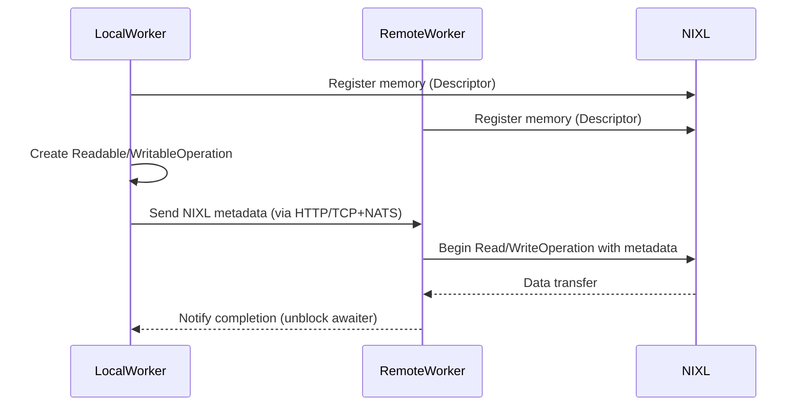
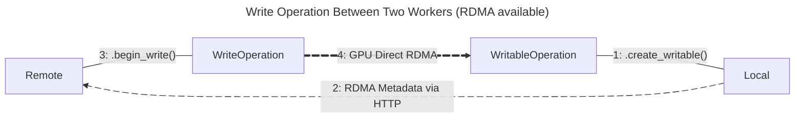
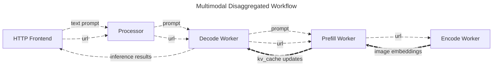

Dynamo NIXL Connect specializes in moving data between models/workers in a Dynamo Graph, and for the use cases where registration and memory regions need to be dynamic.
Dynamo connect provides utilities for such use cases, using the NIXL-based I/O subsystem via a set of Python classes.
The relaxed registration comes with some performance overheads, but simplifies the integration process.
Especially for larger data transfer operations, such as between models in a multi-model graph, the overhead would be marginal.
The `dynamo.nixl_connect` library can be imported by any Dynamo container hosted application.

> [!Note]
> Dynamo NIXL Connect will pick the best available method of data transfer available to it.
> The available methods depend on the hardware and software configuration of the machines and network running the graph.
> GPU Direct RDMA operations require that both ends of the operation have:
> - NIC and GPU capable of performing RDMA operations
> - Device drivers that support GPU-NIC direct interactions (aka "zero copy") and RDMA operations
> - Network that supports InfiniBand or RoCE
>
> With any of the above not satisfied, GPU Direct RDMA will not be available to the graph's workers, and less-optimal methods will be utilized to ensure basic functionality.
> For additional information, please read this [GPUDirect RDMA](https://docs.nvidia.com/cuda/pdf/GPUDirect_RDMA.pdf) document.

```python
import dynamo.nixl_connect
```

All operations using the NIXL Connect library begin with the [`Connector`](connector.md) class and the type of operation required.
There are four types of supported operations:

 1. **Register local readable memory**:

    Register local memory buffer(s) with the NIXL subsystem to enable a remote worker to read from.

 2. **Register local writable memory**:

    Register local memory buffer(s) with the NIXL subsystem to enable a remote worker to write to.

 3. **Read from registered, remote memory**:

    Read remote memory buffer(s), registered by a remote worker to be readable, into local memory buffer(s).

 4. **Write to registered, remote memory**:

    Write local memory buffer(s) to remote memory buffer(s) registered by a remote worker to writable.

When available, by connecting correctly paired operations, high-throughput GPU Direct RDMA data transfers can be completed.
Given the list above, the correct pairing of operations would be 1 & 3 or 2 & 4.
Where one side is a "(read|write)-able operation" and the other is its correctly paired "(read|write) operation".
Specifically, a read operation must be paired with a readable operation, and a write operation must be paired with a writable operation.



## Examples

### Generic Example

In the diagram below, Local creates a [`WritableOperation`](writable-operation.md) intended to receive data from Remote.
Local then sends metadata about the requested operation to Remote.
Remote then uses the metadata to create a [`WriteOperation`](write-operation.md) which will perform the GPU Direct RDMA memory transfer, when available, from Remote's GPU memory to Local's GPU memory.



> [!Note]
> When RDMA isn't available, the NIXL data transfer will still complete using non-accelerated methods.

### Multimodal Example

In the case of the [Dynamo Multimodal Disaggregated Example](../../features/multimodal/multimodal-vllm.md):

 1. The HTTP frontend accepts a text prompt and a URL to an image.

 2. The prompt and URL are then enqueued with the Processor before being dispatched to the first available Decode Worker.

 3. Decode Worker then requests a Prefill Worker to provide key-value data for the LLM powering the Decode Worker.

 4. Prefill Worker then requests that the image be processed and provided as embeddings by the Encode Worker.

 5. Encode Worker acquires the image, processes it, performs inference on the image using a specialized vision model, and finally provides the embeddings to Prefill Worker.

 6. Prefill Worker receives the embeddings from Encode Worker and generates a key-value cache (KV$) update for Decode Worker's LLM and writes the update directly to the GPU memory reserved for the data.

 7. Finally, Decode Worker performs the requested inference.



> [!Note]
> In this example, it is the data transfer between the Prefill Worker and the Encode Worker that utilizes the Dynamo NIXL Connect library.
> The KV Cache transfer between Decode Worker and Prefill Worker utilizes a different connector that also uses the NIXL-based I/O subsystem underneath.

#### Code Examples

See [NixlReadEmbeddingSender](https://github.com/ai-dynamo/dynamo/blob/main/components/src/dynamo/common/multimodal/embedding_transfer.py),
for how they coordinate directly with the Encode Worker by creating a [`ReadableOperation`](readable-operation.md),
sending the operation's metadata via Dynamo's round-robin dispatcher, and awaiting the operation for completion before making use of the transferred data.

See [NixlReadEmbeddingReceiver](https://github.com/ai-dynamo/dynamo/blob/main/components/src/dynamo/common/multimodal/embedding_transfer.py),
for how the resulting embeddings are registered with the NIXL subsystem by creating a [`Descriptor`](descriptor.md),
a [`ReadOperation`](read-operation.md) is created using the metadata provided by the requesting worker,
and the worker awaits for the data transfer to complete for yielding a response.


## Python Classes

  - [Connector](connector.md)
  - [Descriptor](descriptor.md)
  - [Device](device.md)
  - [ReadOperation](read-operation.md)
  - [ReadableOperation](readable-operation.md)
  - [WritableOperation](writable-operation.md)
  - [WriteOperation](write-operation.md)


## References

  - [NVIDIA Dynamo](https://developer.nvidia.com/dynamo) @ [GitHub](https://github.com/ai-dynamo/dynamo)
  - [NVIDIA Inference Transfer Library (NIXL)](https://developer.nvidia.com/blog/introducing-nvidia-dynamo-a-low-latency-distributed-inference-framework-for-scaling-reasoning-ai-models/#nvidia_inference_transfer_library_nixl_low-latency_hardware-agnostic_communication%C2%A0) @ [GitHub](https://github.com/ai-dynamo/nixl)
  - [Dynamo Multimodal Example](https://github.com/ai-dynamo/dynamo/tree/main/examples/backends/vllm/launch)
  - [NVIDIA GPU Direct](https://developer.nvidia.com/gpudirect)
