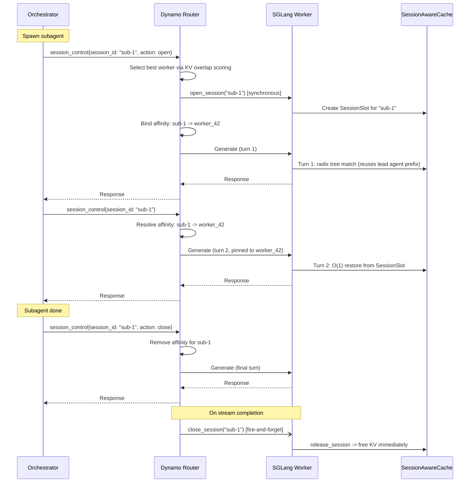

# SGLang for Agentic Workloads

This guide covers SGLang-specific configuration for agentic serving with Dynamo. It explains which SGLang engine flags to enable, how Dynamo's [agent hints](../../components/frontend/nvext.md#agent-hints) map to SGLang behavior, and how to use session control to manage KV cache for multi-turn agent conversations.

## Overview

Agentic workloads (tool-calling loops, multi-turn reasoning, code generation pipelines) have different performance characteristics than batch inference:

- **Prefix-heavy**: Successive turns share a growing conversation prefix. KV cache reuse is critical for low TTFT.
- **Priority-sensitive**: Some requests (user-facing agent turns) matter more than background tasks.
- **Long-lived**: Conversations span minutes to hours. Cache eviction under memory pressure can destroy accumulated KV state.

Dynamo's agent hints give the router per-request metadata. SGLang's engine flags control how that metadata affects scheduling and eviction on the worker.

## SGLang Engine Flags

### Priority Scheduling

Enable priority-based scheduling so the engine respects the `priority` value from `nvext.agent_hints.priority`:

```bash
python -m dynamo.sglang \
  --model-path <model> \
  --enable-priority-scheduling \
  ...
```

| Flag | Description |
|------|-------------|
| `--enable-priority-scheduling` | Enables priority-based request scheduling instead of FCFS. |

When priority scheduling is enabled, the engine uses the `priority` field from `nvext.agent_hints` to order requests in its internal queue. Requests with higher effective priority are scheduled before lower-priority ones. Ties are broken by arrival time.

### Priority-Based KV Cache Eviction

By default, SGLang evicts radix tree nodes using LRU. You can switch to priority-based eviction so that low-priority cache entries are evicted before high-priority ones:

```bash
python -m dynamo.sglang \
  --model-path <model> \
  --radix-eviction-policy priority \
  ...
```

| Flag | Values | Default | Description |
|------|--------|---------|-------------|
| `--radix-eviction-policy` | `lru`, `priority` | `lru` | Eviction strategy for the GPU radix cache. `priority` uses a heap ordered by the request's priority value. |

This does **not** require HiCache. It controls GPU-only radix tree eviction. When the GPU KV cache is full:

- **`lru`**: Evicts the least recently used leaf nodes first.
- **`priority`**: Evicts lowest-priority leaf nodes first. Nodes with equal priority fall back to LRU ordering.

#### Interaction with HiCache

When both `--radix-eviction-policy priority` and `--enable-hierarchical-cache` are enabled, priority affects eviction at both tiers:

| Event | Behavior |
|-------|----------|
| **GPU full** | Low-priority nodes are evicted (demoted to host) first. With `write_through`, all nodes survive on host -- priority only affects demotion order. |
| **Host full** | Low-priority nodes are deleted from host first. High-priority nodes with active retention survive longer. |

The practical impact depends on your write policy. With `write_through`, GPU eviction is just a demotion -- the real deletion happens at host eviction, which is where priority ordering matters most.

## How Agent Hints Map to SGLang

Dynamo's `nvext.agent_hints` fields are consumed by the router and forwarded to SGLang workers. Here is how each hint interacts with the SGLang engine:

| Agent Hint | Router Behavior | SGLang Engine Behavior |
|------------|----------------|----------------------|
| `priority` | Router queue ordering when `--router-queue-threshold` is set. | Request scheduling when `--enable-priority-scheduling` is set. Radix cache eviction order when `--radix-eviction-policy priority` is set. |
| `osl` | Output block tracking for routing decisions (requires `--router-track-output-blocks`) | No direct engine effect. |
| `speculative_prefill` | After response completes, sends a `max_tokens=1` prefill to warm the KV cache for the predicted next turn. | SGLang processes the prefill request normally, populating the radix cache. |

### Example: Agentic Request with Hints

```python
from openai import OpenAI

client = OpenAI(base_url="http://localhost:8000/v1", api_key="dummy")

response = client.chat.completions.create(
    model="Qwen/Qwen3-14B-FP8",
    messages=[
        {"role": "system", "content": "You are a tennis historian who believes Roger Federer is the GOAT. Respond with maximum reverence."},
        {"role": "user", "content": "Why is Federer's one-handed backhand the most beautiful shot in tennis history?"},
    ],
    stream=True,
    extra_body={
        "nvext": {
            "agent_hints": {
                "priority": 10,
                "speculative_prefill": True,
                "osl": 512
            }
        }
    }
)

for chunk in response:
    if chunk.choices[0].delta.content:
        print(chunk.choices[0].delta.content, end="")
```

## Session Control for Subagent KV Isolation (Experimental)

> [!WARNING]
> Session control is experimental. The API may change.

Agentic orchestrators often spawn short-lived subagents (research, code execution, planning) that accumulate KV cache, use it for a few turns, then die. Under normal radix cache behavior, this ephemeral KV pollutes the tree and competes with the lead agent's long-lived prefix for eviction.

Session control solves this by holding subagent KV in dedicated **streaming session slots** outside the radix tree. Session KV is invisible to eviction, has no L2 backup overhead, and is freed deterministically on close or timeout.

### How It Works



Key behaviors:

- **Turn 1** goes through the normal radix tree, so the subagent shares the lead agent's cached system prompt prefix.
- **Turns 2+** skip the radix tree entirely. KV is restored from the `SessionSlot` in O(1).
- **Session KV is invisible to eviction**. It cannot be evicted -- only freed by explicit close or inactivity timeout.
- **Deterministic cleanup**: On close, session KV is freed immediately.
- **Router-side affinity**: The `StickySessionRouter` maintains a `session_id -> worker_id` mapping with sliding-window TTL. Clients only need to send `session_id`.

### Enabling Session Control

Session control is request-driven. The router's `AgentController` (session lifecycle RPCs) and `StickySessionRouter` (session affinity) activate automatically when a request carries `nvext.session_control` -- no additional frontend flags are needed beyond `--router-mode kv`. On the worker side, streaming sessions must be explicitly enabled.

> [!NOTE]
> Session control is currently supported only on the SGLang backend. vLLM and TensorRT-LLM do not yet expose the streaming session API.

> [!IMPORTANT]
> Streaming sessions require SGLang changes from [sgl-project/sglang#21875](https://github.com/sgl-project/sglang/pull/21875) (session-aware cache, race condition fixes, session metrics). This is merged to SGLang main but not yet in a release. Until a version after `0.5.10.post1` is published, build SGLang from source (`pip install -e "python"` from the SGLang repo).

**SGLang worker:**

```bash
python -m dynamo.sglang \
  --model-path <model> \
  --enable-streaming-session \
  ...
```

| Flag | Description |
|------|-------------|
| `--enable-streaming-session` | Wraps the radix cache with `SessionAwareCache`, enabling streaming session slots for subagent KV isolation. |

**Router:**

```bash
python -m dynamo.frontend \
  --router-mode kv \
  ...
```

### Request Format

#### Opening a session

Include `session_control` with `action: "open"` on the first request:

```json
{
    "model": "Qwen/Qwen3-14B-FP8",
    "messages": [{"role": "user", "content": "Research every Federer Grand Slam final in exhaustive detail."}],
    "nvext": {
        "session_control": {
            "session_id": "sub-1",
            "action": "open",
            "timeout": 60
        }
    }
}
```

| Field | Type | Description |
|-------|------|-------------|
| `session_control.session_id` | `string` | Unique session identifier. Present on every turn. |
| `session_control.action` | `string` | `"open"` or `"close"`. Omit on intermediate turns. |
| `session_control.timeout` | `integer` | Inactivity timeout in seconds (default 300). Only used with `action: "open"`. |

#### Subsequent turns

Include `session_control` with just `session_id` (no action). The router resolves affinity automatically:

```json
{
    "model": "Qwen/Qwen3-14B-FP8",
    "messages": [{"role": "user", "content": "Now compare his Wimbledon 2007 final vs Nadal to any shot in human history."}],
    "nvext": {
        "session_control": {
            "session_id": "sub-1"
        }
    }
}
```

#### Closing a session

Include `action: "close"`. The close RPC fires after generation completes:

```json
{
    "model": "Qwen/Qwen3-14B-FP8",
    "messages": [{"role": "user", "content": "Write a 500-word love letter to Federer's single-handed backhand."}],
    "nvext": {
        "session_control": {
            "session_id": "sub-1",
            "action": "close"
        }
    }
}
```

### Limitations

- **Streaming sessions only**: Sessions are opened with `streaming=True`, which means only sequential append operations are supported. Branching (`replace`), token-level rewind (`offset`), and `drop_previous_output` are not supported.
- **Timeout is idle-based**: The timeout refreshes on every request. If a subagent pauses for a long tool call that exceeds the timeout, the session is reaped and KV is freed. The subagent must re-open the session and re-prefill.
- **Session metrics**: Active session count (`sglang:num_streaming_sessions`) and held KV tokens (`sglang:streaming_session_held_tokens`) are exported as Prometheus gauges on the worker's metrics endpoint.

## Quickstart

### Launch Script

The `agg_agent.sh` script launches a single aggregated worker with session control, sticky routing, and KV events:

```bash
# Default model (GLM-4.7-Flash, 2 GPUs)
bash examples/backends/sglang/launch/agg_agent.sh
```

The frontend listens on port 8000 (override with `DYN_HTTP_PORT`). Worker metrics are on port 8081.

### Testing with OpenCode

[OpenCode](https://github.com/opencode-ai/opencode) is an open-source AI coding agent with built-in support for subagents, tool calling, and OpenAI-compatible endpoints. The [Dynamo provider fork](https://github.com/ishandhanani/opencode/tree/idhanani/dynamo-provider) injects `nvext.session_control` on subagent requests, giving each spawned agent its own Dynamo streaming session with sticky routing and KV isolation.

```bash
# Terminal 1 -- launch Dynamo with session control + tool/reasoning parsers
bash examples/backends/sglang/launch/agg_agent.sh \
  --model-path zai-org/GLM-4.7-Flash --tp 2

# Terminal 2 -- run OpenCode against Dynamo
DYNAMO_API_KEY=dummy bun run --cwd packages/opencode src/index.ts \
  -- --model "dynamo/zai-org/GLM-4.7-Flash"
```

When OpenCode spawns a subagent (via the `task` tool), the provider automatically:

1. Sends `session_control.action = "open"` on the subagent's first turn
2. Routes subsequent turns to the same worker via `session_id`
3. Sends `session_control.action = "close"` when the subagent completes, freeing KV

The primary agent runs without session control -- only subagent sessions are pinned. This keeps lead-agent requests load-balanced while subagent multi-turn conversations stay on a single worker with warm KV cache.

#### Configuration

Model and endpoint are configured in `.opencode/opencode.jsonc`:

```jsonc
{
  "provider": {
    "dynamo": {
      "npm": "@ai-sdk/openai-compatible",
      "name": "Dynamo",
      "env": ["DYNAMO_API_KEY"],
      "models": {
        "zai-org/GLM-4.7-Flash": {
          "id": "zai-org/GLM-4.7-Flash",
          "name": "GLM 4.7 Flash",
          "tool_call": true,
          "reasoning": true,
          "temperature": true,
          "attachment": false,
          "release_date": "2025-06-01",
          "limit": { "context": 131072, "output": 8192 },
          "cost": { "input": 0, "output": 0 },
          "interleaved": { "field": "reasoning_content" }
        }
      },
      "options": {
        "baseURL": "http://localhost:8000/v1"
      }
    }
  }
}
```

## See Also

- **[NVIDIA Request Extensions (nvext)](../../components/frontend/nvext.md)**: Full `nvext` field reference including agent hints
- **[Configuration and Tuning](../../components/router/router-configuration.md)**: Router configuration and CLI arguments
- **[SGLang HiCache](../../integrations/sglang-hicache.md)**: Enabling hierarchical KV cache
