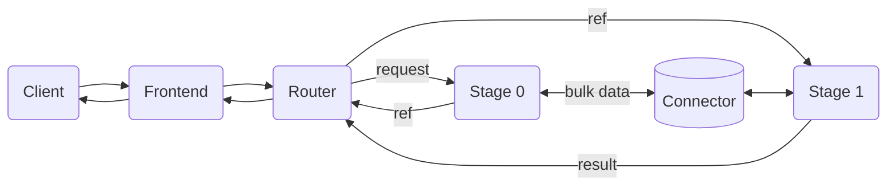
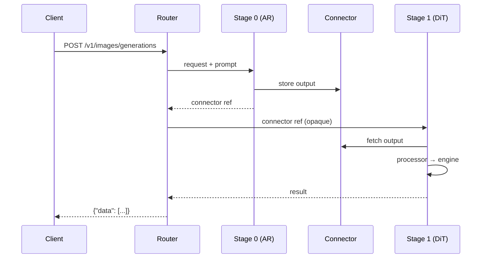

Dynamo supports multimodal generation through the [vLLM-Omni](https://github.com/vllm-project/vllm-omni) backend. This integration exposes text-to-text, text-to-image, text-to-video, and text-to-audio (TTS) capabilities via OpenAI-compatible API endpoints.

## Prerequisites

This guide assumes familiarity with deploying Dynamo with vLLM as described in the [vLLM backend guide](README.md).

### Installation

Dynamo container images include vLLM-Omni pre-installed. If you are using `pip install ai-dynamo[vllm]`, vLLM-Omni is **not** included automatically because the matching release is not yet available on PyPI. Install it separately from source, pinning the vLLM-Omni release that matches your installed vLLM version (see the [vLLM-Omni releases](https://github.com/vllm-project/vllm-omni/releases) page):

```bash
pip install git+https://github.com/vllm-project/vllm-omni.git@<version>
```

> **ARM64 not supported:** vLLM-Omni is currently only installed on `amd64` builds. On `arm64`, the container build skips the install and vLLM-Omni features are unavailable.

## Supported Modalities

| Modality | Endpoint(s) | `--output-modalities` |
|---|---|---|
| Text-to-Text | `/v1/chat/completions` | `text` (default) |
| Text-to-Image | `/v1/chat/completions`, `/v1/images/generations` | `image` |
| Text-to-Video | `/v1/videos` | `video` |
| Image-to-Video | `/v1/videos` | `video` |
| Text-to-Audio (TTS) | `/v1/audio/speech` | `audio` |

The `--output-modalities` flag determines which endpoint(s) the worker registers. When set to `image`, both `/v1/chat/completions` (returns inline base64 images) and `/v1/images/generations` are available. When set to `video`, the worker serves `/v1/videos`. When set to `audio`, the worker serves `/v1/audio/speech`.

## Tested Models

| Modality | Models |
|---|---|
| Text-to-Text | `Qwen/Qwen2.5-Omni-7B` |
| Text-to-Image | `Qwen/Qwen-Image`, `AIDC-AI/Ovis-Image-7B`, `zai-org/GLM-Image` (disagg) |
| Text-to-Video | `Wan-AI/Wan2.1-T2V-1.3B-Diffusers`, `Wan-AI/Wan2.2-T2V-A14B-Diffusers` |
| Image-to-Video | `Wan-AI/Wan2.2-TI2V-5B-Diffusers`, `Wan-AI/Wan2.2-I2V-A14B-Diffusers` |
| Text-to-Audio (TTS) | `Qwen/Qwen3-TTS-12Hz-1.7B-CustomVoice`, `Qwen/Qwen3-TTS-12Hz-1.7B-VoiceDesign` |

To run a non-default model, pass `--model` to any launch script:

```bash
bash examples/backends/vllm/launch/agg_omni_image.sh --model AIDC-AI/Ovis-Image-7B
bash examples/backends/vllm/launch/agg_omni_video.sh --model Wan-AI/Wan2.2-T2V-A14B-Diffusers
```

## Text-to-Text

Launch an aggregated deployment (frontend + omni worker):

```bash
bash examples/backends/vllm/launch/agg_omni.sh
```

This starts `Qwen/Qwen2.5-Omni-7B` with a single-stage thinker config on one GPU.

Verify the deployment:

```bash
curl -s http://localhost:8000/v1/chat/completions \
  -H "Content-Type: application/json" \
  -d '{
    "model": "Qwen/Qwen2.5-Omni-7B",
    "messages": [{"role": "user", "content": "What is 2+2?"}],
    "max_tokens": 50,
    "stream": false
  }'
```

This script uses a custom stage config (`stage_configs/single_stage_llm.yaml`) that configures the thinker stage for text generation. See [Stage Configuration](#stage-configuration) for details.

## Text-to-Image

Launch using the provided script with `Qwen/Qwen-Image`:

```bash
bash examples/backends/vllm/launch/agg_omni_image.sh
```

### Via `/v1/chat/completions`

```bash
curl -s http://localhost:8000/v1/chat/completions \
  -H "Content-Type: application/json" \
  -d '{
    "model": "Qwen/Qwen-Image",
    "messages": [{"role": "user", "content": "A cat sitting on a windowsill"}],
    "stream": false
  }'
```

The response includes base64-encoded images inline:

```json
{
  "choices": [{
    "delta": {
      "content": [
        {"type": "image_url", "image_url": {"url": "data:image/png;base64,..."}}
      ]
    }
  }]
}
```

### Via `/v1/images/generations`

```bash
curl -s http://localhost:8000/v1/images/generations \
  -H "Content-Type: application/json" \
  -d '{
    "model": "Qwen/Qwen-Image",
    "prompt": "A cat sitting on a windowsill",
    "size": "1024x1024",
    "response_format": "url"
  }'
```

## Text-to-Video

Launch using the provided script with `Wan-AI/Wan2.1-T2V-1.3B-Diffusers`:

```bash
bash examples/backends/vllm/launch/agg_omni_video.sh
```

Generate a video via `/v1/videos`:

```bash
curl -s http://localhost:8000/v1/videos \
  -H "Content-Type: application/json" \
  -d '{
    "model": "Wan-AI/Wan2.1-T2V-1.3B-Diffusers",
    "prompt": "A drone flyover of a mountain landscape",
    "seconds": 2,
    "size": "832x480",
    "response_format": "url"
  }'
```

The response returns a video URL or base64 data depending on `response_format`:

```json
{
  "id": "...",
  "object": "video",
  "model": "Wan-AI/Wan2.1-T2V-1.3B-Diffusers",
  "status": "completed",
  "data": [{"url": "file:///tmp/dynamo_media/videos/req-abc123.mp4"}]
}
```

The `/v1/videos` endpoint also accepts NVIDIA extensions via the `nvext` field for fine-grained control:

| Field | Description | Default |
|---|---|---|
| `nvext.fps` | Frames per second | 24 |
| `nvext.num_frames` | Number of frames (overrides `fps * seconds`) | -- |
| `nvext.negative_prompt` | Negative prompt for guidance | -- |
| `nvext.num_inference_steps` | Number of denoising steps | 50 |
| `nvext.guidance_scale` | CFG guidance scale | 5.0 |
| `nvext.seed` | Random seed for reproducibility | -- |
| `nvext.boundary_ratio` | MoE expert switching boundary (I2V) | 0.875 |
| `nvext.guidance_scale_2` | CFG scale for low-noise expert (I2V) | 1.0 |

## Image-to-Video

Image-to-video (I2V) uses the same `/v1/videos` endpoint as text-to-video, with an additional `input_reference` field that provides the source image. The image can be an HTTP URL, a base64 data URI, or a local file path.

Launch with the provided script using `Wan-AI/Wan2.2-TI2V-5B-Diffusers`:

```bash
bash examples/backends/vllm/launch/agg_omni_i2v.sh
```

Generate a video from an image:

```bash
curl -s http://localhost:8000/v1/videos \
  -H "Content-Type: application/json" \
  -d '{
    "model": "Wan-AI/Wan2.2-TI2V-5B-Diffusers",
    "prompt": "A bear playing with yarn, smooth motion",
    "input_reference": "https://example.com/bear.png",
    "size": "832x480",
    "response_format": "url",
    "nvext": {
      "num_inference_steps": 40,
      "num_frames": 33,
      "guidance_scale": 1.0,
      "boundary_ratio": 0.875,
      "guidance_scale_2": 1.0,
      "seed": 42
    }
  }'
```

The `input_reference` field accepts:
- **HTTP/HTTPS URL**: `"https://example.com/image.png"`
- **Base64 data URI**: `"data:image/png;base64,iVBORw0KGgo..."`
- **Local file path**: `"/path/to/image.png"` or `"file:///path/to/image.png"`

The I2V-specific `nvext` fields (`boundary_ratio`, `guidance_scale_2`) control the dual-expert MoE denoising schedule in Wan2.x models. See [Wan2.2-I2V model card](https://huggingface.co/Wan-AI/Wan2.2-I2V-A14B-Diffusers) for details.

## Text-to-Audio (TTS)

Launch using the provided script with `Qwen/Qwen3-TTS-12Hz-1.7B-CustomVoice`:

```bash
bash examples/backends/vllm/launch/agg_omni_audio.sh
```

### CustomVoice (predefined speakers)

```bash
curl -X POST http://localhost:8000/v1/audio/speech \
  -H "Content-Type: application/json" \
  -d '{
    "input": "Hello, how are you?",
    "voice": "vivian",
    "language": "English"
  }' --output output.wav
```

### CustomVoice with style instructions

```bash
curl -X POST http://localhost:8000/v1/audio/speech \
  -H "Content-Type: application/json" \
  -d '{
    "input": "I am so excited!",
    "voice": "vivian",
    "instructions": "Speak with great enthusiasm"
  }' --output excited.wav
```

### VoiceDesign (describe a voice)

```bash
bash examples/backends/vllm/launch/agg_omni_audio.sh --model Qwen/Qwen3-TTS-12Hz-1.7B-VoiceDesign

curl -X POST http://localhost:8000/v1/audio/speech \
  -H "Content-Type: application/json" \
  -d '{
    "input": "Hello world",
    "task_type": "VoiceDesign",
    "instructions": "A warm, friendly female voice with a gentle tone"
  }' --output voicedesign.wav
```

### Parameters

The `/v1/audio/speech` endpoint follows the [vLLM-Omni](https://docs.vllm.ai/projects/vllm-omni/en/latest/user_guide/examples/online_serving/qwen3_tts/) API format. All TTS-specific parameters are top-level fields:

| Field | Description | Default |
|---|---|---|
| `input` | Text to synthesize (required) | -- |
| `model` | TTS model name | auto-detected |
| `voice` | Speaker name (e.g., vivian, ryan). Validated against model config. | Vivian |
| `response_format` | Audio format: wav, mp3, pcm, flac, aac, opus | wav |
| `speed` | Speed factor (0.25-4.0) | 1.0 |
| `task_type` | CustomVoice, VoiceDesign, or Base (Qwen3-TTS) | CustomVoice |
| `language` | Language code. Validated against model config. | Auto |
| `instructions` | Voice style/emotion description. Required for VoiceDesign. | -- |
| `ref_audio` | Reference audio URL or base64 data URI. Required for Base. | -- |
| `ref_text` | Transcript of reference audio (Base task) | -- |
| `max_new_tokens` | Maximum tokens to generate (1-4096) | 2048 |

Available voices and languages are loaded dynamically from the model's `config.json` at startup. Non-Qwen3-TTS audio models (e.g., MiMo-Audio) use a generic text prompt and ignore TTS-specific parameters.

## CLI Reference

The omni backend uses a dedicated entrypoint: `python -m dynamo.vllm.omni`.

| Flag | Description |
|---|---|
| `--omni` | Enable the vLLM-Omni orchestrator (required for all omni workloads) |
| `--output-modalities <modality>` | Output modality: `text`, `image`, `video`, or `audio` |
| `--stage-configs-path <path>` | Path to stage config YAML (optional; vLLM-Omni uses model defaults if omitted) |
| `--boundary-ratio <float>` | MoE expert switching boundary (default: 0.875) |
| `--flow-shift <float>` | Scheduler flow_shift (5.0 for 720p, 12.0 for 480p) |
| `--vae-use-slicing` | Enable VAE slicing for memory optimization |
| `--vae-use-tiling` | Enable VAE tiling for memory optimization |
| `--default-video-fps <int>` | Default frames per second for generated videos (default: 16) |
| `--enable-layerwise-offload` | Enable layerwise offloading on DiT modules to reduce GPU memory |
| `--layerwise-num-gpu-layers <int>` | Number of ready layers to keep on GPU during generation (default: 1) |
| `--cache-backend <backend>` | Diffusion cache: `cache_dit` or `tea_cache` |
| `--cache-config <json>` | Cache configuration as JSON string (overrides defaults) |
| `--enable-cache-dit-summary` | Enable cache-dit summary logging after diffusion forward passes |
| `--enforce-eager` | Disable torch.compile for diffusion models |
| `--enable-cpu-offload` | Enable CPU offloading for diffusion models |
| `--ulysses-degree <int>` | GPUs for Ulysses sequence parallelism in diffusion (default: 1) |
| `--ring-degree <int>` | GPUs for ring sequence parallelism in diffusion (default: 1) |
| `--cfg-parallel-size <int>` | GPUs for classifier-free guidance parallelism (1 or 2, default: 1) |
| `--media-output-fs-url <url>` | Filesystem URL for storing generated media (default: `file:///tmp/dynamo_media`) |
| `--media-output-http-url <url>` | Base URL for rewriting media paths in responses (optional) |

## Storage Configuration

Generated images, videos, and audio files are stored via [fsspec](https://filesystem-spec.readthedocs.io/), which supports local filesystems, S3, GCS, and Azure Blob.

By default, media is written to the local filesystem at `file:///tmp/dynamo_media`. To use cloud storage:

```bash
bash examples/backends/vllm/launch/agg_omni_video.sh \
  --media-output-fs-url s3://my-bucket/media \
  --media-output-http-url https://cdn.example.com/media
```

When `--media-output-http-url` is set, response URLs are rewritten as `{base-url}/{storage-path}` (e.g., `https://cdn.example.com/media/videos/req-id.mp4`). When unset, the raw filesystem path is returned.

For S3 credential configuration, set the standard AWS environment variables (`AWS_ACCESS_KEY_ID`, `AWS_SECRET_ACCESS_KEY`) or use IAM roles. See the [fsspec S3 docs](https://s3fs.readthedocs.io/en/latest/#credentials) for details.

## Stage Configuration

Omni pipelines are configured via YAML stage configs. See [`examples/backends/vllm/launch/stage_configs/single_stage_llm.yaml`](https://github.com/ai-dynamo/dynamo/blob/main/examples/backends/vllm/launch/stage_configs/single_stage_llm.yaml) for an example. For full documentation on stage config format and multi-stage pipelines, refer to the [vLLM-Omni Stage Configs documentation](https://docs.vllm.ai/projects/vllm-omni/en/latest/configuration/stage_configs/).

## Disaggregated Multi-Stage Serving

For models with multiple pipeline stages (e.g., AR + Diffusion), Dynamo supports disaggregated serving where each stage runs as an independent process on its own GPU. This enables independent scaling, GPU isolation, and multi-worker replicas per stage.

### Architecture

Each stage runs as an independent process on its own GPU. A lightweight router coordinates them, acting as a **pure message broker** — it never inspects or transforms inter-stage data.



**How it works:**

- The router sends the initial request to Stage 0 and receives back a lightweight connector reference (pointer to the output in shared memory).
- The router forwards that reference — unchanged — to Stage 1. It never reads the bulk data.
- Each stage fetches its inputs from the connector, runs any model-specific processor (e.g., `ar2diffusion`, `thinker2talker`), then runs its engine.
- The final stage's result goes back to the router for formatting and response.
- Connector references accumulate as the pipeline progresses, so any stage can access outputs from all previous stages.

### Data Flow



### Quick Start: GLM-Image (2-Stage, 2 GPUs)

GLM-Image is a 2-stage text-to-image model with an AR stage (generates prior token IDs) and a DiT stage (diffusion denoising + VAE decode). The built-in vLLM-Omni stage config already assigns each stage to a separate GPU.

> **Experimental:** GLM-Image support is experimental; generation may fail or produce incorrect/garbled outputs for some prompts and sizes.

```bash
bash examples/backends/vllm/launch/disagg_omni_glm_image.sh
```

Test:

```bash
curl -s http://localhost:8000/v1/images/generations \
  -H "Content-Type: application/json" \
  -d '{
    "model": "zai-org/GLM-Image",
    "prompt": "A red apple on a white table",
    "size": "1024x1024",
    "response_format": "url"
  }' | jq
```

### Scaling Stage Replicas

Each stage registers independently with Dynamo's service discovery. To scale a bottleneck stage, launch additional workers with the same `--stage-id` on different GPUs — the router automatically load-balances across all replicas for that stage. Other stages are unaffected.

### Tested Models

| Model | Stages | Output | Stage Config |
|---|---|---|---|
| GLM-Image (`zai-org/GLM-Image`) | AR -> DiT | Image | `glm_image.yaml` (built-in) |

### CLI Flags (Disaggregated Mode)

| Flag | Description |
|---|---|
| `--stage-id <int>` | Run as a single-stage worker for the given stage ID. Requires `--stage-configs-path`. |
| `--omni-router` | Run as the stage router. Requires `--stage-configs-path`. Mutually exclusive with `--stage-id`. |
| `--stage-configs-path <path>` | Path to vLLM-Omni stage configuration YAML. |

## Current Limitations

- Image input is supported only for I2V via `input_reference` in `/v1/videos`. Other endpoints accept text prompts only.
- KV cache events are not published for omni workers.
- Each worker supports a single output modality at a time.
- Audio: streaming (`stream: true`) is not yet supported.
- Audio: Base task (voice cloning) is not yet supported.
- Disaggregated mode: `async_chunk=true` (streaming between stages) is not yet supported.
