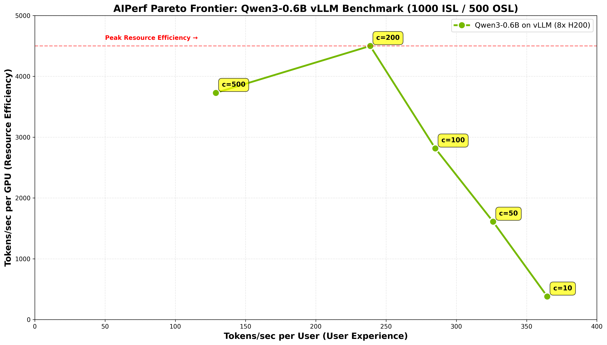

This guide shows how to benchmark Dynamo deployments using [AIPerf](https://github.com/ai-dynamo/aiperf), a comprehensive tool for measuring generative AI inference performance. AIPerf provides detailed metrics, real-time dashboards, and automatic visualization — you call it directly against your endpoints.

You can benchmark any combination of:
- **DynamoGraphDeployments**
- **External HTTP endpoints** (vLLM, llm-d, AIBrix, etc.)

## Choosing Your Benchmarking Approach

**Client-side** runs benchmarks on your local machine via port-forwarding. **Server-side** runs benchmarks directly within the Kubernetes cluster using internal service URLs.

**TLDR:**
Need high performance/load testing? Server-side.
Just quick testing/comparison? Client-side.

### Use Client-Side Benchmarking When:
- You want to quickly test deployments
- You want immediate access to results on your local machine
- You're comparing external services or deployments (not necessarily just Dynamo deployments)
- You need to run benchmarks from your laptop/workstation

→ **[Go to Client-Side Benchmarking (Local)](#client-side-benchmarking-local)**

### Use Server-Side Benchmarking When:
- You have a development environment with kubectl access
- You're doing performance validation with high load/speed requirements
- You're experiencing timeouts or performance issues with client-side benchmarking
- You want optimal network performance (no port-forwarding overhead)
- You're running automated CI/CD pipelines
- You need isolated execution environments
- You want persistent result storage in the cluster

→ **[Go to Server-Side Benchmarking (In-Cluster)](#server-side-benchmarking-in-cluster)**

### Quick Comparison

| Feature | Client-Side | Server-Side |
|---------|-------------|-------------|
| **Location** | Your local machine | Kubernetes cluster |
| **Network** | Port-forwarding required | Direct service DNS |
| **Setup** | Quick and simple | Requires cluster resources |
| **Performance** | Limited by local resources, may timeout under high load | Optimal cluster performance, handles high load |
| **Isolation** | Shared environment | Isolated job execution |
| **Results** | Local filesystem | Persistent volumes |
| **Best for** | Light load | High load |

## AIPerf Overview

[AIPerf](https://github.com/ai-dynamo/aiperf) is a standalone benchmarking tool available on [PyPI](https://pypi.org/project/aiperf/). It is pre-installed in Dynamo container images. Key features:

- Measures latency, throughput, TTFT, inter-token latency, and more
- Multiple load modes: concurrency, request-rate, trace replay
- Automatic visualization with `aiperf plot` (Pareto curves, time series, GPU telemetry)
- Interactive dashboard mode for real-time exploration
- Arrival patterns (Poisson, constant, gamma) for realistic traffic simulation
- Warmup phases, gradual ramping, and multi-URL load balancing

**Important**: The `--model` parameter must match the model deployed at the endpoint.

For full documentation, see the [AIPerf docs](https://github.com/ai-dynamo/aiperf/tree/main/docs).

---

# Client-Side Benchmarking (Local)

Client-side benchmarking runs on your local machine and connects to Kubernetes deployments via port-forwarding.

## Prerequisites

1. **Dynamo container environment** - You must be running inside a Dynamo container with AIPerf pre-installed, or install it locally:
   ```bash
   pip install aiperf
   ```

2. **HTTP endpoints** - Ensure you have HTTP endpoints available for benchmarking. These can be:
   - DynamoGraphDeployments exposed via HTTP endpoints
   - External services (vLLM, llm-d, AIBrix, etc.)
   - Any HTTP endpoint serving OpenAI-compatible models

## User Workflow

### Step 1: Set Up Cluster and Deploy

Set up your Kubernetes cluster with NVIDIA GPUs and install the Dynamo Kubernetes Platform following the [installation guide](../kubernetes/installation-guide.md). Then deploy your DynamoGraphDeployments using the [deployment documentation](https://github.com/ai-dynamo/dynamo/blob/main/examples/backends).

### Step 2: Port-Forward and Run a Single Benchmark

> **Wait for model readiness.** Before benchmarking, ensure your deployment has fully loaded the model. Check pod logs or hit the health endpoint (`curl http://localhost:8000/health`) — it should return `200 OK` before you proceed.

```bash
# Port-forward the frontend service
kubectl port-forward -n <namespace> svc/<frontend-service-name> 8000:8000 > /dev/null 2>&1 &

# Run a single benchmark
aiperf profile \
    --model <your-model-name> \
    --url http://localhost:8000 \
    --endpoint-type chat \
    --streaming \
    --concurrency 10 \
    --request-count 100 \
    --synthetic-input-tokens-mean 2000 \
    --output-tokens-mean 256
```

This produces results in `artifacts/` and prints a summary table to the console:

```text
                                NVIDIA AIPerf | LLM Metrics
┏━━━━━━━━━━━━━━━━━━━━━┳━━━━━━━━━┳━━━━━━━━━┳━━━━━━━━━┳━━━━━━━━━┳━━━━━━━━━┳━━━━━━━━━┳━━━━━━━━━┓
┃              Metric ┃     avg ┃     min ┃     max ┃     p99 ┃     p90 ┃     p50 ┃     std ┃
┡━━━━━━━━━━━━━━━━━━━━━╇━━━━━━━━━╇━━━━━━━━━╇━━━━━━━━━╇━━━━━━━━━╇━━━━━━━━━╇━━━━━━━━━╇━━━━━━━━━┩
│ Time to First Token │  234.56 │  189.23 │  298.45 │  289.34 │  267.12 │  231.12 │   28.45 │
│                (ms) │         │         │         │         │         │         │         │
│     Request Latency │ 1234.56 │  987.34 │ 1567.89 │ 1534.23 │ 1456.78 │ 1223.45 │  156.78 │
│                (ms) │         │         │         │         │         │         │         │
│ Inter Token Latency │   15.67 │   12.34 │   19.45 │   19.01 │   18.23 │   15.45 │    1.89 │
│                (ms) │         │         │         │         │         │         │         │
│  Request Throughput │   31.45 │     N/A │     N/A │     N/A │     N/A │     N/A │     N/A │
│      (requests/sec) │         │         │         │         │         │         │         │
└─────────────────────┴─────────┴─────────┴─────────┴─────────┴─────────┴─────────┴─────────┘
```

*Actual numbers will vary based on model size, hardware, batch size, and network conditions. Client-side benchmarks include port-forwarding overhead — use [server-side benchmarking](#server-side-benchmarking-in-cluster) for accurate performance measurement.*

To stop the port-forward when done: `kill %1` (or `kill <PID>`).

### Step 3: Concurrency Sweep for Pareto Analysis

To understand how your deployment behaves across load levels, run a concurrency sweep. Each concurrency level sends enough requests for stable measurements (`max(c*3, 10)`):

```bash
MODEL="<your-model-name>"
URL="http://localhost:8000"

for c in 1 2 5 10 50 100; do
    aiperf profile \
        --model "$MODEL" \
        --url "$URL" \
        --endpoint-type chat \
        --streaming \
        --concurrency $c \
        --request-count $(( c * 3 > 10 ? c * 3 : 10 )) \
        --synthetic-input-tokens-mean 2000 \
        --output-tokens-mean 256 \
        --artifact-dir "artifacts/deployment-a/c$c"
done
```

**Note**: Adjust concurrency levels to match your deployment's capacity. Very high concurrency on a small deployment (e.g., c250 on a single GPU) will cause server errors. Start with lower values and increase until you find the saturation point.

### Step 4: [If Comparative] Benchmark a Second Deployment

Teardown deployment A and deploy deployment B with a different configuration. Kill the previous port-forward (`kill %1`), then repeat:

```bash
kubectl port-forward -n <namespace> svc/<frontend-service-b> 8000:8000 > /dev/null 2>&1 &

for c in 1 2 5 10 50 100; do
    aiperf profile \
        --model "$MODEL" \
        --url "$URL" \
        --endpoint-type chat \
        --streaming \
        --concurrency $c \
        --request-count $(( c * 3 > 10 ? c * 3 : 10 )) \
        --synthetic-input-tokens-mean 2000 \
        --output-tokens-mean 256 \
        --artifact-dir "artifacts/deployment-b/c$c"
done
```

### Step 5: Generate Visualizations

```bash
# Compare all runs — auto-detects multi-run directories
aiperf plot artifacts/deployment-a artifacts/deployment-b

# Or compare all subdirectories under a parent
aiperf plot artifacts/

# Launch interactive dashboard for exploration
aiperf plot artifacts/ --dashboard
```

AIPerf automatically generates plots based on available data:
- **TTFT vs Throughput** — find the sweet spot between responsiveness and capacity (always generated for multi-run comparisons)
- **Pareto Curves** — throughput per GPU vs latency and interactivity (only generated when GPU telemetry data is available — add `--gpu-telemetry` during profiling if DCGM is running)
- **Time series** — per-request TTFT, ITL, and latency over time (generated for single-run analysis)

Here is an example Pareto frontier from a concurrency sweep of Qwen3-0.6B on 8x H200 with vLLM, showing the tradeoff between user experience (tokens/sec per user) and resource efficiency (tokens/sec per GPU):



See the [AIPerf Visualization Guide](https://github.com/ai-dynamo/aiperf/blob/main/docs/tutorials/plot.md) for full details on plot customization, experiment classification, and themes.

## Use Cases

- **Compare DynamoGraphDeployments** (e.g., aggregated vs disaggregated configurations)
- **Compare different backends** (e.g., SGLang vs TensorRT-LLM vs vLLM)
- **Compare Dynamo vs other platforms** (e.g., Dynamo vs llm-d vs AIBrix)
- **Compare different models** (e.g., Llama-3-8B vs Llama-3-70B vs Qwen-3-0.6B)
- **Compare different hardware configurations** (e.g., H100 vs A100 vs H200)
- **Compare different parallelization strategies** (e.g., different GPU counts or memory configurations)

## AIPerf Quick Reference

### Commonly Used Options

```text
aiperf profile [OPTIONS]

REQUIRED:
  --model MODEL               Model name (must match the deployed model)
  --url URL                   Endpoint URL (e.g., http://localhost:8000)

COMMON OPTIONS:
  --endpoint-type TYPE        Endpoint type: chat, completions, embeddings (default: chat)
  --streaming                 Enable streaming responses
  --concurrency N             Number of concurrent requests
  --request-rate N            Target requests per second (alternative to --concurrency)
  --request-count N           Total number of requests to send
  --benchmark-duration N      Run for N seconds instead of a fixed request count
  --synthetic-input-tokens-mean N   Average input sequence length in tokens
  --output-tokens-mean N      Average output sequence length in tokens
  --artifact-dir DIR          Output directory for results (default: artifacts/)
  --warmup-request-count N    Warmup requests before measurement
  --ui TYPE                   UI mode: dashboard, simple, none (default: dashboard)
```

For the complete CLI reference, see `aiperf profile --help` or the [CLI docs](https://github.com/ai-dynamo/aiperf/blob/main/docs/cli-options.md).

### Output Sequence Length

To enforce a specific output length, pass `ignore_eos` and `min_tokens` via `--extra-inputs`:

```bash
aiperf profile \
    --model <model> \
    --url http://localhost:8000 \
    --endpoint-type chat \
    --streaming \
    --concurrency 10 \
    --output-tokens-mean 256 \
    --extra-inputs max_tokens:256 \
    --extra-inputs min_tokens:256 \
    --extra-inputs ignore_eos:true
```

### Understanding Results

Each `aiperf profile` run produces an artifact directory containing:
- **`profile_export_aiperf.json`** — Structured metrics (latency, throughput, TTFT, ITL, etc.)
- **`profile_export.jsonl`** — Per-request raw data
- **`profile_export_aiperf.csv`** — CSV format metrics

Results are organized by the `--artifact-dir` you specify. For concurrency sweeps, a common pattern is:

```text
artifacts/
├── deployment-a/
│   ├── c1/
│   │   ├── profile_export_aiperf.json
│   │   └── profile_export.jsonl
│   ├── c10/
│   ├── c50/
│   └── c100/
├── deployment-b/
│   ├── c1/
│   ├── c10/
│   ├── c50/
│   └── c100/
└── plots/                    # Generated by aiperf plot
    ├── ttft_vs_throughput.png
    ├── pareto_curve_throughput_per_gpu_vs_latency.png      # If GPU telemetry available
    └── pareto_curve_throughput_per_gpu_vs_interactivity.png # If GPU telemetry available
```

---

# Server-Side Benchmarking (In-Cluster)

Server-side benchmarking runs directly within the Kubernetes cluster, eliminating port-forwarding overhead and enabling high-load testing.

## Prerequisites

1. **Kubernetes cluster** with NVIDIA GPUs and Dynamo namespace setup (see [Dynamo Kubernetes Platform docs](../kubernetes/README.md))
2. **Storage**: PersistentVolumeClaim configured with appropriate permissions (see [deploy/utils README](https://github.com/ai-dynamo/dynamo/blob/main/deploy/utils/README.md))
3. **Docker image** containing AIPerf (Dynamo runtime images include it)

## Quick Start

### Step 1: Deploy Your DynamoGraphDeployment
Deploy using the [deployment documentation](https://github.com/ai-dynamo/dynamo/blob/main/examples/backends). Ensure it has a frontend service exposed and the model is fully loaded before running benchmarks — check pod logs or verify the health endpoint returns `200 OK`.

### Step 2: Configure and Run Benchmark Job

First, edit `benchmarks/incluster/benchmark_job.yaml` to match your deployment:

- **Model name**: Update the `MODEL` variable
- **Service URL**: Update the `URL` variable (use `<svc_name>.<namespace>.svc.cluster.local:port` for cross-namespace access)
- **Concurrency levels**: Adjust the `for c in ...` loop
- **Docker image**: Update the `image` field if needed

Then deploy:

```bash
export NAMESPACE=benchmarking

# Deploy the benchmark job
kubectl apply -f benchmarks/incluster/benchmark_job.yaml -n $NAMESPACE

# Monitor the job
kubectl logs -f job/dynamo-benchmark -n $NAMESPACE
```

### Step 3: Retrieve Results
```bash
# Create access pod (skip if already running)
kubectl apply -f deploy/utils/manifests/pvc-access-pod.yaml -n $NAMESPACE
kubectl wait --for=condition=Ready pod/pvc-access-pod -n $NAMESPACE --timeout=60s

# Download the results
kubectl cp $NAMESPACE/pvc-access-pod:/data/results ./results

# Cleanup
kubectl delete pod pvc-access-pod -n $NAMESPACE
```

### Step 4: Generate Plots
```bash
aiperf plot ./results
```

## Cross-Namespace Service Access

When referencing services in other namespaces, use full Kubernetes DNS:

```bash
# Same namespace
--url http://vllm-agg-frontend:8000

# Different namespace
--url http://vllm-agg-frontend.production.svc.cluster.local:8000
```

## Monitoring and Debugging

```bash
# Check job status
kubectl describe job dynamo-benchmark -n $NAMESPACE

# Follow logs
kubectl logs -f job/dynamo-benchmark -n $NAMESPACE

# Check pod status
kubectl get pods -n $NAMESPACE -l job-name=dynamo-benchmark

# Debug failed pod
kubectl describe pod <pod-name> -n $NAMESPACE
```

### Troubleshooting

1. **Service not found**: Ensure your DynamoGraphDeployment frontend service is running
2. **PVC access**: Check that `dynamo-pvc` is properly configured and accessible
3. **Image pull issues**: Ensure the Docker image is accessible from the cluster
4. **Resource constraints**: Adjust resource limits if the job is being evicted

```bash
# Check PVC status
kubectl get pvc dynamo-pvc -n $NAMESPACE

# Verify service exists and has endpoints
kubectl get svc -n $NAMESPACE
kubectl get endpoints <service-name> -n $NAMESPACE
```

---

## Testing with Mocker Backend

For development and testing purposes, Dynamo provides a [mocker backend](https://github.com/ai-dynamo/dynamo/blob/main/components/src/dynamo/mocker) that simulates LLM inference without requiring actual GPU resources. This is useful for:

- **Testing deployments** without expensive GPU infrastructure
- **Developing and debugging** router, planner, or frontend logic
- **CI/CD pipelines** that need to validate infrastructure without model execution
- **Benchmarking framework validation** to ensure your setup works before using real backends

The mocker backend mimics the API and behavior of real backends (SGLang, TensorRT-LLM, vLLM) but generates mock responses instead of running actual inference.

See the [mocker directory](https://github.com/ai-dynamo/dynamo/blob/main/components/src/dynamo/mocker) for usage examples and configuration options.

---

## Advanced AIPerf Features

AIPerf has many capabilities beyond basic profiling. Here are some particularly useful for Dynamo benchmarking:

| Feature | Description | Docs |
|---------|-------------|------|
| Trace Replay | Replay production traces for deterministic benchmarking | [Trace Replay](https://github.com/ai-dynamo/aiperf/blob/main/docs/benchmark-modes/trace-replay.md) |
| Arrival Patterns | Poisson, constant, gamma traffic distributions | [Arrival Patterns](https://github.com/ai-dynamo/aiperf/blob/main/docs/tutorials/arrival-patterns.md) |
| Gradual Ramping | Smooth ramp-up of concurrency and request rate | [Ramping](https://github.com/ai-dynamo/aiperf/blob/main/docs/tutorials/ramping.md) |
| Warmup Phase | Eliminate cold-start effects from measurements | [Warmup](https://github.com/ai-dynamo/aiperf/blob/main/docs/tutorials/warmup.md) |
| Multi-URL Load Balancing | Distribute requests across multiple endpoints | [Multi-URL](https://github.com/ai-dynamo/aiperf/blob/main/docs/tutorials/multi-url-load-balancing.md) |
| GPU Telemetry | Collect DCGM metrics during benchmarking | [GPU Telemetry](https://github.com/ai-dynamo/aiperf/blob/main/docs/tutorials/gpu-telemetry.md) |
| Goodput Analysis | SLO-based throughput measurement | [Goodput](https://github.com/ai-dynamo/aiperf/blob/main/docs/tutorials/goodput.md) |
| Timeslice Analysis | Per-timeslice performance breakdown | [Timeslices](https://github.com/ai-dynamo/aiperf/blob/main/docs/tutorials/timeslices.md) |
| Multi-Turn Conversations | Benchmark multi-turn chat workloads | [Multi-Turn](https://github.com/ai-dynamo/aiperf/blob/main/docs/tutorials/multi-turn.md) |
| Experiment Classification | Baseline vs treatment semantic colors in plots | [Plotting](https://github.com/ai-dynamo/aiperf/blob/main/docs/tutorials/plot.md) |
