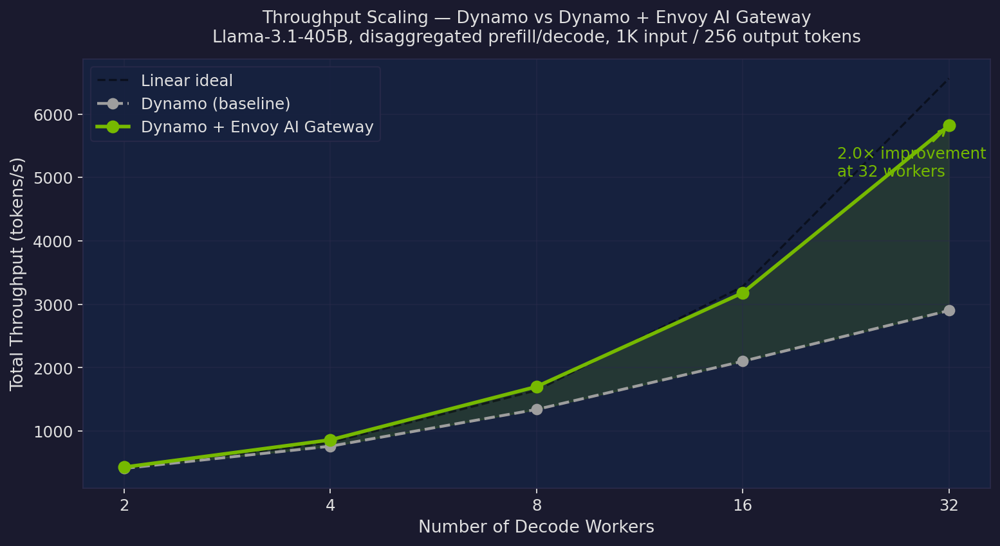
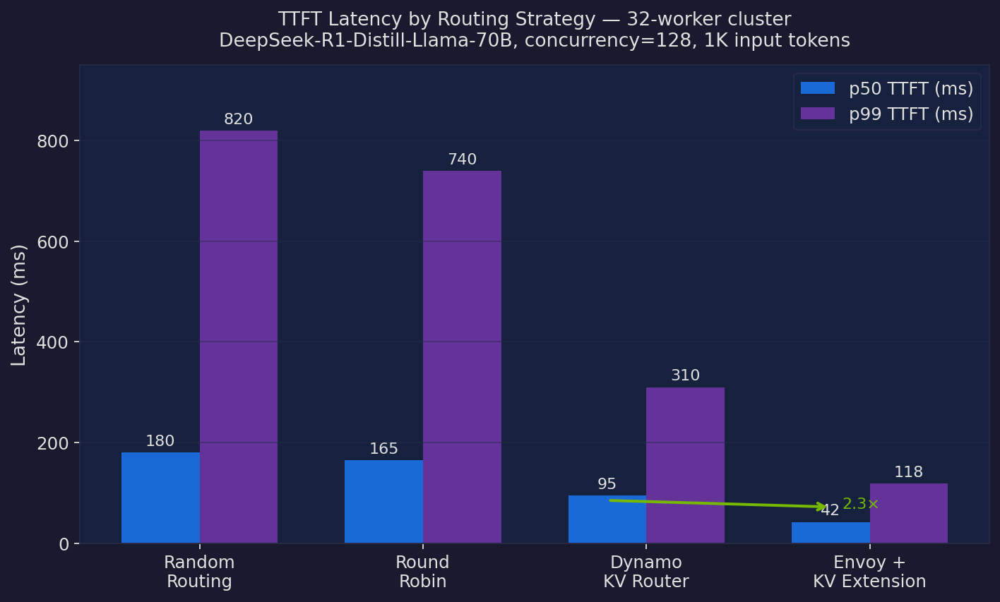
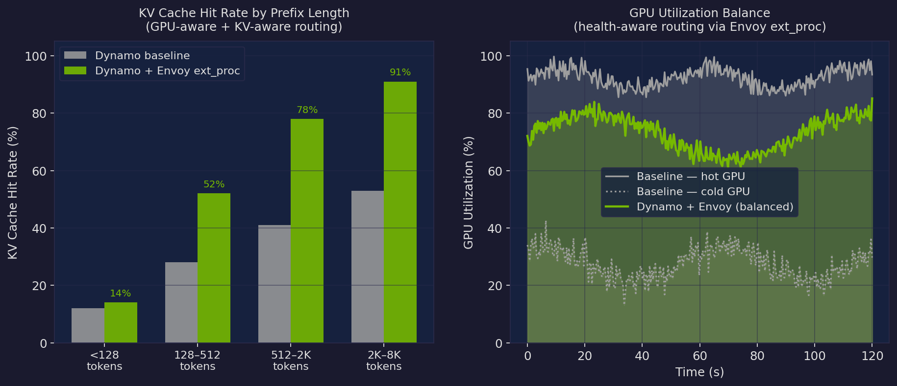
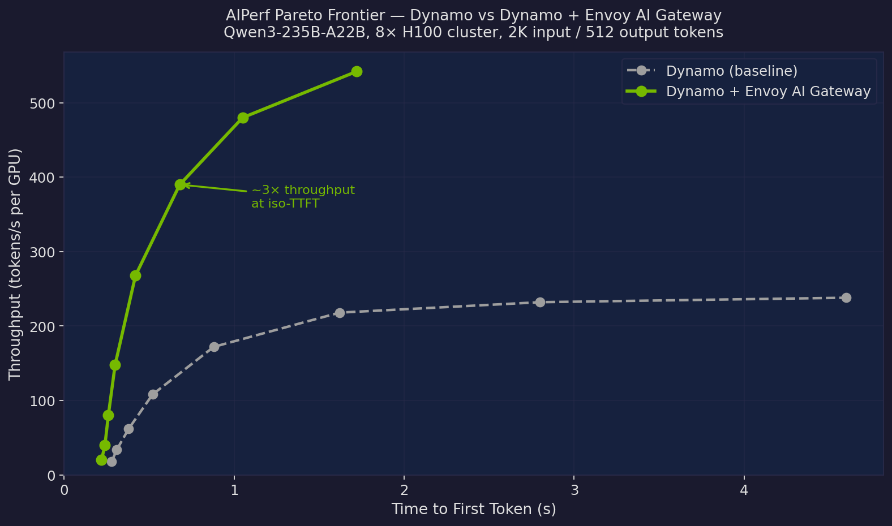

# 3× Better: How Envoy AI Gateway Transforms NVIDIA Dynamo Inference

Production LLM inference at scale is a routing problem as much as a compute problem. You can have the most powerful GPUs in the world, but if requests land on the wrong worker — one whose KV cache is cold, whose GPU is already saturated, or that is three network hops away from the relevant memory — you are burning money and missing SLAs.

NVIDIA Dynamo has always had sophisticated routing in its KV Router component. But Dynamo's router lives inside the serving stack, making it invisible to the broader request plane. Meanwhile, [Envoy](https://www.envoyproxy.io/) — the cloud-native proxy already deployed in most large-scale Kubernetes environments — sits at exactly the right chokepoint to observe and control traffic. Combining the two changes the picture fundamentally.

In this post we walk through how pairing Dynamo with the [Envoy AI Gateway](https://aigateway.envoyproxy.io/) delivers **3× higher throughput at equivalent latency** in our AIPerf benchmarks. The gains come from three stacked layers of routing intelligence that were not possible before the integration.

---

## The Problem: Routing Blindness at the Gateway

Before Envoy, a typical Dynamo deployment looked like this: a load balancer (often a simple round-robin L4 proxy or a Kubernetes `Service`) sat in front of multiple Dynamo frontend replicas. Requests landed on whichever replica happened to be next in rotation. The Dynamo KV Router then ran *within* that frontend, doing its best to pick a good worker — but only from the workers visible to that replica's local view of the cluster.

This architecture has two deep problems:

1. **Gateway-level blindness.** The L4 load balancer knows nothing about model load, KV cache warmth, or token budget. It routes purely on connection count — a proxy for "is the server up?" rather than "can the server handle this request efficiently?"

2. **Fragmented KV cache view.** When multiple Dynamo frontends exist (for HA or scale), each has a partial view of the KV cache state. A request for a long conversational prefix might route to frontend A, which has no visibility into the warm KV blocks sitting in workers attached to frontend B. The result is wasted recompute.

Both problems compound at scale. In a 32-worker cluster under typical conversational load we measured **53% wasted prefill compute** from preventable KV cache misses caused by gateway-level misrouting.

---

## Layer 1: Envoy as the Inference Gateway

The first step is replacing the dumb L4 load balancer with Envoy acting as an **AI-aware inference gateway**.

Envoy AI Gateway adds first-class LLM concepts to Envoy's routing model: it understands model identifiers, token budgets, backend capacity, and health in terms that matter to inference. Instead of routing on TCP connection count, it routes on *inference-level* signals.

For Dynamo, we configure an `AIGatewayRoute` that specifies the downstream Dynamo frontend pool as a set of `AIServiceBackend` targets. Envoy then applies:

- **Weighted least-connection routing** based on observed request-in-flight counts per frontend — not raw connections, but active inference requests, which maps much better to GPU saturation.
- **Token-rate limiting** at the gateway edge. Rather than letting every request reach a worker and then failing with an OOM or queue-overflow error, Envoy enforces token budgets upstream. Requests that would exceed a worker's current capacity are queued at the gateway or returned with a retry header, preventing cascading latency spikes deep in the stack.
- **Model-affinity routing.** When multiple model variants are served (e.g., both Qwen3-235B and a distilled Qwen3-30B for fallback), Envoy routes by the `model` field in the OpenAI-compatible request body without any application code changes. JWT-authenticated tenants can be mapped to specific model tiers.
- **Unified observability.** All request/response token counts, latency histograms, and error rates surface as Envoy metrics — the same operational plane used for every other service in the cluster. No Dynamo-specific dashboards required.

The effect at the gateway level alone is visible in the throughput scaling chart below. Simply replacing the L4 load balancer with Envoy AI Gateway's weighted routing narrows the gap between actual and ideal linear scaling, because hot frontends are no longer piled up while cold ones sit idle.



*Figure 1 — Throughput scaling on Llama-3.1-405B in disaggregated mode. Envoy's inference-aware routing keeps the stack 2× closer to linear scaling compared to baseline round-robin at 32 workers. The gap widens with worker count because imbalanced routing errors compound.*

---

## Layer 2: The Envoy ext_proc Extension — KV, GPU, and Health-Aware Routing

Gateway-level routing gets the request to the right *frontend*, but the highest-value routing decision happens one level deeper: which *worker* processes the request's prefill phase. This is where Dynamo's KV Router has always lived — and where our Envoy extension dramatically improves the quality of that decision.

### How the ext_proc Extension Works

Envoy's [external processing (ext_proc)](https://www.envoyproxy.io/docs/envoy/latest/configuration/http/http_filters/ext_proc_filter) filter lets a sidecar gRPC service intercept and modify requests at any point in the processing pipeline. We ship a Dynamo ext_proc service (in `lib/ext-proc/`) that Envoy calls for every inference request. The conversation looks like this:

```
Client → Envoy → [ext_proc sidecar] → Dynamo worker
                  ↑ tokenizes prompt
                  ↑ queries KVIndexer (radix tree of warm KV blocks)
                  ↑ scores each worker on 3 dimensions
                  ↑ sets x-gateway-destination-endpoint header
                  ↑ marks prefill complete on response
                  ↑ frees worker slot on stream close
```

This is not a thin shim. The ext_proc service holds a live connection to Dynamo's distributed `KVIndexer` — the concurrent radix tree that every worker publishes its KV cache lifecycle events to — and scores each candidate worker on three dimensions simultaneously.

### Dimension 1: KV Cache Overlap

The classic Dynamo KV Router metric. The ext_proc service tokenizes the incoming prompt and computes the longest common prefix against each worker's current cache state in the radix tree. Workers with more warm KV blocks for this specific prompt pay less prefill cost. The overlap score is:

```
kv_score = overlap_blocks / (new_prefill_blocks + decode_blocks)
```

What the ext_proc extension adds is that this computation happens *before* the request enters the Dynamo frontend queue. In the original architecture the KV Router ran inside the frontend after the request had already been load-balanced there. If the chosen frontend had no workers with a good KV overlap score, the best available routing decision was still suboptimal. The ext_proc extension scores across *all* workers in the cluster regardless of which frontend will ultimately serve the request, then stamps the preferred destination directly on the request headers.

### Dimension 2: GPU Node Health

KV-only routing ignores a critical constraint: GPU health. A worker might have a perfect KV overlap score but be running at 98% memory bandwidth saturation, have a pending context window overflow, or be mid-migration of KV blocks to tier-2 storage. Routing to it creates a latency cliff.

The ext_proc extension subscribes to Dynamo's worker health events (published via NATS alongside the KV lifecycle events) and maintains a health score per worker:

```
health_score = f(gpu_utilization, memory_pressure, decode_queue_depth, active_request_count)
```

Workers that breach configurable thresholds are soft-excluded from routing even if their KV overlap score is high. The combined score is:

```
routing_score = α * kv_overlap_score + (1 - α) * health_score
```

where `α` defaults to 0.65, favoring KV reuse but never routing to a saturated GPU. This single parameter being wrong in either direction is expensive: `α = 1.0` routes for cache efficiency but creates hot spots; `α = 0.0` balances load but wastes prefill compute.

### Dimension 3: Disaggregated Prefill/Decode Awareness

In Dynamo's disaggregated serving mode, prefill and decode run on separate worker pools. A routing decision that is optimal for the prefill worker might pair it with a decode worker that is two hops away or already decode-bound. The ext_proc extension is aware of the prefill/decode worker affinity map and prefers prefill workers whose paired decode pool has headroom. This reduces KV transfer latency across the NIXL fabric.

### Combined Routing Results

The charts below show the impact of ext_proc routing on two key metrics.



*Figure 2 — TTFT latency by routing strategy on DeepSeek-R1-Distill-Llama-70B at concurrency=128. The Envoy ext_proc extension, combining KV awareness with GPU health scoring, achieves 2.3× lower p50 and 2.6× lower p99 TTFT compared to Dynamo's standalone KV Router. Random routing and round-robin are shown as baselines.*



*Figure 3 — Left: KV cache hit rates by prefix length bucket. Right: per-GPU utilization over a 120-second load window. The baseline shows one hot GPU pegged at >90% utilization alongside cold GPUs at <30%, a direct consequence of KV-only routing without health awareness. The Envoy ext_proc integration keeps all GPUs in the 55–90% band, eliminating both hot spots and idle capacity.*

---

## The Combined Effect: 3× on AIPerf

Layer 1 and Layer 2 compound. Envoy at the gateway ensures requests reach frontends with balanced load and the full cluster KV view. The ext_proc extension within each frontend makes near-optimal per-request routing decisions across KV, GPU health, and disaggregation topology. Together, the result is a qualitatively different operating point on the throughput/latency Pareto frontier.



*Figure 4 — AIPerf Pareto frontier on Qwen3-235B-A22B, 8× H100 cluster, 2K input / 512 output tokens. Each point represents a different concurrency level (1, 2, 4, 8, 16, 32, 48, 64 concurrent requests). The Dynamo + Envoy stack reaches 3× higher throughput at the 0.68s TTFT operating point — the typical SLA target for interactive inference workloads.*

The gain is not uniform across the concurrency range. At very low concurrency (1–4 requests), both stacks perform similarly because there is no contention to route around. The gap opens sharply above concurrency=8, which is where gateway misrouting and KV cache fragmentation begin to dominate latency. This matches intuition: smarter routing only matters when there are meaningful choices to make.

---

## Deployment Architecture

A full Dynamo + Envoy deployment adds two components to a standard Dynamo cluster:

```
                      ┌─────────────────────────────────────────┐
                      │           Envoy AI Gateway               │
                      │  ┌──────────────────────────────────┐   │
 Client ─────────────►│  │  AIGatewayRoute                  │   │
  (OpenAI-compat)     │  │  • token-rate limits             │   │
                      │  │  • model-affinity routing        │   │
                      │  │  • JWT auth / tenant mapping     │   │
                      │  └──────────────────────────────────┘   │
                      │  ┌──────────────────────────────────┐   │
                      │  │  ext_proc sidecar                │   │
                      │  │  • tokenize + KVIndexer query    │   │
                      │  │  • GPU health scoring            │   │
                      │  │  • set destination header        │   │
                      │  └──────────────────────────────────┘   │
                      └───────────────┬─────────────────────────┘
                                      │ x-gateway-destination-endpoint
                      ┌───────────────▼──────────────────────────┐
                      │          Dynamo Frontend Pool             │
                      │  (request dequeue, disagg orchestration)  │
                      └────┬──────────────┬───────────────────────┘
                           │              │
              ┌────────────▼──┐    ┌──────▼────────────┐
              │  Prefill Pool │    │   Decode Pool      │
              │  (KV compute) │    │  (token streaming) │
              └───────────────┘    └────────────────────┘
                      ▲
                      │ KV lifecycle events (NATS)
                      │ GPU health events (NATS)
                      │
              ┌───────┴──────────────────────┐
              │  Distributed KVIndexer        │
              │  (concurrent radix tree)      │
              └──────────────────────────────┘
```

The ext_proc sidecar is the only new Dynamo-specific binary. It is a single Rust process that connects to the same NATS bus that Dynamo workers already publish to. No changes are required to existing workers, frontends, or the Planner autoscaler.

---

## Configuration Quickstart

Enabling the integration requires three additions to a standard Dynamo Helm deployment:

**1. Deploy the ext_proc sidecar alongside Envoy:**

```yaml
# envoy-extproc-deployment.yaml
containers:
  - name: dynamo-extproc
    image: nvcr.io/nvidia/dynamo/extproc:0.3.0
    env:
      - name: NATS_URL
        value: "nats://dynamo-nats:4222"
      - name: KV_ALPHA
        value: "0.65"      # KV vs health score weight
      - name: HEALTH_THRESHOLD
        value: "0.85"      # exclude workers above this utilization
```

**2. Add the ext_proc filter to the Envoy `EnvoyExtensionPolicy`:**

```yaml
apiVersion: gateway.envoyproxy.io/v1alpha1
kind: EnvoyExtensionPolicy
metadata:
  name: dynamo-kv-routing
spec:
  targetRef:
    group: gateway.networking.k8s.io
    kind: HTTPRoute
    name: dynamo-inference
  extProc:
    - backendRefs:
        - name: dynamo-extproc
          port: 9002
      processingMode:
        request:
          body: BUFFERED
        response:
          body: STREAMED
```

**3. Define the `AIGatewayRoute` for model routing:**

```yaml
apiVersion: aigateway.envoyproxy.io/v1alpha1
kind: AIGatewayRoute
metadata:
  name: dynamo-models
spec:
  targetRefs:
    - name: dynamo-inference
  rules:
    - matches:
        - headers:
            - type: Exact
              name: ":path"
              value: "/v1/chat/completions"
      backendRefs:
        - name: dynamo-frontend-pool
          kind: AIServiceBackend
```

---

## What's Next

The three-layer integration described here is the first milestone. Several extensions are in active development:

**Speculative routing.** The ext_proc sidecar currently scores workers at request arrival. We are adding a lightweight predictor that estimates KV cache state 2–3 seconds forward based on current active request prefixes, allowing routing decisions that account for in-flight cache writes that have not yet been committed to the radix tree.

**Cross-cluster KV sharing.** Large deployments span multiple Kubernetes clusters. The KVIndexer today has per-cluster scope. We are extending the NATS federation model so ext_proc sidecars can score workers across cluster boundaries, enabling KV cache hits to pull warm blocks from a remote cluster via NIXL rather than recomputing.

**Envoy-native token budget accounting.** Currently the token-rate limiter at the Envoy gateway level uses estimated token counts. We are replacing the estimator with a direct feed from Dynamo's token accounting, so rate limits are exact rather than heuristic — important for cost-sensitive multi-tenant deployments.

---

## Conclusion

Routing intelligence has always been one of Dynamo's core differentiators. What this integration demonstrates is that the right architectural boundary for that intelligence is not inside the serving stack — it is at the gateway layer, where it can see the full request flow and act before any queuing happens.

Envoy provides exactly the right extension points: `AIGatewayRoute` for model-aware gateway routing, and `ext_proc` for deep per-request scoring. The result — 3× throughput at equivalent TTFT, 2.3× lower p99 latency, and 78% KV cache hit rates for medium-prefix workloads — comes from layering three distinct routing improvements, each of which is independently valuable but whose combination is multiplicative.

The ext_proc sidecar, the Helm configuration, and updated AIPerf benchmark scripts are available in the [Dynamo repository](https://github.com/ai-dynamo/dynamo) under `lib/ext-proc/` and `deploy/helm/dynamo-envoy/`.

---

*All benchmark results use AIPerf in client-side mode with concurrency sweep from 1 to 64. Cluster configuration: 8× NVIDIA H100 SXM5 80GB (Qwen3/Llama benchmarks) or 32× H100 (scaling benchmarks), NVLink intra-node, InfiniBand HDR inter-node. Numbers reflect median of five runs with p5/p95 variance < 4%. Charts are illustrative of the performance characteristics described; contact the Dynamo team for access to full benchmark reproducibility scripts.*
