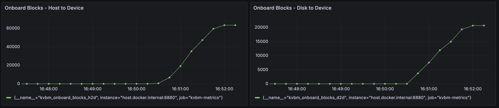

The Dynamo KV Block Manager (KVBM) is a scalable runtime component designed to handle memory allocation, management, and remote sharing of Key-Value (KV) blocks for inference tasks across heterogeneous and distributed environments. It acts as a unified memory layer and write-through cache for frameworks like vLLM and TensorRT-LLM.

KVBM is modular and can be used standalone via `pip install kvbm` or as the memory management component in the full Dynamo stack. This guide covers installation, configuration, and deployment of the Dynamo KV Block Manager (KVBM) and other KV cache management systems.

## Run KVBM Standalone

KVBM can be used independently without using the rest of the Dynamo stack:

```bash
pip install kvbm
```

See the [support matrix](../../reference/support-matrix.md) for version compatibility.

### Build from Source

To build KVBM from source, see the detailed instructions in the [KVBM bindings README](https://github.com/ai-dynamo/dynamo/tree/main/lib/bindings/kvbm/README.md#build-from-source).

## Run KVBM in Dynamo with vLLM

### Docker Setup

```bash
# Start up etcd for KVBM leader/worker registration and discovery
docker compose -f deploy/docker-compose.yml up -d
```

Pick one of the following to get a Dynamo vLLM container with KVBM built in. The subsequent serving commands are the same either way.

**Option A: Pre-built NGC container (recommended for quick start)**

```bash
docker run --gpus all --network host --rm -it nvcr.io/nvidia/ai-dynamo/vllm-runtime:1.0.0
```

See the [Local Installation Guide](../../getting-started/local-installation.md) for full setup instructions and [Release Artifacts](../../reference/release-artifacts.md#container-images) for available versions.

**Option B: Build from source**

```bash
# Build a dynamo vLLM container (KVBM is built in by default)
# NOTE: render.py defaults to --platform linux/amd64. On ARM64 hosts, pass --platform linux/arm64.
python container/render.py --framework vllm --target runtime --output-short-filename
docker build -t dynamo:latest-vllm-runtime -f container/rendered.Dockerfile .

# Launch the container
container/run.sh --image dynamo:latest-vllm-runtime -it --mount-workspace --use-nixl-gds
```

### Aggregated Serving

```bash
cd $DYNAMO_HOME/examples/backends/vllm
./launch/agg_kvbm.sh
```

#### Verify Deployment

```bash
curl localhost:8000/v1/chat/completions \
  -H "Content-Type: application/json" \
  -d '{
    "model": "Qwen/Qwen3-0.6B",
    "messages": [{"role": "user", "content": "Hello, how are you?"}],
    "stream": false,
    "max_tokens": 10
  }'
```

#### Alternative: Using Direct vllm serve

You can also use `vllm serve` directly with KVBM:

```bash
vllm serve --kv-transfer-config '{"kv_connector":"DynamoConnector","kv_role":"kv_both", "kv_connector_module_path": "kvbm.vllm_integration.connector"}' Qwen/Qwen3-0.6B
```

## Run KVBM in Dynamo with TensorRT-LLM

> [!NOTE]
> **Prerequisites:**
> - Ensure `etcd` and `nats` are running before starting
> - KVBM only supports TensorRT-LLM's PyTorch backend
> - Disable partial reuse (`enable_partial_reuse: false`) to increase offloading cache hits
> - KVBM requires TensorRT-LLM v1.2.0rc2 or newer

### Docker Setup

```bash
# Start up etcd for KVBM leader/worker registration and discovery
docker compose -f deploy/docker-compose.yml up -d
```

Pick one of the following to get a Dynamo TensorRT-LLM container with KVBM built in. The subsequent serving commands are the same either way.

**Option A: Pre-built NGC container (recommended for quick start)**

```bash
docker run --gpus all --network host --rm -it nvcr.io/nvidia/ai-dynamo/tensorrtllm-runtime:1.0.0
```

See the [Local Installation Guide](../../getting-started/local-installation.md) for full setup instructions and [Release Artifacts](../../reference/release-artifacts.md#container-images) for available versions.

**Option B: Build from source**

```bash
# Build a dynamo TRTLLM container (KVBM is built in by default)
# NOTE: render.py defaults to --platform linux/amd64. On ARM64 hosts, pass --platform linux/arm64.
python container/render.py --framework trtllm --target runtime --output-short-filename
docker build -t dynamo:latest-trtllm-runtime -f container/rendered.Dockerfile .

# Launch the container
container/run.sh --image dynamo:latest-trtllm-runtime -it --mount-workspace --use-nixl-gds
```

### Aggregated Serving

```bash
# Write the LLM API config
cat > "/tmp/kvbm_llm_api_config.yaml" <<EOF
backend: pytorch
cuda_graph_config: null
kv_cache_config:
  enable_partial_reuse: false
  free_gpu_memory_fraction: 0.80
kv_connector_config:
  connector_module: kvbm.trtllm_integration.connector
  connector_scheduler_class: DynamoKVBMConnectorLeader
  connector_worker_class: DynamoKVBMConnectorWorker
EOF

# Start dynamo frontend
python3 -m dynamo.frontend --http-port 8000 &

# Serve the model with KVBM
python3 -m dynamo.trtllm \
  --model-path Qwen/Qwen3-0.6B \
  --served-model-name Qwen/Qwen3-0.6B \
  --extra-engine-args /tmp/kvbm_llm_api_config.yaml &
```

#### Verify Deployment

```bash
curl localhost:8000/v1/chat/completions \
  -H "Content-Type: application/json" \
  -d '{
    "model": "Qwen/Qwen3-0.6B",
    "messages": [{"role": "user", "content": "Hello, how are you?"}],
    "stream": false,
    "max_tokens": 30
  }'
```

#### Alternative: Using trtllm-serve

```bash
trtllm-serve Qwen/Qwen3-0.6B --host localhost --port 8000 --backend pytorch --extra_llm_api_options /tmp/kvbm_llm_api_config.yaml
```

## Run Dynamo with SGLang HiCache

SGLang's Hierarchical Cache (HiCache) extends KV cache storage beyond GPU memory to include host CPU memory. When using NIXL as the storage backend, HiCache integrates with Dynamo's memory infrastructure.

### Quick Start

```bash
# Start SGLang worker with HiCache enabled
python -m dynamo.sglang \
  --model-path Qwen/Qwen3-0.6B \
  --host 0.0.0.0 --port 8000 \
  --enable-hierarchical-cache \
  --hicache-ratio 2 \
  --hicache-write-policy write_through \
  --hicache-storage-backend nixl

# In a separate terminal, start the frontend
python -m dynamo.frontend --http-port 8000

# Send a test request
curl localhost:8000/v1/chat/completions \
  -H "Content-Type: application/json" \
  -d '{
    "model": "Qwen/Qwen3-0.6B",
    "messages": [{"role": "user", "content": "Hello!"}],
    "stream": false,
    "max_tokens": 30
  }'
```

> **Learn more:** See the [SGLang HiCache Integration Guide](../../integrations/sglang-hicache.md) for detailed configuration, deployment examples, and troubleshooting.

## Disaggregated Serving with KVBM

KVBM supports disaggregated serving where prefill and decode operations run on separate workers. KVBM is enabled on the prefill worker to offload KV cache.

### Disaggregated Serving with vLLM

```bash
# 1P1D - one prefill worker and one decode worker
# NOTE: requires at least 2 GPUs
cd $DYNAMO_HOME/examples/backends/vllm
./launch/disagg_kvbm.sh

# 2P2D - two prefill workers and two decode workers
# NOTE: requires at least 4 GPUs
cd $DYNAMO_HOME/examples/backends/vllm
./launch/disagg_kvbm_2p2d.sh
```

### Disaggregated Serving with TRT-LLM

```bash
# Launch prefill worker with KVBM
python3 -m dynamo.trtllm \
  --model-path Qwen/Qwen3-0.6B \
  --served-model-name Qwen/Qwen3-0.6B \
  --extra-engine-args /tmp/kvbm_llm_api_config.yaml \
  --disaggregation-mode prefill &
```

## Configuration

### Cache Tier Configuration

Configure KVBM cache tiers using environment variables:

```bash
# Option 1: CPU cache only (GPU -> CPU offloading)
export DYN_KVBM_CPU_CACHE_GB=4  # 4GB of pinned CPU memory

# Option 2: Both CPU and Disk cache (GPU -> CPU -> Disk tiered offloading)
export DYN_KVBM_CPU_CACHE_GB=4
export DYN_KVBM_DISK_CACHE_GB=8  # 8GB of disk

# [Experimental] Option 3: Disk cache only (GPU -> Disk direct offloading)
# NOTE: Experimental, may not provide optimal performance
# NOTE: Disk offload filtering not supported with this option
export DYN_KVBM_DISK_CACHE_GB=8
```

You can also specify exact block counts instead of GB:
- `DYN_KVBM_CPU_CACHE_OVERRIDE_NUM_BLOCKS`
- `DYN_KVBM_DISK_CACHE_OVERRIDE_NUM_BLOCKS`

> [!NOTE] KVBM is a write-through cache and it is possible to misconfigure. Each of the capacities should increase as you enable more tiers. As an example, if you configure your GPU device to have 100GB of memory dedicated for KV cache storage, then configure
`DYN_KVBM_CPU_CACHE_GB >= 100`. The same goes for configuring the disk cache; `DYN_KVBM_DISK_CACHE_GB >= DYN_KVBM_CPU_CACHE_GB`. If the cpu cache is configured to be less than the device cache, then _there will be no benefit from KVBM_. In many cases you will see performance degradation as KVBM will churn by offloading blocks from the GPU to CPU after every forward pass. To know what your minimum value for `DYN_KVBM_CPU_CACHE_GB` should be for your setup, consult your llm engine's kv cache configuration.

### SSD Lifespan Protection

When disk offloading is enabled, disk offload filtering is enabled by default to extend SSD lifespan. The current policy only offloads KV blocks from CPU to disk if the blocks have frequency ≥ 2. Frequency doubles on cache hit (initialized at 1) and decrements by 1 on each time decay step.

To disable disk offload filtering:

```bash
export DYN_KVBM_DISABLE_DISK_OFFLOAD_FILTER=true
```

### NCCL Replicated Mode for MLA Models

For MLA (Multi-Layer Attention) models such as DeepSeek, KVBM can use **NCCL replicated mode** so that only rank 0 loads KV blocks from G2/G3 storage and then broadcasts them to all GPUs via NCCL. This avoids redundant loads and can improve performance when multiple GPUs share the same replicated KV cache.

**Enable NCCL MLA mode:**

```bash
export DYN_KVBM_NCCL_MLA_MODE=true
```

**Requirements:**

- MPI must be initialized (e.g., when launching with `mpirun` or equivalent) so that rank and world size are available for NCCL.
- For optimal broadcast-based replication, build KVBM with the NCCL feature: `cargo build -p kvbm --features nccl`. Without it, the connector falls back to worker-level replication (each GPU loads independently).

When disabled (default), each GPU loads KV blocks independently. Set `DYN_KVBM_NCCL_MLA_MODE=true` when running MLA models with KVBM to use the NCCL broadcast optimization.

## Enable and View KVBM Metrics

### Setup Monitoring Stack

```bash
# Start basic services (etcd & natsd), along with Prometheus and Grafana
docker compose -f deploy/docker-observability.yml up -d
```

### Enable Metrics for vLLM

```bash
DYN_KVBM_METRICS=true \
DYN_KVBM_CPU_CACHE_GB=20 \
python -m dynamo.vllm \
    --model Qwen/Qwen3-0.6B \
    --enforce-eager \
    --kv-transfer-config '{"kv_connector":"DynamoConnector","kv_connector_module_path":"kvbm.vllm_integration.connector","kv_role":"kv_both"}'
```

### Enable Metrics for TensorRT-LLM

```bash
DYN_KVBM_METRICS=true \
DYN_KVBM_CPU_CACHE_GB=20 \
python3 -m dynamo.trtllm \
  --model-path Qwen/Qwen3-0.6B \
  --served-model-name Qwen/Qwen3-0.6B \
  --extra-engine-args /tmp/kvbm_llm_api_config.yaml &
```

### Firewall Configuration (Optional)

```bash
# If firewall blocks KVBM metrics ports
sudo ufw allow 6880/tcp
```

### View Metrics

Access Grafana at http://localhost:3000 (default login: `dynamo`/`dynamo`) and look for the **KVBM Dashboard**.

### Available Metrics

| Metric | Description |
|--------|-------------|
| `kvbm_matched_tokens` | Number of matched tokens |
| `kvbm_offload_blocks_d2h` | Offload blocks from device to host |
| `kvbm_offload_blocks_h2d` | Offload blocks from host to disk |
| `kvbm_offload_blocks_d2d` | Offload blocks from device to disk (bypassing host) |
| `kvbm_onboard_blocks_d2d` | Onboard blocks from disk to device |
| `kvbm_onboard_blocks_h2d` | Onboard blocks from host to device |
| `kvbm_host_cache_hit_rate` | Host cache hit rate (0.0-1.0) |
| `kvbm_disk_cache_hit_rate` | Disk cache hit rate (0.0-1.0) |

## Benchmarking KVBM

Use [LMBenchmark](https://github.com/LMCache/LMBenchmark) to evaluate KVBM performance.

### Setup

```bash
git clone https://github.com/LMCache/LMBenchmark.git
cd LMBenchmark/synthetic-multi-round-qa
```

### Run Benchmark

```bash
# Synthetic multi-turn chat dataset
# Arguments: model, endpoint, output prefix, qps
./long_input_short_output_run.sh \
    "Qwen/Qwen3-0.6B" \
    "http://localhost:8000" \
    "benchmark_kvbm" \
    1
```

Average TTFT and other performance numbers will be in the output.

> **TIP:** If metrics are enabled, observe KV offloading and onboarding in the Grafana dashboard.

### Baseline Comparison

#### vLLM Baseline (without KVBM)

```bash
vllm serve Qwen/Qwen3-0.6B
```

#### TensorRT-LLM Baseline (without KVBM)

```bash
# Create config without kv_connector_config
cat > "/tmp/llm_api_config.yaml" <<EOF
backend: pytorch
cuda_graph_config: null
kv_cache_config:
  enable_partial_reuse: false
  free_gpu_memory_fraction: 0.80
EOF

trtllm-serve Qwen/Qwen3-0.6B --host localhost --port 8000 --backend pytorch --extra_llm_api_options /tmp/llm_api_config.yaml
```

## Troubleshooting

### No TTFT Performance Gain

**Symptom:** Enabling KVBM does not show TTFT improvement or causes performance degradation.

**Cause:** Not enough prefix cache hits on KVBM to reuse offloaded KV blocks.

**Solution:** Enable KVBM metrics and check the Grafana dashboard for `Onboard Blocks - Host to Device` and `Onboard Blocks - Disk to Device`. Large numbers of onboarded KV blocks indicate good cache reuse:



### KVBM Worker Initialization Timeout

**Symptom:** KVBM fails to start when allocating large memory or disk storage.

**Solution:** Increase the leader-worker initialization timeout (default: 1800 seconds):

```bash
export DYN_KVBM_LEADER_WORKER_INIT_TIMEOUT_SECS=3600  # 1 hour
```

### Disk Offload Fails to Start

**Symptom:** KVBM fails to start when disk offloading is enabled.

**Cause:** `fallocate()` is not supported on the filesystem (e.g., Lustre, certain network filesystems),
or the storage backend requires a different method for setting `O_DIRECT`.

**Solution:**

1. If `fallocate()` is not supported, enable the zerofill fallback:

```bash
export DYN_KVBM_DISK_ZEROFILL_FALLBACK=true
```

2. If your filesystem ignores `fcntl(F_SETFL, O_DIRECT)` (e.g., IBM Storage Scale), set the
disk allocator type to pass `O_DIRECT` at file open time instead:

```bash
export DYN_KVBM_DISK_ALLOCATOR_TYPE=open-direct
```

Supported values for `DYN_KVBM_DISK_ALLOCATOR_TYPE`:
- `default`: Apply `O_DIRECT` via `fcntl` after file creation. Works on most POSIX filesystems (ext4, XFS, Lustre, etc.).
- `open-direct`: Pass `O_DIRECT` to `mkostemp` at file open time. Required on filesystems where `fcntl(F_SETFL, O_DIRECT)` is ignored (e.g., IBM Storage Scale).

3. If you encounter "write all error" or EINVAL (errno 22), or need to debug without `O_DIRECT`:

```bash
export DYN_KVBM_DISK_DISABLE_O_DIRECT=true
```

## Developing Locally

Inside the Dynamo container, after changing KVBM-related code (Rust and/or Python):

```bash
cd /workspace/lib/bindings/kvbm
uv pip install maturin[patchelf]
maturin build --release --out /workspace/dist
uv pip install --upgrade --force-reinstall --no-deps /workspace/dist/kvbm*.whl
```

To use [Nsight Systems](https://developer.nvidia.com/nsight-systems) for perf analysis, please follow below steps (using vLLM as example). KVBM has NVTX annotation on top level KV Connector APIs (search for `@nvtx_annotate`). If more is needed, please add then rebuild.
```bash
# build and run local-dev container, which contains nsys
python container/render.py --framework=vllm --target=local-dev --output-short-filename
docker build --build-arg USER_UID=$(id -u) --build-arg USER_GID=$(id -g) -f container/rendered.Dockerfile -t dynamo:latest-vllm-local-dev .

container/run.sh --image dynamo:latest-vllm-local-dev -it --mount-workspace --use-nixl-gds

# export nsys to PATH
# NOTE: change the version accordingly
export PATH=/opt/nvidia/nsight-systems/2025.5.1/bin:$PATH

# example usage of nsys: delay 30 seconds and then capture 60 seconds
python -m dynamo.frontend &

DYN_KVBM_CPU_CACHE_GB=10 \
nsys profile -o /tmp/kvbm-nsys --trace-fork-before-exec=true --cuda-graph-trace=node --delay 30 --duration 60 \
python -m dynamo.vllm --model Qwen/Qwen3-0.6B --kv-transfer-config '{"kv_connector":"DynamoConnector","kv_connector_module_path":"kvbm.vllm_integration.connector","kv_role":"kv_both"}'
```

## See Also

- [KVBM Overview](README.md) for a quick overview of KV Caching, KVBM and its architecture
- [KVBM Design](../../design-docs/kvbm-design.md) for a deep dive into KVBM architecture
- [LMCache Integration](../../integrations/lmcache-integration.md)
- [FlexKV Integration](../../integrations/flexkv-integration.md)
- [SGLang HiCache](../../integrations/sglang-hicache.md)
