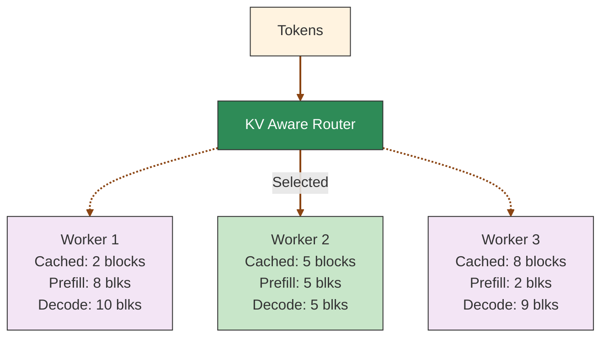

This page explains how the Dynamo router evaluates workers, chooses a target, and fits into the request path. For CLI flags and tuning knobs, see [Configuration and Tuning](router-configuration.md).

## KV Cache Routing

KV cache routing optimizes large language model inference by intelligently directing requests to workers with the most relevant cached data. By maximizing cache reuse, it reduces redundant computation and improves both throughput and latency.



KV cache reuse introduces complexity to LLM serving load balancing. While it can significantly reduce computation costs, routing strategies that ignore worker-specific KV states can lead to:
- Missed cache reuse opportunities due to suboptimal worker selection
- System throughput degradation from uneven request distribution across workers

The router uses a cost function that considers both the prefill cost (influenced by cached blocks) and the decode load to make optimal routing decisions.

## Cost Calculation

1. **Prefill blocks**: Calculated by dividing the number of tokens requiring prefill processing by the block size. The system predicts this based on input tokens and available cached blocks per worker, updating the count when the first output token signals prefill completion.
2. **Decode blocks**: Estimated from the request's input tokens and each worker's active sequences. The count updates when requests complete and their blocks are freed.
3. **Cost formula**: `cost = overlap_score_weight * prefill_blocks + decode_blocks`

Lower costs indicate better routing choices.
`overlap_score_weight` balances cache hit optimization against load distribution.
Higher weights favor cache reuse (improving TTFT), while lower weights prioritize even load distribution (improving ITL).

## Worker Selection

The router selects the worker with the lowest cost. When `router_temperature` is set to a non-zero value, the router uses softmax sampling on the normalized cost logits to introduce randomness in the selection, which can help with load distribution.

Example calculation with `overlap_score_weight = 1.0`:
- Worker 1: cost = 1.0 * 8 + 10 = 18
- **Worker 2: cost = 1.0 * 5 + 5 = 10** (selected - lowest cost)
- Worker 3: cost = 1.0 * 2 + 9 = 11

## Using the KV Cache Router

To enable KV cache-aware routing, start the frontend node like this:

```bash
python -m dynamo.frontend --router-mode kv
```

When KV blocks are created or removed, the engine notifies the Dynamo router, which then identifies the worker with the best matching blocks and routes traffic accordingly.

To evaluate the benefits of KV-aware routing, compare your workload's performance using `--router-mode random|round-robin` against KV-aware routing.

For detailed CLI arguments and advanced configuration options, see [Configuration and Tuning](router-configuration.md).

## Basic Routing

Dynamo supports several routing strategies when sending requests from one component to another component's endpoint.

First, create a client tied to a component endpoint. Here we get a client tied to the `generate` endpoint of the `VllmWorker` component.

```python
client = runtime.endpoint("dynamo.VllmWorker.generate").client()
```

You can then use the default routing methods exposed by the client class to send requests to the `VllmWorker` component.

- **Random routing**: Default strategy, available via `client.generate()` or `client.random()`
- **Round-robin routing**: Cycles through available workers via `client.round_robin()`
- **Direct routing**: Explicitly targets a specific worker via `client.direct(input, component_id)`
- **Least-loaded routing**: Routes to the worker with fewest active connections via `--router-mode least-loaded`
- **Device-aware weighted routing**: Routes using CPU/non-CPU ratio budgeting plus least-loaded selection within the selected device group via `--router-mode device-aware-weighted`

In disaggregated prefill paths it skips bootstrap optimization and uses the synchronous prefill path, matching power-of-two routing.

KV cache routing uses direct routing with a special worker selection algorithm.

For benchmarking KV router performance, see the [KV Router A/B Benchmarking Guide](../../benchmarks/kv-router-ab-testing.md).
For custom routing logic and advanced patterns, see [Routing Patterns](router-examples.md#routing-patterns).

## Device-Aware Weighted Routing

`device-aware-weighted` is designed for heterogeneous fleets where CPU and non-CPU workers share the same endpoint. Instead of comparing raw in-flight counts, the router compares a capability-normalized load across the CPU and non-CPU groups, then selects the least-loaded worker within the winning group.

```text
normalized_load = total_inflight(group) / (instance_count(group) x throughput_weight)
```

The throughput weight is `1` for CPU workers and `DYN_ENCODER_CUDA_TO_CPU_RATIO` for non-CPU workers. This lets the router route proportionally to device capability instead of permanently starving slower devices.

When only one device class is present, the behavior degenerates to standard least-loaded routing.
