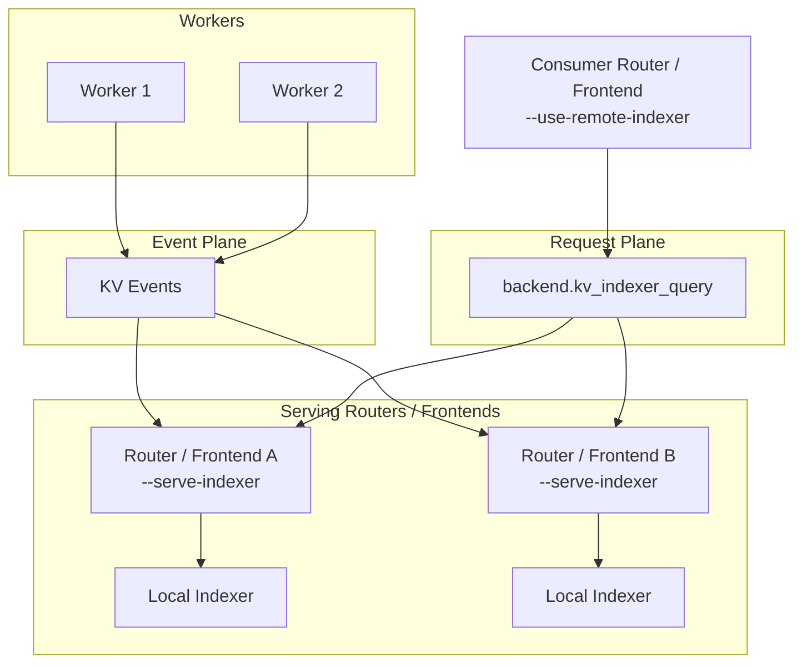

This page covers day-2 operational topics for router deployments. For flags and tuning guidance, see [Configuration and Tuning](router-configuration.md).

## Serving Multiple Router Replicas

For improved fault tolerance, you can launch multiple frontend-plus-router replicas. If multiple `dynamo.frontend` processes share the same host or network namespace, give each instance a different HTTP port. In Kubernetes or on separate hosts, replicas can usually reuse the same container port. Alternatively, you can deploy the router separately as the standalone `python -m dynamo.router` service.

## Dynamo-Native Remote Indexer

For Dynamo-native deployments, the remote indexer is served by `dynamo.frontend` or `dynamo.router`, not by `dynamo.indexer`.

- Use `--serve-indexer` on router or frontend replicas that should expose `kv_indexer_query` from the worker component.
- Use `--use-remote-indexer` on consumer routers or frontends that should query that served endpoint instead of maintaining a local overlap indexer.
- `dynamo.indexer` remains the standalone HTTP plus ZMQ microservice for non-Dynamo or direct-ZMQ deployments.

Frontend example:

```bash
# Serving anchors
python -m dynamo.frontend --router-mode kv --serve-indexer

# Consumer frontend
python -m dynamo.frontend --router-mode kv --use-remote-indexer
```

The served service is request-plane only. Each serving router or frontend keeps its normal local KV event ingestion, gap detection, and worker-query recovery path; remote consumers only issue hash-based overlap queries.

Approximate mode (`--no-router-kv-events`) is singleton-only for remote serving: only one `--serve-indexer` replica may exist for a given worker component. Event-driven mode allows multiple serving replicas behind the same worker component.



## Router State Management

The KV router tracks two types of state:

1. **Prefix blocks (cached KV blocks)**: Maintained in a radix tree, tracking which blocks are cached on each worker. This state is persistent. In local indexer mode, state is rebuilt from workers on startup. In JetStream mode (`--router-durable-kv-events`) it is backed by JetStream events and object store snapshots.
2. **Active blocks (decoding blocks)**: Tracks blocks currently being used for active generation requests. This state is ephemeral. When a new router replica starts, it begins with zero active block knowledge but becomes eventually consistent as it handles requests.

For the architecture behind these states, see [Router Design](../../design-docs/router-design.md).

## Enabling Router Replica Synchronization

```bash
# Router replica 1
python -m dynamo.frontend --router-mode kv --http-port 8000 --router-replica-sync

# Router replica 2
python -m dynamo.frontend --router-mode kv --http-port 8001 --router-replica-sync
```

The `--router-replica-sync` flag enables active block synchronization between replicas:
- Active blocks are shared via NATS core messaging.
- Replicas exchange routing decisions to maintain consistent load estimates.
- A new replica starts with zero active blocks but quickly converges through request handling and active syncing with other replicas.

Without this flag, each replica maintains its own isolated view of active blocks, which can lead to suboptimal routing.

## Persistence and Recovery

Persistence behavior depends on the event transport mode.

### NATS Core / Event Plane with Local Indexer Mode

- State persists on workers. Events are fire-and-forget, but workers retain their local indexer state.
- On startup, the router queries each worker's local indexer to rebuild state.
- Recovery depends on workers being available. If a worker is down, its blocks cannot be recovered.
- This mode keeps the infrastructure simpler because JetStream is not required.

For more on gap detection and replay, see [KV Event Replay — Dynamo vs vLLM](kv-event-replay-comparison.md).

### JetStream Mode

JetStream mode requires `--router-durable-kv-events` on both frontend and workers.

- Prefix blocks are stored in NATS JetStream with 1-hour retention.
- Snapshots are saved to NATS object store at configurable thresholds.
- New replicas automatically restore this state on startup.
- You can launch a third router replica even if the first two are down, and it will recover the full prefix state.

```bash
python -m dynamo.frontend --router-mode kv --http-port 8002 --router-replica-sync
```

>[!Note]
> If you need to start with a fresh state in JetStream mode, you have two options:
> 1. Use a different namespace or component, which creates a new stream and NATS object store path.
> 2. Launch a router with `--router-reset-states`, which purges the entire stream and radix snapshot. Only do this when launching the first router replica in a component, because it can bring existing replicas into an inconsistent state.

## Additional Notes

State persistence depends on the event transport mode:
- **NATS Core / event plane mode**: State persists on workers, and the router rebuilds state by querying workers on startup.
- **JetStream mode**: State persists across router restarts via JetStream and NATS object store snapshots.
- **No KV events** (`--no-router-kv-events`): State persistence is not supported.

Request-plane transport is independent of KV event transport. The request plane (`DYN_REQUEST_PLANE` or `--request-plane`) controls how requests reach workers. KV events use NATS in JetStream or NATS Core modes, or ZMQ when `--event-plane zmq` is set. With `--event-plane zmq` and `--discovery-backend file` or `mem`, the router can run without etcd or NATS. When using a NATS-based event plane, NATS is initialized automatically; set `NATS_SERVER=nats://...` to override the default `localhost:4222`.

When `--router-kv-overlap-score-weight` is set to 0, no KV indexer is created and prefix matching is disabled. When `--no-router-kv-events` is set, a KV indexer is still created but no event subscriber is launched; the router predicts cache state from its own routing decisions with TTL-based expiration and pruning.

Backend KV event publishing is independent of the frontend's `--no-router-kv-events` flag. The frontend flag controls whether the router consumes events; backend flags control whether workers publish them. If the router is not consuming events, workers that still publish will waste resources but cause no harm.

- **vLLM**: Pass `--kv-events-config '{"enable_kv_cache_events": false}'` to disable, or `'{"enable_kv_cache_events": true, "publisher": "zmq", "endpoint": "tcp://*:5557"}'` to enable.
- **SGLang**: Pass `--kv-events-config` with a JSON config to enable, or omit it to keep publishing disabled.
- **TRT-LLM**: Pass `--publish-events-and-metrics` to enable, or omit it to keep publishing disabled.

The CLI args `--router-ttl-secs`, `--router-max-tree-size`, and `--router-prune-target-ratio` control local cache management when the router operates without receiving events from workers. When workers are configured to publish KV events, the router relies on worker-side eviction events and these parameters are ignored.

`--router-queue-threshold` and the busy thresholds (`--active-decode-blocks-threshold`, `--active-prefill-tokens-threshold`, `--active-prefill-tokens-threshold-frac`) serve different purposes. Busy thresholds reject a worker entirely from the candidate set when it exceeds a utilization limit. In contrast, `--router-queue-threshold` defers the entire routing decision until at least one worker has capacity, so the request is routed with the freshest load metrics. The busy thresholds can be updated at runtime without restarting the frontend via the `/busy_threshold` HTTP endpoint. For details, see [Request Rejection](../../fault-tolerance/request-rejection.md).
