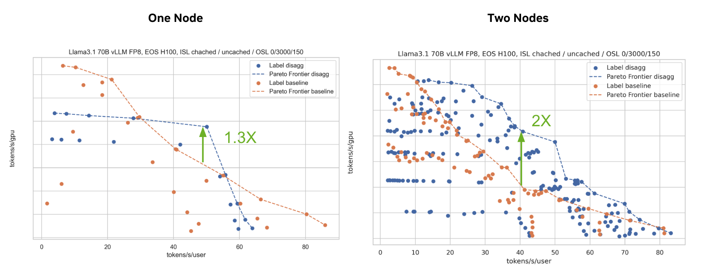
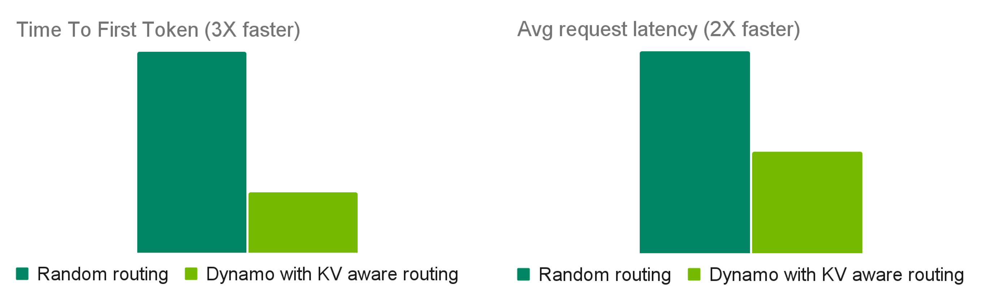
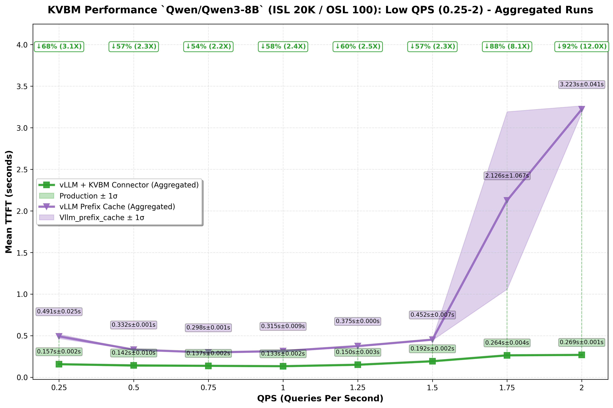

# Dynamo Architecture

Dynamo is a distributed inference runtime for generative AI systems that must operate at high throughput, low latency, and high reliability under changing traffic conditions. It is backend-agnostic (SGLang, TRT-LLM, vLLM, and others) and is built around three cooperating concerns:

- A fast **request path** for token generation
- A responsive **control path** for scaling and placement
- A resilient **state path** for KV reuse and failure recovery

This document presents Dynamo as an architecture, not a feature list: what each plane owns, how requests move, how the system adapts, and how it remains correct under failure.

## Design Goals

Dynamo is designed to satisfy the following goals simultaneously:

1. **Latency stability**: keep TTFT and ITL predictable under bursty and mixed-length traffic.
2. **GPU efficiency**: disaggregate prefill and decode so each can scale independently.
3. **Compute reuse**: minimize KV recomputation through KV-aware routing and cache lifecycle management.
4. **Operational resilience**: treat worker crashes, restarts, and overload as normal operating events.
5. **Deployment portability**: support Kubernetes-native control paths and non-Kubernetes runtime modes.

## Why This Architecture Exists

Modern LLM serving hits recurring bottlenecks:

- **Prefill/decode imbalance** leaves GPUs underutilized when traffic mix shifts ([DistServe](https://arxiv.org/abs/2401.09670)).
- **KV recomputation** increases TTFT and wastes compute when routing ignores cache overlap ([DeepSeek](https://arxiv.org/abs/2501.12948)).
- **Memory pressure** from long contexts and concurrency exceeds HBM capacity without multi-tier cache management ([KVBM](https://docs.nvidia.com/dynamo/components/kvbm), [Mooncake](https://kvcache-ai.github.io/Mooncake/design/mooncake-store.html), [AIBrix](https://blog.vllm.ai/2025/02/21/aibrix-release.html), [FlexKV](https://github.com/taco-project/FlexKV), [LMCache](https://lmcache.ai/)).
- **Dynamic demand** breaks static provisioning assumptions ([AzureTrace](https://github.com/Azure/AzurePublicDataset)).
- **Real-world failures** (pod restart, partition, hot-spot overload) require first-class recovery behavior.

Dynamo addresses these constraints by separating serving, control, and state propagation into explicit planes and control loops.

## Architecture Overview

## System Model

### Request Plane (critical data path)

The request plane is responsible for request/response execution:

- **Frontend** accepts and normalizes requests.
- **Router** selects workers based on load and KV overlap.
- **Prefill workers** compute prompt KV state.
- **Decode workers** generate output tokens.

This path is optimized for low overhead and continuous token streaming.

### Control Plane (adaptation and orchestration path)

The control plane is responsible for desired-state management:

- **Planner** computes scaling targets from live metrics.
- **Dynamo Operator** reconciles Kubernetes resources from Dynamo CRDs.
- **Discovery + Endpoints/CRD** establish liveness and discoverability.
- **Grove/KAI Scheduler path** provides topology-aware placement and grouped scaling in multinode Kubernetes deployments.
- **Model Express** is an optional model-management endpoint when configured.

This path is optimized for correctness and convergence to target capacity.

### Storage & Events Plane (state propagation path)

The storage/events plane is responsible for cache state visibility and movement:

- **KV Events** publish cache lifecycle transitions.
- **KVBM** manages block reuse, eviction, and offload/recall across memory tiers.
- **NIXL** performs high-speed KV/data transfer across workers and memory domains.

This path is optimized for cache reuse and cross-worker handoff efficiency.

## End-to-End Request Narrative (Disaggregated Mode)

1. Client sends request to **Frontend**.
2. Frontend validates/preprocesses and forwards to **Router**.
3. Router chooses a **Prefill worker**.
4. Prefill computes KV and returns transfer metadata.
5. Router chooses a **Decode worker**.
6. Decode receives KV state (typically via **NIXL** transfer path).
7. Decode streams tokens back through Frontend.
8. **KV Events** update cache visibility for future routing decisions.
9. **KVBM** may offload or recall KV blocks based on pressure and reuse potential.

For flow-level detail, see [Architecture Flow](dynamo-flow.md).
For request transport options, see [Request Plane](request-plane.md).

## Control Loops

### Serving Loop

Maintains low-latency request execution across frontend, router, prefill, and decode workers.

### Planning Loop

Maintains capacity alignment with demand:

- Planner consumes runtime metrics.
- Planner computes prefill/decode targets.
- Connector layer applies targets to runtime resources.

Planner supports throughput-based and load-based strategies. See [Planner Design](planner-design.md).

### Resilience Loop

Maintains system continuity under failure:

- Health checks detect unhealthy workers.
- Discovery liveness removes stale endpoints.
- Graceful shutdown drains in-flight work.
- Request migration/cancellation controls in-flight behavior.
- Load shedding prevents cascading collapse under overload.

See [Fault Tolerance](../fault-tolerance/README.md).

## Kubernetes-Native Realization (CRD + Grove)

In Kubernetes deployments, the same architecture maps to declarative resources:

- Dynamo Operator reconciles `DynamoGraphDeployment`.
- Discoverability is derived from `DynamoWorkerMetadata` + EndpointSlices.
- Grove-backed multinode deployments model worker groups as `PodCliqueSet` and `PodClique`.
- Independent prefill/decode elasticity is represented via `PodCliqueScalingGroup` with separate `replicas` and `min` targets.

The diagram labels such as `PodClique A/B`, `ScalingGroup "Prefill"`, `ScalingGroup "Decode"`, and `(replicas, min)` represent this grouped scaling model.

## Fault Tolerance Architecture

Fault tolerance is embedded across layers:

| Layer | Mechanism | Practical effect |
|------|-----------|------------------|
| Request | Migration, cancellation | In-flight work can continue or terminate intentionally |
| Worker | Health checks, graceful shutdown, endpoint draining | Failed/terminating workers stop taking new traffic safely |
| System | Request rejection/load shedding | Prevents overload from propagating across workers |
| Infrastructure | Discovery lease expiry, event-path recovery | Stale membership is removed and traffic reroutes |

This model assumes failures are routine, not exceptional.

## Performance Rationale

### Disaggregated Serving

Separating prefill and decode improves utilization and enables phase-specific scaling.

*Tested on H100 with R1 Distilled Llama 70B FP8 on vLLM. 3K ISL / 150 OSL.*

### KV-Aware Routing

Routing with cache overlap + load signals reduces prefill recomputation and improves latency.
For an external production case study, see [How Baseten achieved 2x faster inference with NVIDIA Dynamo](https://www.baseten.co/blog/how-baseten-achieved-2x-faster-inference-with-nvidia-dynamo/#how-baseten-uses-nvidia-dynamo).

*Tested with 100K requests to R1 using R1 Distilled Llama 70B FP8 on 2 H100 nodes. Avg 4K ISL / 800 OSL.*

### KV Block Manager (KVBM)

KVBM extends effective cache capacity using multi-tier memory offload/recall.

*Tested across QPS values using Qwen3-8B on H100. Avg 20K ISL / 100 OSL.*

### NIXL Data Transfer

NIXL reduces KV handoff cost in distributed serving by optimizing cross-worker transfer behavior across heterogeneous memory.

## Implementation Model

- **Rust** for performance-sensitive runtime components.
- **Python** for backend integration and extensibility.
- Modular subsystem boundaries so routing, planning, memory, and transport can evolve independently.

## Related Documentation

- [Architecture Flow](dynamo-flow.md)
- [Router Design](router-design.md)
- [Planner Design](planner-design.md)
- [Discovery Plane](discovery-plane.md)
- [Event Plane](event-plane.md)
- [Request Plane](request-plane.md)
- [Fault Tolerance](../fault-tolerance/README.md)
- [Grove](../kubernetes/grove.md)

## Acknowledgements

Dynamo is informed by prior open-source work from:

- vLLM
- SGLang
- DistServe
- Mooncake
- AIBrix
- BentoML
