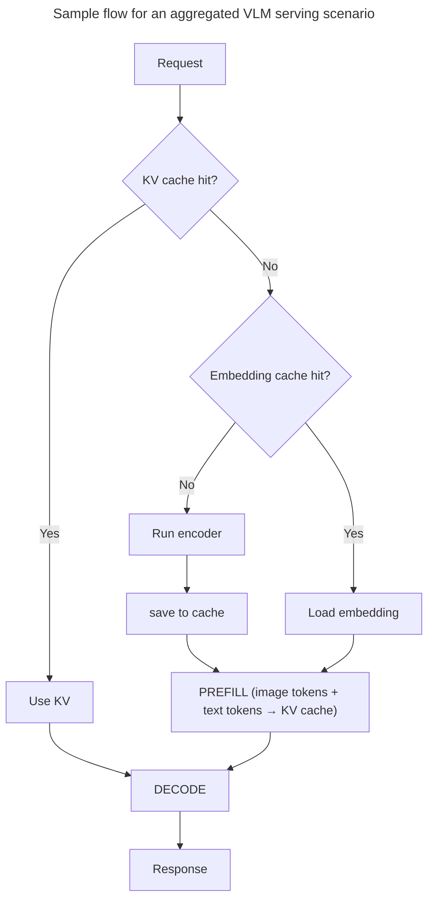

Dynamo supports multimodal inference across multiple LLM backends, enabling models to process images, video, and audio alongside text.

<Warning>
**Security Requirement**: Multimodal processing must be explicitly enabled at startup. See the relevant backend documentation ([vLLM](multimodal-vllm.md), [SGLang](multimodal-sglang.md), [TRT-LLM](multimodal-trtllm.md)) for the necessary flags. This prevents unintended processing of multimodal data from untrusted sources.
</Warning>

## Key Features

Dynamo provides support for improving latency and throughput for vision-and-language workloads through the following features, that can be used together or separately, depending on your workload characteristics:
| Feature | Description |
|---------|-------------|
| **[Embedding Cache](embedding-cache.md)** | CPU-side LRU cache that skips re-encoding repeated images |
| **[Encoder Disaggregation](encoder-disaggregation.md)** | Separate vision encoder worker for independent scaling |
| **[Multimodal KV Routing](multimodal-kv-routing.md)** | MM-aware KV cache routing for optimal worker selection |

## Support Matrix

| Stack | Image | Video | Audio |
|-------|-------|-------|-------|
| **[vLLM](https://github.com/ai-dynamo/dynamo/blob/main/docs/features/multimodal/multimodal-vllm.md)** | ✅ | 🧪  | 🧪 |
| **[TRT-LLM](https://github.com/ai-dynamo/dynamo/blob/main/docs/features/multimodal/multimodal-trtllm.md)** | ✅ | ❌ | ❌ |
| **[SGLang](https://github.com/ai-dynamo/dynamo/blob/main/docs/features/multimodal/multimodal-sglang.md)** | ✅ | 🧪 | ❌ |

**Status:** ✅ Supported | 🧪 Experimental | ❌ Not supported

## Example Workflows

Reference implementations for deploying multimodal models:

- [vLLM multimodal examples](https://github.com/ai-dynamo/dynamo/tree/main/examples/backends/vllm/launch) (image, video)
- [TRT-LLM multimodal examples](https://github.com/ai-dynamo/dynamo/tree/main/examples/backends/trtllm/launch)
- [SGLang multimodal examples](https://github.com/ai-dynamo/dynamo/tree/main/examples/backends/sglang/launch)

## Backend Documentation

Detailed deployment guides, configuration, and examples for each backend:

- **[vLLM Multimodal](https://github.com/ai-dynamo/dynamo/blob/main/docs/features/multimodal/multimodal-vllm.md)**
- **[TensorRT-LLM Multimodal](https://github.com/ai-dynamo/dynamo/blob/main/docs/features/multimodal/multimodal-trtllm.md)**
- **[SGLang Multimodal](https://github.com/ai-dynamo/dynamo/blob/main/docs/features/multimodal/multimodal-sglang.md)**
