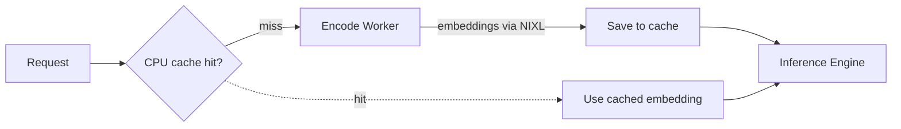

## Overview

The embedding cache is a CPU-side LRU cache that stores vision encoder outputs. When the same image appears in multiple requests, the cached embedding is reused instead of running the vision encoder again. This reduces GPU load on the encoder and lowers latency for repeated images.
> Note: This feature can also be referred to as **encoder cache**. Embedding cache is separate from KV cache, which reuses attention key/value state after prefill to skip prefill and go straight to decode. For KV cache reuse and routing, see [Multimodal KV Routing](https://github.com/ai-dynamo/dynamo/blob/main/docs/features/multimodal/multimodal-kv-routing.md).
## When to Use

Use the embedding cache when your workload includes repeated images across requests. Common scenarios:

- Product catalog queries where users ask about the same product images
- Document processing pipelines that reference shared diagrams or figures
- Chat sessions where the same image is discussed across multiple turns, like an architecture diagram in a code-gen use case.

If your workload consists entirely of unique images, the cache provides no benefit.

## Support Matrix

| Backend | Aggregated | Disaggregated (E/PD) | Notes |
|---------|------------|----------------------|-------|
| **vLLM** | ✅ | ✅ | Aggregated uses vLLM-native `ec_both`; disaggregated uses Dynamo `EmbeddingCacheManager` |
| **TRT-LLM** | ❌ | ✅ | Dynamo `MultimodalEmbeddingCacheManager` in PD worker |
| **SGLang** | ❌ | ❌ | Not supported yet |

This support requires vLLM `0.17.0` or newer.

## How It Works

The prefill worker owns the CPU-side LRU cache. On a hit, the encode worker is skipped entirely. On a miss, the encode worker produces the embedding, transfers it via NIXL, and the prefill worker saves it to the cache.



**Launch (vLLM):**

```bash
cd $DYNAMO_HOME/examples/backends/vllm
bash launch/disagg_multimodal_e_pd.sh --multimodal-embedding-cache-capacity-gb 10
```

**Launch (TRT-LLM):**

```bash
cd $DYNAMO_HOME/examples/backends/trtllm
./launch/disagg_e_pd.sh --multimodal-embedding-cache-capacity-gb 10
```

## Configuration

| Parameter | Description | Default |
|-----------|-------------|---------|
| `--multimodal-embedding-cache-capacity-gb` | CPU-side LRU cache size in GB | 0 (disabled) |

Set the capacity based on your expected working set of unique images. A larger cache holds more embeddings but consumes more host memory.

See the backend-specific documentation ([vLLM](https://github.com/ai-dynamo/dynamo/blob/main/docs/features/multimodal/multimodal-vllm.md#embedding-cache), [TRT-LLM](https://github.com/ai-dynamo/dynamo/blob/main/docs/features/multimodal/multimodal-trtllm.md#embedding-cache)) for more details.
