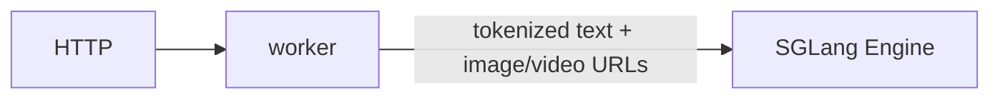
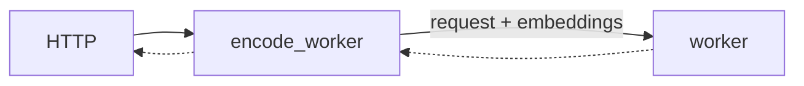
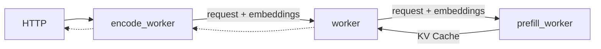

This document provides a comprehensive guide for multimodal inference using SGLang backend in Dynamo. SGLang multimodal supports **EPD**, **E/PD**, and **E/P/D** flows, with NIXL (RDMA) for zero-copy tensor transfer in disaggregated modes.

## Support Matrix

| Modality | Input Format | Aggregated | Disaggregated | Notes |
|----------|--------------|------------|---------------|-------|
| **Image** | HTTP/HTTPS URL | Yes | Yes | Vision encoder generates embeddings |
| **Image** | Data URL (Base64) | No | No |  |
| **Video** | HTTP/HTTPS/`file://` URL | Yes | No | Aggregated only |
| **Audio** | HTTP/HTTPS URL | No | No |  |

### Supported URL Formats

| Format | Example | Description |
|--------|---------|-------------|
| **HTTP/HTTPS** | `http://example.com/image.jpg` | Remote media files |
| **file://** | `file:///tmp/test.mp4` | Local files accessible to the backend |

## Deployment Patterns

SGLang supports EPD, E/PD, and E/P/D patterns. See [Multimodal Architecture Patterns](README.md#architecture-patterns) for detailed explanations.

| Pattern | Supported | Launch Script | Notes |
|---------|-----------|---------------|-------|
| EPD (Simple Aggregated) | ✅ | `agg.sh` | Internal encoding |
| E/PD (Encode Separate) | ✅ | `multimodal_epd.sh` | Vision encoder separate |
| E/P/D (Full Disaggregation) | ✅ | `multimodal_disagg.sh` | KV cache via bootstrap |
| EP/D (Traditional Disaggregated) | ❌ | N/A | Not supported |

### Component Flags

| Component | Flag | Purpose |
|-----------|------|---------|
| Encode Worker | `--multimodal-encode-worker` | Frontend-facing, vision encoding, embeddings generation (Rust frontend tokenizes) |
| PD Worker | `--multimodal-worker` | Prefill + Decode with embeddings |
| Decode Worker | `--multimodal-worker --serving-mode=decode` | Entry point for disaggregation |
| Prefill Worker | `--multimodal-worker --serving-mode=prefill` | Called by Decode, bootstrap coordination |

### SGLang-Specific Characteristics

- **Vision Encoder in Python**: Encode worker uses SGLang's MMEncoder for model-agnostic vision encoding
- **Token Expansion**: Single `<|image_pad|>` token replaced with N tokens based on embedding shape
- **NIXL Transfer**: Embeddings transferred from Encoder → PD Worker using NIXL
- **No Rust Processing**: All tokenization and image handling happens in Python

## Use the Latest Release

We recommend using the latest stable release of dynamo to avoid breaking changes:

[](https://github.com/ai-dynamo/dynamo/releases/latest)

You can find the [latest release](https://github.com/ai-dynamo/dynamo/releases/latest) and check out the corresponding branch with:

```bash
git checkout $(git describe --tags $(git rev-list --tags --max-count=1))
```

## EPD Serving (Simple Aggregated)

### Components

- worker: [DecodeWorkerHandler](https://github.com/ai-dynamo/dynamo/blob/main/components/src/dynamo/sglang/request_handlers/llm/decode_handler.py) handles encoding, prefilling, and decoding in a single process.

### Workflow

The `DecodeWorkerHandler` receives multimodal requests with image/video URLs and passes them directly to SGLang's engine. SGLang's internal `mm_data_processor` handles image/video fetching, loading, encoding, and token expansion.



### Launch

```bash
cd $DYNAMO_HOME/examples/backends/sglang
./launch/agg_vision.sh --model-path Qwen/Qwen2-VL-7B-Instruct
```

**Client:**

```bash
curl http://localhost:8000/v1/chat/completions \
  -H "Content-Type: application/json" \
  -d '{
    "model": "Qwen/Qwen2.5-VL-7B-Instruct",
    "messages": [
      {
        "role": "user",
        "content": [
          {
            "type": "text",
            "text": "Explain why Roger Federer is considered one of the greatest tennis players of all time"
          },
          {
            "type": "image_url",
            "image_url": {
              "url": "http://images.cocodataset.org/test2017/000000155781.jpg"
            }
          }
        ]
      }
    ],
    "max_tokens": 50,
    "stream": false
  }' | jq
```

Video requests use the same aggregated path:

```bash
curl http://localhost:8000/v1/chat/completions \
  -H "Content-Type: application/json" \
  -d '{
    "model": "Qwen/Qwen2-VL-7B-Instruct",
    "messages": [
      {
        "role": "user",
        "content": [
          {
            "type": "text",
            "text": "Describe the video in detail"
          },
          {
            "type": "video_url",
            "video_url": {
              "url": "https://samplelib.com/mp4/sample-5s.mp4"
            }
          }
        ]
      }
    ],
    "max_tokens": 50,
    "stream": false
  }' | jq
```

## E/PD Serving (Encode Separate)

### Components

- workers:
  - [MultimodalEncodeWorkerHandler](https://github.com/ai-dynamo/dynamo/blob/main/components/src/dynamo/sglang/request_handlers/multimodal/encode_worker_handler.py) for image encoding and embeddings generation
  - [MultimodalWorkerHandler](https://github.com/ai-dynamo/dynamo/blob/main/components/src/dynamo/sglang/request_handlers/multimodal/worker_handler.py) for prefilling and decoding.

### Workflow

The Rust frontend tokenizes the request and extracts image URLs into `multi_modal_data`. The `MultimodalEncodeWorker` receives the pre-tokenized request, downloads and encodes the image, and passes the embeddings to the MultimodalWorker. The work complete event is sent via NATS, while the embeddings tensor is transferred via RDMA through the NIXL interface. The `MultimodalWorker` then prefills and decodes the prompt in the same engine, as in the [LLM aggregated serving](../../backends/sglang/README.md) example. Only the encode worker is registered to the Dynamo frontend as an available endpoint. The PD worker does NOT register - it is an internal component and communicates via NATS.




### Launch

```bash
cd $DYNAMO_HOME/examples/backends/sglang
./launch/multimodal_epd.sh
```

**Client:**

```bash
curl http://localhost:8000/v1/chat/completions \
  -H "Content-Type: application/json" \
  -d '{
    "model": "Qwen/Qwen2.5-VL-7B-Instruct",
    "messages": [
      {
        "role": "user",
        "content": [
          {
            "type": "text",
            "text": "Explain why Roger Federer is considered one of the greatest tennis players of all time"
          },
          {
            "type": "image_url",
            "image_url": {
              "url": "http://images.cocodataset.org/test2017/000000155781.jpg"
            }
          }
        ]
      }
    ],
    "max_tokens": 50,
    "stream": false
  }' | jq
```

## E/P/D Serving (Full Disaggregation)

### Components

- workers:
  - [MultimodalEncodeWorkerHandler](https://github.com/ai-dynamo/dynamo/blob/main/components/src/dynamo/sglang/request_handlers/multimodal/encode_worker_handler.py) for image encoding and embeddings generation
  - [MultimodalWorkerHandler](https://github.com/ai-dynamo/dynamo/blob/main/components/src/dynamo/sglang/request_handlers/multimodal/worker_handler.py) for decoding
  - [MultimodalPrefillWorkerHandler](https://github.com/ai-dynamo/dynamo/blob/main/components/src/dynamo/sglang/request_handlers/multimodal/worker_handler.py) for prefilling

### Workflow

In models like Qwen2.5-VL, embeddings are only required during the prefill stage. The Rust frontend tokenizes and extracts image URLs. The `MultimodalEncodeWorker` receives the pre-tokenized request, encodes images, and transfers embeddings via NIXL to the Decode Worker (the entry point for disaggregation), which then coordinates with the Prefill Worker. The Prefill Worker processes the embeddings and forwards the KV cache back to the Decode Worker for token generation.



### Launch

```bash
cd $DYNAMO_HOME/examples/backends/sglang
./launch/multimodal_disagg.sh
```

**Client:**

```bash
curl http://localhost:8000/v1/chat/completions \
  -H "Content-Type: application/json" \
  -d '{
    "model": "Qwen/Qwen2.5-VL-7B-Instruct",
    "messages": [
      {
        "role": "user",
        "content": [
          {
            "type": "text",
            "text": "Explain why Roger Federer is considered one of the greatest tennis players of all time"
          },
          {
            "type": "image_url",
            "image_url": {
              "url": "http://images.cocodataset.org/test2017/000000155781.jpg"
            }
          }
        ]
      }
    ],
    "max_tokens": 50,
    "stream": false
  }' | jq
```

## Bootstrap Coordination

SGLang disaggregation uses a bootstrap mechanism for P->D coordination:

### Request Flow (Important)

```text
Client → Frontend → Processor → Encode → DECODE Worker → Prefill Worker
                                               ↑
                                    Entry point for disaggregation!
```

### Bootstrap Process

1. **Decode Worker** receives request from Encode Worker
2. **Decode Worker** calls Prefill Worker via NATS to request bootstrap info
3. **Prefill Worker** generates `{host, port, room}` and returns immediately
4. **Both workers** connect to same "room" using bootstrap coordinates
5. **SGLang internally** transfers KV cache state via bootstrap connection (not NIXL)

### Key Difference from vLLM

- vLLM: Frontend → Prefill → Decode (Prefill is entry point)
- SGLang: Frontend → Processor → Encode → **Decode → Prefill** (Decode is entry point)

## Inter-Component Communication

### Control Flow (NATS)

All component-to-component communication happens via NATS:

#### E/PD Mode (Encode Separate)

```text
Processor → Encode Worker → PD Worker
  (NATS)        (NATS + NIXL embeddings)
```

#### E/P/D Mode (Full Disaggregation)

```text
Processor → Encode Worker → DECODE Worker → Prefill Worker
  (NATS)        (NATS)            (NATS)
                             ↓
                    Decode requests bootstrap
                             ↓
                    Prefill returns {host, port, room}
                             ↓
                    Both connect via bootstrap
                             ↓
                    SGLang internal KV cache transfer
```

### Detailed Message Flow

```text
Processor → Encode Worker:
  - NATS round_robin with SglangMultimodalRequest
  - Contains: tokenized input_ids, image URL, sampling params

Encode Worker → Decode/PD Worker:
  - NATS round_robin to "backend" component
  - Contains: expanded token_ids, NIXL metadata, embeddings shape
  - NIXL transfer: embeddings tensor

Decode Worker → Prefill Worker (disagg only):
  - NATS call to "prefill" component
  - Decode requests bootstrap coordinates
  - Prefill returns: {bootstrap_host, bootstrap_port, bootstrap_room}

Prefill ↔ Decode (via bootstrap):
  - SGLang internal connection (not NATS)
  - KV cache state shared via bootstrap mechanism
```

### Data Transfer (NIXL)

NIXL is used only for embedding transfer:

```python
# Encode Worker
descriptor = connect.Descriptor(precomputed_embeddings)
with connector.create_readable(descriptor) as readable:
    request.serialized_request = readable.metadata()
    await pd_worker_client.round_robin(request)
    await readable.wait_for_completion()

# PD Worker
embeddings = torch.empty(request.embeddings_shape, dtype=torch.float16)
descriptor = connect.Descriptor(embeddings)
read_op = await connector.begin_read(request.serialized_request, descriptor)
await read_op.wait_for_completion()
```

## Vision Encoding Details

### Encode Worker Components

The encode worker uses SGLang's `MMEncoder` for model-agnostic vision encoding. `MMEncoder` handles vision model loading, image preprocessing, and feature extraction internally:

```python
from sglang.srt.disaggregation.encode_server import MMEncoder

self.encoder = MMEncoder(
    server_args=config.server_args,
    dist_init_method="tcp://127.0.0.1:0",
    rank=0,
)

# At request time:
image_grid_dim, mm_embedding = await self.encoder._encode([image_url])
```

### Token Expansion Process

1. Processor inserts single image token (e.g., `<|image_pad|>`)
2. Encode worker generates embeddings: `shape = (batch, num_patches, hidden_dim)`
3. Encode worker replaces single token with `num_patches` tokens
4. Downstream worker receives expanded token sequence

Example:

```python
# Before: ["Hello", "<|image_pad|>", "world"]
# After:  ["Hello", "<|image_pad|>", "<|image_pad|>", ...(576 tokens), "world"]
```

## Chat Template Processing

SGLang uses its own chat template system:

```python
from sglang.srt.parser.conversation import chat_templates

conv = chat_templates["qwen2-vl"].copy()
conv.append_message(conv.roles[0], f"{conv.image_token} Describe this image")
processed = tokenizer(text=conv.get_prompt(), return_tensors="pt")
```

Supported templates: `qwen2-vl`, `llama-3`, `vicuna`, etc.

## NIXL Usage

| Use Case | NIXL Used? | Data Transfer | Notes |
|----------|------------|---------------|-------|
| EPD (Simple Aggregated) | No | N/A | All processing internal to SGLang |
| E/PD (Encode Separate) | Yes | Encoder → PD (embeddings) | Vision encoder separate |
| E/P/D (Full Disaggregation) | Yes | Encoder → Prefill (embeddings) | KV cache via SGLang bootstrap |

**Key Difference:** SGLang P/D uses bootstrap mechanism, not NIXL for KV cache like vLLM.

## Environment Variables

### `SGLANG_ENCODER_MM_LOAD_WORKERS`

Controls how many threads the encoder uses to fetch and load images concurrently. When a request contains multiple images (URLs, file paths, or base64 data), each image is loaded in a separate thread. Default is 4. Increase if image loading (network fetch or disk I/O) is the bottleneck rather than GPU compute. Has no effect if the vision encoder itself is the bottleneck, since encoding is sequential on GPU after all images are loaded.

```bash
# Example: allow up to 16 concurrent image loads per encoder
export SGLANG_ENCODER_MM_LOAD_WORKERS=16
```

Only applies to the EPD encode worker (which uses [SGLang's MMEncoder](https://github.com/sgl-project/sglang/blob/main/python/sglang/srt/disaggregation/encode_server.py) internally).

## Profiling

Dynamo's SGLang multimodal workers include NVTX markers for `nsys` profiling. They are disabled by default (zero overhead) and enabled by setting `DYN_NVTX=1`.

```bash
cd $DYNAMO_HOME/examples/backends/sglang
DYN_NVTX=1 nsys profile --trace=cuda,nvtx -o profile.nsys-rep \
  bash launch/multimodal_epd.sh ...
```

| ENV Variable | Default | Description |
|---|---|---|
| `DYN_NVTX` | `0` | Set to `1` to enable NVTX range/mark annotations in multimodal encode/prefill/decode worker paths for `nsys` profiling |

Key NVTX ranges emitted:

| Range | Worker | Description |
|-------|--------|-------------|
| `mm:enc:generate` | Encode | Full encode request lifetime |
| `mm:enc:vision_encode` | Encode | Vision encode call (`MMEncoder._encode`) |
| `mm:enc:embedding_transfer` | Encode | Embedding handoff to downstream worker |
| `mm:nixl:begin_read` | PD (agg) / Prefill | Begin NIXL read operation for embeddings |
| `mm:nixl:wait_completion` | PD (agg) / Prefill | Wait for NIXL embedding transfer completion |
| `mm:pd:generate` | Aggregated worker / Decode worker (`MultimodalWorkerHandler`) | Full worker-side request lifetime |
| `mm:pd:generate_agg` | PD (agg) | Aggregated generation path |
| `mm:pd:load_multimodal` | PD (agg) | Build multimodal items from transferred embeddings |
| `mm:pd:generate_disagg` | Decode worker (disagg entrypoint) | Disaggregated generation path |
| `mm:prefill:bootstrap` | Prefill (disagg) | Bootstrap coordination path before returning `{bootstrap_host, bootstrap_port, bootstrap_room}` |
| `mm:prefill:load_multimodal` | Prefill (disagg) | Build multimodal items from transferred embeddings in the prefill worker |
| `mm:prefill:engine_async_generate` | Prefill (disagg) | SGLang prefill engine invocation (`engine.async_generate`) |
| `mm:pd:ttft` | Aggregated worker / Decode worker (`MultimodalWorkerHandler`) | Worker-entry TTFT: from request arrival at this worker to first output token (excludes client->frontend->worker network transit) |
| `mm:dec:first_token` | Aggregated worker / Decode worker (`MultimodalWorkerHandler`) | Decode-stage first-token range (starts when decode stream is launched; not worker-entry TTFT) |

## Known Limitations

- **No Data URL support** - Only HTTP/HTTPS URLs supported; `data:image/...` base64 URLs not supported
- **No pre-computed embeddings** - Cannot use `.pt`, `.pth`, `.bin` embedding files; vision encoder runs for every request
- **No video support** - No video encoder implementation
- **No audio support** - No audio encoder implementation
- **Only Processor registers with Dynamo** - Workers are internal components, frontend routes to Processor only
- **Disaggregated routing** - Decode Worker is the entry point (calls Prefill), cannot route directly to Prefill workers
- **Limited model generalization** - Token expansion logic is model-specific; adding new models may require implementation updates

## Supported Models

SGLang multimodal **only supports image-based vision-language models**:

- **Qwen2-VL** / **Qwen2.5-VL** - `Qwen/Qwen2.5-VL-7B-Instruct`
- **Qwen3-VL** - `Qwen/Qwen3-VL-30B-A3B-Instruct`
- Models supported by SGLang's MMEncoder

## Key Files

| File | Description |
|------|-------------|
| `components/src/dynamo/sglang/main.py` | Component initialization, Encode Worker registers |
| `components/src/dynamo/sglang/request_handlers/multimodal/encode_worker_handler.py` | Frontend-facing: vision encoding, embeddings generation (receives pre-tokenized input) |
| `components/src/dynamo/sglang/request_handlers/multimodal/worker_handler.py` | PD/Prefill/Decode workers, NIXL read |
| `components/src/dynamo/sglang/protocol.py` | Request/response data structures |
| `components/src/dynamo/sglang/register.py` | Registration logic (called for Encode Worker) |
