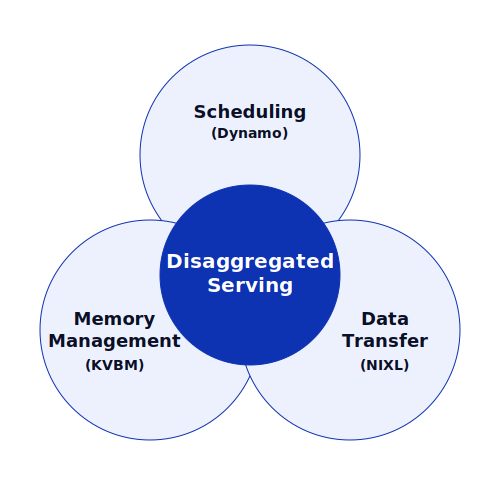
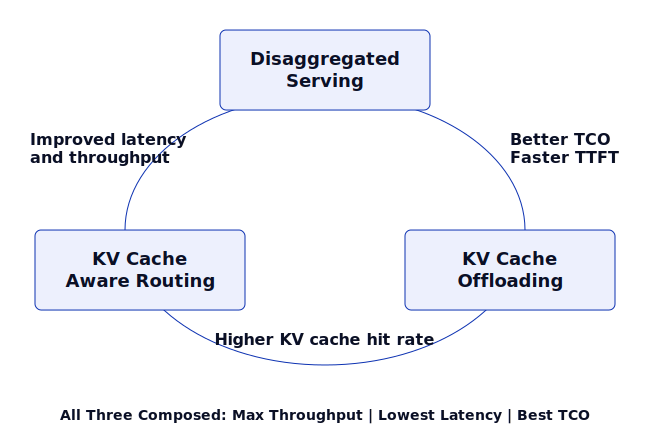

# Introduction to Dynamo

Dynamo is an open-source, high-throughput, low-latency inference framework, designed to serve generative AI workloads in distributed environments. This page gives an overview of Dynamo's design principles, performance benefits, and production-grade features.

> [!TIP]
> Looking to get started right away? See the [Quickstart](quickstart.md) to install and run Dynamo in minutes.

## Why Dynamo?

Inference engines optimize the GPU; Dynamo optimizes the system around them.

- **System-level optimization on top of any engine** -- Inference engines optimize the single-GPU forward pass. Dynamo adds the distributed layer: disaggregated serving, smart routing, KV cache management across memory tiers, and auto-scaling.
- **Composable performance improvement techniques** -- The techniques, disaggregated serving, KV cache-aware routing, and KV cache offloading, each improve performance on their own; using them together yields compounding gains.
- **Engine-agnostic** -- Works with vLLM, SGLang, and TensorRT-LLM. Swap engines without changing your serving infrastructure. Extending support for Intel XPU and AMD hardware.
- **Production-ready at scale** -- Dynamo covers the full deployment lifecycle: automatic configuration (AIConfigurator), runtime auto-scaling (Planner), topology-aware gang scheduling (Grove), fault tolerance, and observability.
- **Modular adoption** -- Start with one component (e.g., just the Router for KV-aware routing on top of your existing engine). Adopt more as needed. Each component is independently installable via pip.

## Design Principles

### Strong Foundations for AI Inference

Dynamo adds system-level optimizations on top of inference engines. To provide such optimizations, Dynamo takes an operating systems approach by laying down the foundations for scheduling, memory management, and data transfer. These foundations allow Dynamo to evolve as new system-level performance techniques emerge.

One of the motivations for Dynamo's system-level design was to support disaggregated serving: running prefill and decode on different devices so each can be scaled and parallelized independently. Disaggregated serving required three capabilities: (1) scheduling to assign prefill and decode phases without interference, (2) memory management for KV cache offloading and onboarding, and (3) low-latency data transfer to move KV cache between nodes and across the memory hierarchy.



Dynamo's foundations first addressed disaggregated serving, then extended to EPD disaggregation for multimodal, and now support workloads such as diffusion, RL, and agents.

### Modular but Well-Integrated Ecosystem

Dynamo is designed to reduce the burden of replacing an existing stack in production. It offers modular, standalone components as Rust crates and pip wheels. For example, the three foundations of Dynamo for scheduling (Dynamo), memory management (KV Block Manager), and data transfer (NIXL) are each independently installable:

```bash
pip install ai-dynamo
pip install kvbm
pip install nixl
```

> [!NOTE]
> Pre-built containers with all dependencies are also available. See [Release Artifacts](../reference/release-artifacts.md) for container images.

The Dynamo ecosystem includes these additional modular components, and will continue to grow over time:

| Category | Products | Description |
| :--- | :--- | :--- |
| **Scheduling** | Dynamo | Inference serving for GenAI workloads |
| **Routing** | Router | Smart routing leveraging KV cache hit rate and KV cache load. More algorithms will be added (e.g., agentic routing) |
| **Data Transfer** | [NIXL](https://github.com/ai-dynamo/nixl) | Point-to-point data transfer between GPUs and tiered storage (G1: GPU, G2: CPU, G3: SSD, G4: remote) |
| **Memory** | KVBM (KV Block Manager) | Manage KV cache across memory tiers (G1-G4) with customizable eviction policy |
| **Scaling / Cloud** | Planner | Automatically tune performance in real time for prefill and decode given SLA constraints (TTFT and TPOT) |
| | [Grove](https://github.com/ai-dynamo/grove) | Enables gang scheduling and topology awareness required for Kubernetes multi-node disaggregated serving |
| | [Model Express](https://github.com/ai-dynamo/model-express) | Load model weights fast by caching and transferring them via NIXL to other GPUs. Will also be leveraged for fault tolerance |
| **Perf** | [AIConfigurator](https://github.com/ai-dynamo/aiconfigurator) | Estimate performance for aggregated vs. disaggregated serving based on model, ISL/OSL, HW, etc. Formerly known as LLMPet |
| | [AIPerf](https://github.com/ai-dynamo/aiperf) | Re-architected GenAI-Perf written in Python for maximum extensibility; supports distributed benchmarking |
| | AITune | Given a model or pipeline, searches for best backend to deploy with (e.g., TensorRT, Torch.compile, etc.) (coming soon) |
| | Flex Tensor | Stream weights to GPUs from host memory to run very large language models in GPUs with limited memory capacity (coming soon) |

These components are modular but are designed to work together as a unified family. New components will follow the same design principle.

### Vendor-Agnostic Ecosystem Enablement

Dynamo is ***not designed for vendor lock-in***. Dynamo aims to enable the broader AI ecosystem and to provide the functionality developers need, such as integrations with third-party components.

From the beginning, Dynamo is designed to support all LLM inference engines (vLLM, SGLang, and TensorRT-LLM). Support for additional engines is planned to enable more developer use cases.

**Support for non-NVIDIA hardware** is also available: Dynamo is working with HW vendors such as Intel and AMD to extend hardware support.

The full list of supported ecosystem components:

| **Product Areas** | **Supported Ecosystem Components** |
| :--- | :--- |
| Inference engines | SGLang, TensorRT-LLM, vLLM |
| Kubernetes | Inference gateway |
| Memory management | Dynamo KV Block Manager, [LMCache](../integrations/lmcache-integration.md), [SGLang HiCache](../integrations/sglang-hicache.md), [FlexKV](../integrations/flexkv-integration.md) |
| Networking and storage | Mooncake, DOCA NetIO, GDS, POSIX, S3, 3FS ([supported via NIXL](../design-docs/kvbm-design.md)) |
| Multi-HW | Intel XPU, AMD |

## Performance

Dynamo achieves state-of-the-art LLM performance by composing three core techniques: Disaggregated Serving, KV Cache-Aware Routing, and KV Cache Offloading. These techniques are underpinned by NIXL, a low-latency data transfer layer that enables seamless KV cache movement between nodes.

- [KV cache-aware routing](../design-docs/router-design.md) Smartly routes requests based on worker load and existing cache hits. By reusing precomputed KV pairs, it bypasses the prefill compute, starting the decode phase immediately. [Baseten](https://www.baseten.co/blog/how-baseten-achieved-2x-faster-inference-with-nvidia-dynamo/#how-baseten-uses-nvidia-dynamo) applied Dynamo KV cache-aware routing and saw 2x faster TTFT and 1.6x throughput on Qwen3 Coder 480B A35B.

- [KV cache offloading](../design-docs/kvbm-design.md) Expands the available context window by moving KV cache from HBM to cheaper storage tiers such as host memory, local disk, or remote storage. Reusing precomputed state improves TTFT, reduces Total Cost of Ownership (TCO), and allows for longer context processing.

- [Disaggregated serving](../design-docs/disagg-serving.md) In the Design Principles section, we introduced the concept of disaggregated serving. Its performance has been showcased by [InferenceX](https://newsletter.semianalysis.com/p/inferencex-v2-nvidia-blackwell-vs). DeepSeek V3 can be served with ~7x throughput/GPU, with disaggregated serving and large-scale expert parallelism.
Furthermore, when these three techniques are composed together, they yield compounding benefits as shown in the following diagram.



- **Disaggregated Serving + KV Cache-Aware Routing** -- KV cache-aware routing load balances for both compute (on prefill) and memory (on decode), optimizing latency and throughput simultaneously.
- **Disaggregated Serving + KV Cache Offloading** -- KV cache offloading results in faster TTFT, and the number of prefill workers can be reduced to reduce TCO.
- **KV Cache-Aware Routing + KV Cache Offloading** -- Offloading increases the total addressable cache size, increasing the KV cache hit rate, which in turn accelerates the TTFT.

> [!TIP]
> Ready to try these techniques? See [Dynamo recipes](https://github.com/ai-dynamo/dynamo/tree/main/recipes) for step-by-step deployment examples that compose disaggregated serving, routing, and offloading.

## From Configuration to Production-Grade Deployment

### Finding Best Configurations Under 30 Seconds with AIConfigurator

Manually finding the optimal parallelism for disaggregated serving can take days of exhaustive configuration sweeps—a challenge that only intensifies at scale.

Dynamo's [AIConfigurator](https://github.com/ai-dynamo/aiconfigurator/) solves this by identifying the best-performing configurations in under 30 seconds, providing clear projections of the performance gains over standard aggregated serving. This logic is natively integrated into Kubernetes Custom Resource Definition (CRD), Dynamo Graph Deployment Request (DGDR), allowing users to deploy using automatically generated optimized configs.

### Auto-Adjusting Deployment Based on SLA with Planner

Once the offline configuration is found with AIConfigurator or DGDR, developers can deploy their desired model into production. However, the production traffic can vary greatly online, and static configuration determined offline will not be able to adequately handle spikes in traffic.

Dynamo offers [Planner](../design-docs/planner-design.md) to circumvent this problem. Developers can simply set their SLA in terms of TTFT and Time Per Output Token (TPOT). Planner examines online traffic and automatically makes decisions to scale prefill and decode workers to effectively deal with traffic spikes while maintaining the specified SLA.

Recently, Planner was expanded to deal with even more sophisticated scenarios such as drastically varying Input Sequence Length (ISL) given the same SLA. See the [Planner documentation](../components/planner/planner-guide.md) for more details.

### Applying Topology-Aware Hierarchical Gang Scheduling with Grove

When Planner decides to autoscale, developers need a way to effectively scale workers independently and hierarchically. Especially for prefill/decode disaggregation, prefill and decode workers need to be scaled independently to meet the specified SLA, and they need to be scheduled in physical proximity to each other for best performance.

Dynamo offers [Grove](https://github.com/ai-dynamo/grove) which is a Kubernetes operator that provides a single declarative API for orchestrating any AI inference workload from simple single-pod deployments to complex multi-node, disaggregated systems.

Grove enables:

- Hierarchical gang scheduling
- Topology-aware placement
- Multi-level horizontal autoscaling
- Explicit startup ordering
- Rolling updates with configurable replacement strategies

These features are crucial for deploying and scaling inference at data center scale for optimal performance.

### Ensuring Fault Tolerance for LLMs

Kubernetes comes with some fault tolerance functionalities, but LLM deployment requires specialized fault tolerance and resiliency. Dynamo provides comprehensive fault tolerance mechanisms across multiple layers to ensure reliable LLM inference in production deployments:

- **Router and Frontend** -- Dynamo supports launching multiple frontend + router replicas for improved fault tolerance by sharing router states.
- **Request Migration** -- When a worker fails during request processing, Dynamo can migrate in-progress requests to healthy workers while preserving partial generation state and maintaining seamless token flow to clients.
- **Request Cancellation** -- Dynamo supports canceling in-flight requests through the AsyncEngineContext trait, which provides graceful stop signals and hierarchical cancellation propagation through request chains.
- **Request Rejection (Load Shedding)** -- When workers are overloaded, Dynamo rejects new requests with HTTP 503 responses based on configurable thresholds for KV cache utilization and prefill tokens.

### Observability

Dynamo provides built-in metrics, distributed tracing, and logging for monitoring inference deployments. See the [Observability Guide](../observability/README.md) for setup details.

## What's Next?

Explore the following resources to go deeper:

- [Recipes](https://github.com/ai-dynamo/dynamo/tree/main/recipes) -- Compose disaggregated serving, routing, and offloading
- [KV Cache-Aware Routing](../components/router/router-guide.md) -- Configure smart request routing
- [KV Cache Offloading](../components/kvbm/kvbm-guide.md) -- Set up multi-tier memory management
- [Planner](../components/planner/planner-guide.md) -- Configure SLA-based autoscaling
- [Kubernetes Deployment](../kubernetes/README.md) -- Deploy at scale with Grove
- [Overall Architecture](../design-docs/architecture.md) -- Full technical design
- [Support Matrix](../reference/support-matrix.md) -- Check hardware and engine compatibility
