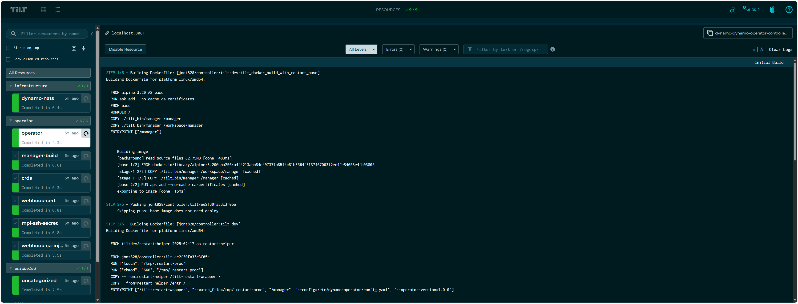

## Overview

[Tilt](https://tilt.dev) provides a live-reload development environment for the
Dynamo Kubernetes operator. Instead of manually building images, pushing to a
registry, and redeploying on every change, Tilt watches your source files and
automatically recompiles the Go binary, syncs it into the running container, and
restarts the process — all in seconds.

Under the hood, the Tiltfile:

1. **Compiles** the Go manager binary locally (`CGO_ENABLED=0`).
2. **Builds** a minimal Docker image containing only the binary.
3. **Renders** the production Helm chart (`deploy/helm/charts/platform`) with
   `helm template`, applies CRDs via `kubectl`, and deploys all rendered
   resources.
4. **Live-updates** the binary inside the running container on every code
   change — no full image rebuild required.

This gives you a fully working cluster where you can apply `DynamoGraphDeployment`
and `DynamoGraphDeploymentRequest` resources and have them reconcile into real
workloads — while iterating on controller logic with sub-second feedback.

## Prerequisites

| Tool | Version | Purpose |
|------|---------|---------|
| [Tilt](https://docs.tilt.dev/install.html) | v0.33+ | Development orchestration |
| [Helm](https://helm.sh/docs/intro/install/) | v3 | Chart rendering |
| [Go](https://go.dev/dl/) | 1.25+ | Compiling the operator |
| [kubectl](https://kubernetes.io/docs/tasks/tools/) | — | Cluster access |
| A Kubernetes cluster | — | kind, minikube, or remote cluster |

You also need a **container registry** that is accessible to your cluster's
nodes, so they can pull the operator image Tilt builds. If you use a local
cluster like kind with a local registry, Tilt can push there directly.

## Quick Start

```bash
cd deploy/operator

# Create your personal settings file (gitignored)
cat > tilt-settings.yaml <<EOF
allowed_contexts:
  - my-cluster-context
registry: docker.io/myuser
skip_codegen: true
EOF

# Launch
tilt up
```

Tilt opens a terminal UI and a web dashboard at [http://localhost:10350](http://localhost:10350).
The dashboard shows resource status, build logs, and port-forwards.

Press **Space** in the terminal to open the web UI. Press **Ctrl-C** to
shut everything down (resources remain deployed; run `tilt down` to tear
them down).



## Configuration

All configuration is optional. The Tiltfile defines sensible defaults for every
setting, and `tilt-settings.yaml` is gitignored so your personal values
(cluster context, registry, etc.) never leak into the repo.

Create `deploy/operator/tilt-settings.yaml` with any of the settings below:

```yaml
# Kubernetes contexts Tilt is allowed to connect to.
# Safety guard: prevents accidental deployments to production clusters.
allowed_contexts:
  - my-cluster-context

# Container registry for the operator image.
# Can also be set via the REGISTRY env var (env var takes precedence).
registry: docker.io/myuser

# Skip running `make generate && make manifests` before applying CRDs.
# Set to true when you haven't changed API types (faster iteration).
skip_codegen: true

# Target namespace for the operator and related resources.
# namespace: dynamo-system

# Subchart toggles
# enable_nats: true            # Required for DGD/DGDR workloads (default: true)
# enable_etcd: false           # Only if discoveryBackend is "etcd"
# enable_kai_scheduler: false  # GPU-aware scheduling for multi-node
# enable_grove: false          # PodClique-based multi-node orchestration

# Extra Helm value overrides (applied on top of subchart toggles)
# helm_values:
#   dynamo-operator.discoveryBackend: kubernetes
#   dynamo-operator.natsAddr: "nats://external-nats:4222"
```

### Settings Reference

| Key | Type | Default | Description |
|-----|------|---------|-------------|
| `allowed_contexts` | list | *(none)* | Kubernetes contexts Tilt may connect to. Prevents accidental production deploys. |
| `registry` | string | `""` | Container registry prefix (e.g. `docker.io/myuser`). Also settable via `REGISTRY` env var, which takes precedence. |
| `namespace` | string | `dynamo-system` | Namespace for the operator Deployment and related resources. |
| `skip_codegen` | bool | `false` | Skip `make generate && make manifests` before applying CRDs. Set to `true` when you haven't changed API types. |
| `enable_nats` | bool | `true` | Deploy NATS subchart. Required for DGD/DGDR workloads (workers use it for communication). |
| `enable_etcd` | bool | `false` | Deploy etcd subchart. Only needed when `discoveryBackend` is `etcd`. |
| `enable_kai_scheduler` | bool | `false` | Deploy kai-scheduler for GPU-aware scheduling in multi-node setups. |
| `enable_grove` | bool | `false` | Deploy Grove for PodClique-based multi-node orchestration. |
| `image_pull_secret` | string | `""` | Name of a `docker-registry` Secret for pulling images from private registries. |
| `helm_values` | map | `{}` | Arbitrary `--set` overrides passed to `helm template`. |
| `operator_version` | string | *(from Chart.yaml)* | Operator `--operator-version` flag. Defaults to `appVersion` from the operator subchart. |

### Registry Configuration

The operator image needs to be pullable by your cluster's nodes. The registry is resolved in priority order:

1. **`REGISTRY` env var** — `REGISTRY=docker.io/myuser tilt up`
2. **`registry` in `tilt-settings.yaml`**

The image is pushed as `{registry}/controller:tilt-dev`.

<Warning>
If no registry is configured, the image is only available locally. This works
with kind using a local registry but will fail on remote clusters.
</Warning>

## How It Works

When you run `tilt up`, the following resources are created in order:

```
manager-build     Compile Go binary locally
        │
        ├───── crds       Apply CRDs via server-side apply
        │
    operator              Deploy operator pod (live-updated)
```

The operator handles webhook certificate generation, CA bundle injection, and
MPI SSH key provisioning at runtime — no external setup needed.

### What Each Resource Does

**manager-build** — Runs `CGO_ENABLED=0 GOOS=linux GOARCH=amd64 go build` to
compile the operator binary. Re-runs on changes to `api/`, `cmd/`, `internal/`,
`go.mod`, or `go.sum`.

**crds** — Applies CRDs from the Helm chart via `kubectl apply --server-side`.
When `skip_codegen` is `false`, runs `make generate && make manifests` first.

**operator** — The operator Deployment itself. Tilt watches the compiled binary
and uses `live_update` to sync it into the running container and restart the
process — no image rebuild needed. On startup, the operator's built-in cert
controller generates a self-signed TLS certificate, injects the CA bundle into
webhook configurations, and creates the MPI SSH secret — matching production
behavior exactly.

### Live Update Cycle

The inner development loop looks like this:

1. You edit Go source files under `deploy/operator/`.
2. Tilt detects the change and recompiles the binary (~2-5 seconds).
3. The new binary is synced into the running container via `live_update`.
4. The process restarts automatically.
5. Your controller changes are live — test by applying a DGD/DGDR.

No `docker build`, no `docker push`, no `kubectl rollout restart`.

## Webhook Certificates

The operator handles webhook TLS certificates automatically at runtime using a
built-in cert controller (based on OPA cert-controller). On startup it:

1. Creates a self-signed CA and webhook serving certificate.
2. Stores them in the `webhook-server-cert` Secret.
3. Injects the CA bundle into `ValidatingWebhookConfiguration` and
   `MutatingWebhookConfiguration` resources.

This matches production behavior and requires no external tooling. For
alternative certificate management (cert-manager or external certs), see the
[webhook documentation](../kubernetes/webhooks.md) and configure via
`helm_values` in `tilt-settings.yaml`.

## Typical Workflows

### Iterating on Controller Logic

The most common workflow — you're modifying reconciliation logic and want fast
feedback:

```yaml
# tilt-settings.yaml
allowed_contexts: [my-cluster]
registry: docker.io/myuser
skip_codegen: true
```

```bash
tilt up
# Edit files under internal/controller/
# Tilt auto-recompiles and live-updates
# Apply test resources:
kubectl apply -f examples/backends/vllm/deploy/agg.yaml
```

### Changing API Types (CRDs)

When you modify files under `api/`, you need codegen to run:

```yaml
# tilt-settings.yaml
skip_codegen: false   # or omit — false is the default
```

Tilt will run `make generate && make manifests` and re-apply CRDs whenever
`api/` files change.

### Testing Multi-Node Features

Enable the necessary subcharts:

```yaml
# tilt-settings.yaml
enable_grove: true
enable_kai_scheduler: true
```

### Using Environment Variables

You can override the registry without editing the settings file:

```bash
REGISTRY=ghcr.io/myorg tilt up
```

## Tilt UI

The web UI at [http://localhost:10350](http://localhost:10350) shows:

- **Resource status** — green/red/pending for each resource
- **Build logs** — compilation output and errors
- **Runtime logs** — operator logs streamed in real time
- **Port forwards** — the health endpoint is forwarded to `localhost:8081`

Resources are grouped by label (`operator` and `infrastructure`) to keep the
UI organized.

## Cleanup

```bash
# Stop Tilt and leave resources deployed
# (Ctrl-C in the terminal)

# Stop Tilt and tear down all resources
tilt down
```

## Troubleshooting

### Image Pull Errors

If pods show `ImagePullBackOff`:
- Verify `registry` is set in `tilt-settings.yaml` or via `REGISTRY` env var.
- Ensure your cluster nodes can pull from that registry.
- For kind with a local registry, follow the
  [kind local registry guide](https://kind.sigs.k8s.io/docs/user/local-registry/).

### Webhook TLS Errors

If applying a DGD/DGDR fails with `x509: certificate signed by unknown authority`:
- Check the operator logs in the Tilt UI — the cert controller logs its
  progress on startup.
- Verify the `webhook-server-cert` Secret exists and has been populated:
  ```bash
  kubectl -n dynamo-system get secret webhook-server-cert
  ```
- The operator may need a few seconds after startup to generate certs and
  inject the CA bundle. Wait for the `cert-controller` log messages before
  applying resources.

### CRD Codegen Failures

If `crds` fails with codegen errors:
- Ensure `controller-gen` is installed: `make controller-gen`
- Try running codegen manually: `make generate && make manifests`
- Set `skip_codegen: true` temporarily to bypass if you haven't changed API types.

### Context Safety Guard

If Tilt refuses to start with a context error, add your cluster context to
`allowed_contexts` in `tilt-settings.yaml`:

```yaml
allowed_contexts:
  - my-cluster-context
```
