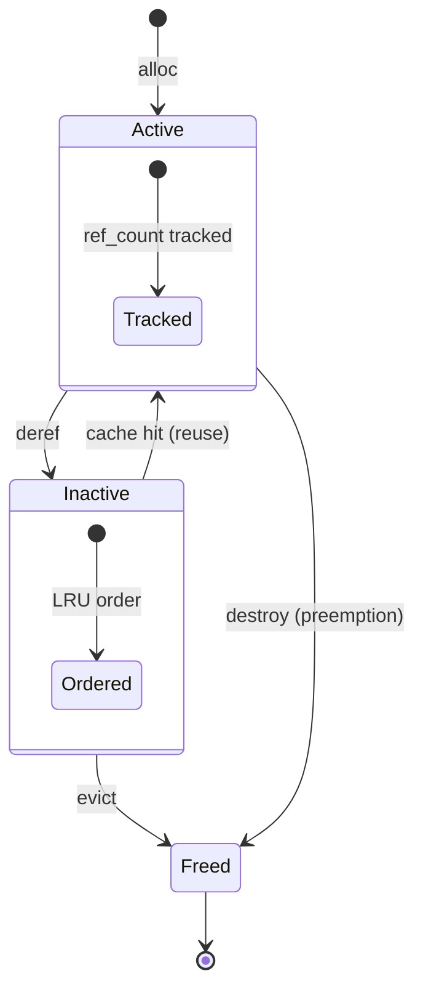

The Mocker is a lightweight, high-fidelity simulation of an LLM inference engine, implemented entirely in Rust. It replicates the core scheduling, memory management, and timing behaviors of production engines without requiring a GPU, making it invaluable for testing Dynamo's routing, KV cache events, disaggregated serving, and planner components.

## Overview

The mocker simulates:

- **Block-based KV cache management** with LRU eviction
- **Engine-specific continuous batching schedulers** for vLLM and SGLang
- **Prefix caching** with hash-based block deduplication
- **Chunked prefill** for better batching efficiency
- **Realistic timing models** for prefill and decode phases
- **Disaggregated serving** (prefill/decode separation)
- **KV event publishing** for router integration
- **Data parallelism** (multiple DP ranks per engine)

> **Note:** While the mocker uses vLLM as its primary reference implementation, these core components—block-based KV cache management, continuous batching schedulers, LRU evictors, and prefix caching—are fundamental to all modern LLM inference engines, including SGLang and TensorRT-LLM. The architectural patterns simulated here are engine-agnostic and apply broadly across the inference ecosystem.

## Quick Start

### Basic Usage

```bash
# Launch a single mocker worker
python -m dynamo.mocker --model-path Qwen/Qwen3-0.6B

# Launch with custom KV cache configuration
python -m dynamo.mocker \
    --model-path Qwen/Qwen3-0.6B \
    --num-gpu-blocks-override 8192 \
    --block-size 64 \
    --max-num-seqs 256

# Launch with timing speedup for faster testing
python -m dynamo.mocker \
    --model-path Qwen/Qwen3-0.6B \
    --speedup-ratio 10.0
```

### Disaggregated Serving

```bash
# Launch prefill worker
python -m dynamo.mocker \
    --model-path Qwen/Qwen3-0.6B \
    --disaggregation-mode prefill \
    --bootstrap-ports 50100

# Launch decode worker (in another terminal)
python -m dynamo.mocker \
    --model-path Qwen/Qwen3-0.6B \
    --disaggregation-mode decode
```

### Multiple Workers in One Process

```bash
# Launch 4 mocker workers sharing the same tokio runtime
python -m dynamo.mocker \
    --model-path Qwen/Qwen3-0.6B \
    --num-workers 4
```

## CLI Arguments

| Argument | Default | Description |
|----------|---------|-------------|
| `--model-path` | Required | HuggingFace model ID or local path for tokenizer |
| `--endpoint` | Auto-derived | Dynamo endpoint string. Defaults are namespace-dependent, and prefill workers use a different default endpoint than aggregated/decode workers |
| `--model-name` | Derived from model-path | Model name for API responses |
| `--num-gpu-blocks-override` | 16384 | Number of KV cache blocks |
| `--block-size` | 64 (`vllm`) / engine-specific | Tokens per KV cache block. For `sglang`, if omitted, the effective page/block size defaults to 1 or to `--sglang-page-size` when provided |
| `--max-num-seqs` | 256 | Maximum concurrent sequences |
| `--max-num-batched-tokens` | 8192 | Maximum tokens per batch |
| `--enable-prefix-caching` | True | Enable prefix caching |
| `--no-enable-prefix-caching` | - | Disable prefix caching |
| `--enable-chunked-prefill` | True | Enable chunked prefill |
| `--no-enable-chunked-prefill` | - | Disable chunked prefill |
| `--preemption-mode` | `lifo` | Decode eviction policy under memory pressure: `lifo` (vLLM v1 style) or `fifo` |
| `--speedup-ratio` | 1.0 | Timing speedup factor |
| `--decode-speedup-ratio` | 1.0 | Decode-only speedup multiplier (e.g. for Eagle speculation) |
| `--data-parallel-size` | 1 | Number of DP replicas |
| `--startup-time` | None | Simulated startup delay (seconds) |
| `--planner-profile-data` | None | Path to either a mocker-format `.npz` file or a profiler results directory |
| `--num-workers` | 1 | Workers per process |
| `--reasoning` | None | JSON config for emitting reasoning token spans, with `start_thinking_token_id`, `end_thinking_token_id`, and `thinking_ratio` |
| `--engine-type` | `vllm` | Engine simulation type: `vllm` or `sglang` |
| `--sglang-schedule-policy` | `fifo` / `fcfs` | SGLang scheduling policy override |
| `--sglang-page-size` | 1 | SGLang radix-cache page size in tokens. Also becomes the effective block size when `--engine-type sglang` and `--block-size` is omitted |
| `--sglang-max-prefill-tokens` | 16384 | SGLang max prefill-token budget per batch |
| `--sglang-chunked-prefill-size` | 8192 | SGLang chunked-prefill chunk size |
| `--sglang-clip-max-new-tokens` | 4096 | SGLang admission-budget cap for max new tokens |
| `--sglang-schedule-conservativeness` | 1.0 | SGLang schedule conservativeness factor |
| `--aic-perf-model` | False | Use AIC SDK for latency prediction instead of interpolated/polynomial models. Opt-in only: default mocker and replay paths do not use AIC. Requires `aiconfigurator` installed and usable AIC systems/perf data for the requested `system/backend/version` tuple |
| `--aic-system` | `h200_sxm` | AIC system name (e.g., `h200_sxm`). Used with `--aic-perf-model` |
| `--aic-backend-version` | Auto | AIC backend engine version (e.g., `0.12.0` for vLLM). If not set, uses the default version for the backend |
| `--aic-tp-size` | 1 | Tensor parallel size for AIC latency prediction. Only affects AIC performance model lookups, not mocker scheduling |
| `--extra-engine-args` | None | Path to a JSON file with mocker configuration; overrides individual CLI arguments |
| `--stagger-delay` | -1 (auto) | Delay between worker launches (seconds). 0 disables, -1 enables auto mode |
| `--disaggregation-mode` | `agg` | Worker mode: `agg` (aggregated), `prefill`, or `decode` |
| `--durable-kv-events` | False | Deprecated JetStream KV-event mode; prefer the local indexer / event-plane subscriber path |
| `--zmq-kv-events-ports` | None | Comma-separated ZMQ PUB base ports for KV event publishing, one per worker |
| `--zmq-replay-ports` | None | Comma-separated ZMQ ROUTER base ports for gap recovery, one per worker |
| `--bootstrap-ports` | None | Comma-separated rendezvous base ports, one per worker in disaggregated mode |
| `--kv-transfer-bandwidth` | 64.0 | KV cache transfer bandwidth in GB/s. Set to 0 to disable |
| `--kv-cache-dtype` | auto | KV cache dtype for bytes-per-token computation |
| `--kv-bytes-per-token` | Auto-computed | KV cache bytes per token (override auto-computation) |
| `--discovery-backend` | Env-driven (`etcd`) | Discovery backend: `kubernetes`, `etcd`, `file`, or `mem` |
| `--request-plane` | Env-driven (`tcp`) | Request transport: `nats`, `http`, or `tcp` |
| `--event-plane` | Env-driven (`nats`) | Event transport: `nats` or `zmq` |

## Environment Variables

| Variable | Default | Description |
|----------|---------|-------------|
| `DYN_MOCKER_KV_CACHE_TRACE` | off | Set to `1` or `true` to log structured KV cache allocation and eviction traces |

> **Note:** For local scale tests and router benchmarks, prefer `--num-workers` over launching many separate mocker processes. All workers share one tokio runtime and thread pool, which is both lighter weight and closer to how the test harnesses exercise the mocker.

## Trace Replay

The mocker supports replaying Mooncake-style traces through the dedicated replay CLI, which exposes
`offline|online`, `round_robin|kv_router`, `arrival_speedup_ratio`, closed-loop concurrency
admission, synthetic workload generation, and offline disaggregated prefill/decode replay directly:

The replay CLI defaults to `--replay-mode offline` and `--router-mode round_robin`. Aggregated
replay uses `--extra-engine-args`. Offline disagg replay instead uses
`--prefill-engine-args` plus `--decode-engine-args`, together with
`--num-prefill-workers` and `--num-decode-workers`.

```bash
python -m dynamo.replay /path/to/mooncake_trace.jsonl \
    --num-workers 4 \
    --replay-mode offline \
    --router-mode kv_router \
    --arrival-speedup-ratio 5 \
    --trace-block-size 512 \
    --extra-engine-args '{"block_size":64}' \
    --router-config '{"router_queue_policy":"fcfs"}' \
    --report-json /tmp/replay-report.json
```

The same CLI also supports synthetic replay without a trace file:

```bash
python -m dynamo.replay \
    --input-tokens 5000 \
    --output-tokens 500 \
    --request-count 1000 \
    --arrival-interval-ms 1.0 \
    --num-workers 1 \
    --replay-mode offline \
    --replay-concurrency 100 \
    --extra-engine-args '{"block_size":512}' \
    --report-json /tmp/replay-report.json
```

Synthetic replay also supports workload-style generation for shared-prefix and multi-turn tests:

```bash
python -m dynamo.replay \
    --input-tokens 5000 \
    --output-tokens 500 \
    --request-count 200 \
    --turns-per-session 3 \
    --shared-prefix-ratio 0.5 \
    --num-prefix-groups 8 \
    --inter-turn-delay-ms 250 \
    --replay-mode offline \
    --replay-concurrency 32 \
    --extra-engine-args '{"block_size":512}' \
    --report-json /tmp/replay-report.json
```

For trace files, replay also understands multi-turn sessions when records share `session_id`. The
first turn uses `timestamp`/`created_time`; later turns can use `delay` or `delay_ms`:

```json
{"session_id":"session-a","timestamp":1000,"input_length":2048,"output_length":128,"hash_ids":[1,2,3,4]}
{"session_id":"session-a","delay":250,"input_length":2560,"output_length":128,"hash_ids":[1,2,3,4,5]}
```

For trace-file replay, `--trace-block-size` controls how many tokens each `hash_id` represents in
the dataset, while engine `block_size` still controls the replay engine and router hashing. Public
Mooncake/toolagent traces use `--trace-block-size 512`; engine `block_size` can still stay at `64`
to match the live runtime configuration.

The standalone replay CLI prints an AIPerf-style summary table to stdout and writes the full replay
report JSON to disk.

Timing semantics:

- trace mode honors first-turn timestamps and inter-turn delays
- concurrency mode ignores first-turn timestamps but still enforces inter-turn delays
- in concurrency mode, TTFT is measured from actual dispatch under the in-flight cap

For full usage, constraints, and benchmarking guidance, see [Mocker Trace Replay](../benchmarks/mocker-trace-replay.md).

Replay supports aggregated `vllm` and `sglang` engine configs. Internally replay uses canonical
`block_size`; for `sglang`, `sglang.page_size` is still accepted as a compatibility alias as long
as it matches `block_size` when both are provided.

Offline replay also supports disaggregated `kv_router` mode. In that mode:

- `--prefill-engine-args` must describe a prefill worker
- `--decode-engine-args` must describe a decode worker
- `--router-mode` must be `kv_router`
- only offline replay is supported

Example:

```bash
python -m dynamo.replay \
    --input-tokens 4096 \
    --output-tokens 256 \
    --request-count 100 \
    --replay-mode offline \
    --router-mode kv_router \
    --replay-concurrency 32 \
    --num-prefill-workers 2 \
    --num-decode-workers 6 \
    --prefill-engine-args '{"worker_type":"prefill","block_size":512}' \
    --decode-engine-args '{"worker_type":"decode","block_size":512}' \
    --router-config '{"router_queue_policy":"wspt"}' \
    --report-json /tmp/replay-report.json
```

## Performance Modeling Setup

By default, the mocker uses hardcoded polynomial formulas to estimate prefill and decode timing. For more realistic simulations, pass `--planner-profile-data` with either:

- a mocker-format `.npz` file, or
- a profiler output directory

The mocker automatically accepts profiler-style results directories and converts them internally.

It also accepts older raw-data directories containing:

- `prefill_raw_data.json`
- `decode_raw_data.json`

```bash
python -m dynamo.mocker \
    --model-path nvidia/Llama-3.1-8B-Instruct-FP8 \
    --planner-profile-data components/src/dynamo/planner/tests/data/profiling_results/H200_TP1P_TP1D \
    --speedup-ratio 1.0
```

### AIC Performance Model

To use the AIC SDK for latency prediction:

```bash
uv pip install '.[mocker]'

python -m dynamo.mocker \
    --model-path nvidia/Llama-3.1-8B-Instruct-FP8 \
    --engine-type vllm \
    --aic-perf-model \
    --aic-system h200_sxm
```

The AIC model automatically uses `--model-path` and `--engine-type` to select the appropriate performance data. Available systems include `h200_sxm`, `h100_sxm`, etc. (see AIC SDK documentation for the full list).

Important notes:

- AIC is opt-in. If you do not pass `--aic-perf-model`, `python -m dynamo.mocker` does not use AIC.
- `python -m dynamo.replay` has two separate AIC surfaces:
  - engine timing AIC through `--extra-engine-args` / staged engine JSON
  - router-side prefill-load AIC through top-level `--aic-*` flags plus `router_prefill_load_model="aic"` in `--router-config`
- The Python AIC session bridge is now shared with the live KV router path via the internal `dynamo._internal.aic` module. Mocker CLI behavior is unchanged; this just removes duplicate AIC session code.
- `aiconfigurator` must be able to load the requested performance database for the selected `system/backend/version`. If the SDK is installed but the backing systems data is missing or unreadable, mocker now fails fast at startup with a clear error instead of failing later on first request.
- In development environments, this may require pointing Python at a source checkout of `aiconfigurator` with real Git LFS payloads materialized in its `systems/` directory.

This mocker AIC path is separate from the router-side prefill-load estimator. Live router,
frontend, and replay all use `router_prefill_load_model="aic"` plus top-level `--aic-*` flags for
oldest-prefill prompt-load decay. Replay still uses engine-args AIC separately when you want the
mocked worker timing model itself to come from AIC.

For aggregated replay, engine timing AIC still comes from `--extra-engine-args`:

```bash
python -m dynamo.replay /path/to/trace.jsonl \
    --extra-engine-args '{"aic_backend":"vllm","aic_system":"h200_sxm","aic_model_path":"nvidia/Llama-3.1-8B-Instruct-FP8","aic_tp_size":1}'
```

For offline disagg replay, pass the staged engine configs instead:

```bash
python -m dynamo.replay /path/to/trace.jsonl \
    --replay-mode offline \
    --router-mode kv_router \
    --prefill-engine-args '{"worker_type":"prefill","aic_backend":"vllm","aic_system":"h200_sxm","aic_model_path":"nvidia/Llama-3.1-8B-Instruct-FP8","aic_tp_size":1,"block_size":512}' \
    --decode-engine-args '{"worker_type":"decode","aic_backend":"vllm","aic_system":"h200_sxm","aic_model_path":"nvidia/Llama-3.1-8B-Instruct-FP8","aic_tp_size":1,"block_size":512}' \
    --num-prefill-workers 2 \
    --num-decode-workers 6
```

The `aic_backend` field enables the AIC perf model and should match `engine_type` (`"vllm"` or `"sglang"`). The `aic_model_path` field is the equivalent of `--model-path` in `dynamo.mocker`.

Replay router-side AIC prompt-load modeling is configured separately with top-level flags:

```bash
python -m dynamo.replay /path/to/trace.jsonl \
    --replay-mode offline \
    --router-mode kv_router \
    --num-workers 4 \
    --trace-block-size 512 \
    --extra-engine-args '{"block_size":64}' \
    --router-config '{"router_track_prefill_tokens":true,"router_prefill_load_model":"aic"}' \
    --aic-backend vllm \
    --aic-system h200_sxm \
    --aic-model-path nvidia/Llama-3.1-8B-Instruct-FP8 \
    --aic-tp-size 1
```

For offline disagg replay, the same top-level `--aic-*` flags drive the prefill-stage router only;
the decode-stage router keeps prompt tracking disabled.

Example `--reasoning` configuration:

```bash
python -m dynamo.mocker \
    --model-path Qwen/Qwen3-0.6B \
    --reasoning '{"start_thinking_token_id":123,"end_thinking_token_id":456,"thinking_ratio":0.6}'
```

The profile results directory should contain:

- `selected_prefill_interpolation/raw_data.npz`
- `selected_decode_interpolation/raw_data.npz`

To generate profile data for your own model and hardware, run the profiler and then point `--planner-profile-data` at the resulting output directory.

## Event Transport and Router Testing

The default event path uses the local indexer / event-plane subscriber flow. The older durable KV-events mode is still available through `--durable-kv-events`, but it is deprecated and should not be the preferred setup for new tests.

For router and indexer experiments that need native wire-format event forwarding, the mocker also supports a ZMQ path:

- `--event-plane zmq`
- `--zmq-kv-events-ports` for per-worker PUB base ports
- `--zmq-replay-ports` for optional replay/gap-recovery ROUTER base ports

When set, each worker binds on its base port plus `dp_rank`, so the number of comma-separated base ports must match `--num-workers`.

## Disaggregation Port Layout

`--bootstrap-ports` takes a comma-separated list of base ports, one per worker. In multi-worker mode, the number of listed ports must exactly match `--num-workers`.

Prefill workers listen on these ports and publish the bootstrap endpoint through discovery. Decode workers use the matching ports to rendezvous before decode begins.

## Kubernetes Deployment

The mocker can be deployed through example `DynamoGraphDeployment` manifests for both aggregated and disaggregated setups:

```bash
kubectl apply -f examples/backends/mocker/deploy/agg.yaml
kubectl apply -f examples/backends/mocker/deploy/disagg.yaml
```

## Architecture

The mocker is organized into several cooperating components that mirror the internal architecture of production LLM inference engines.

### Scheduler

The mocker now has two scheduler shapes rather than one generic queue model:

- **vLLM mocker** uses an upstream-style `waiting + running` scheduler. Each request tracks
  computed tokens, the scheduler spends one token budget across the running set first, and decode
  pressure triggers inline preemption of running requests.
- **SGLang mocker** uses a cache-aware waiting/running scheduler around a radix-style prefix cache.
  It batches prefill work with decode-state awareness and handles pressure primarily through decode
  retraction while preserving cached prefixes.

Both schedulers simulate continuous batching, prefix reuse, chunked prefill, memory pressure, and
decode token emission while publishing metrics about current resource utilization.

When resources become constrained, the mocker simulates the engine's real recovery path:
- vLLM-style decode preemption and recompute
- SGLang-style decode retraction plus prefix-preserving cache updates

### KV Block Manager

The block manager tracks KV cache blocks using reference counting and an LRU eviction policy. Blocks exist in one of two pools:

- **Active Pool** - Blocks currently in use by one or more sequences, tracked with reference counts
- **Inactive Pool** - Blocks no longer actively referenced but kept for potential reuse (prefix caching)

When a sequence needs blocks, the manager first checks if they already exist (cache hit). If not, it allocates new blocks, potentially evicting the least-recently-used inactive blocks to make room. When a sequence completes or is preempted, its blocks are either moved to the inactive pool (for potential reuse) or freed entirely.

The following diagram illustrates the block lifecycle, based on vLLM's block manager design:



### Evictor

The LRU evictor maintains blocks ordered by a monotonic counter, enabling O(log n) eviction of the lowest-priority block. Each `insert` assigns the next counter value, so blocks inserted later have higher counters and survive longer.

This produces a **depth-aware eviction policy**: when a sequence completes, `free_signal` releases its blocks in reverse order (tail first). Deeper suffix blocks therefore receive lower counters and are evicted before shallower prefix blocks. This keeps shared prefixes cached longer, improving cache hit rates across requests with common prefixes.

The evictor also supports front-insertion (negative counters) for marking blocks for immediate eviction, though this is not currently used in the scheduler.

### Sequence Tracking

Each active request is tracked as a sequence, managing its token blocks and generation state. As tokens are generated, the sequence tracks which blocks are partial (still being filled) versus full (complete and hashable for prefix caching). When a partial block fills up, it gets "promoted" to a full block with a content-based hash, enabling future cache hits from requests with matching prefixes.

### Performance Model

The mocker supports three timing prediction modes:

**Polynomial Model (Default):** Uses hardcoded polynomial formulas that approximate typical GPU behavior. Prefill time scales quadratically with token count, while decode time depends on the total active KV cache size.

**Interpolated Model:** Loads actual profiling data from an NPZ file containing measured prefill and decode latencies. The mocker interpolates between data points to predict timing for any input size. This enables high-fidelity simulation matching a specific hardware configuration.

**AIC Model (`--aic-perf-model`):** Uses the NVIDIA AI Configurator (AIC) SDK for latency prediction. AIC provides calibrated performance models for specific GPU/model/engine combinations, predicting prefill and decode latency as a function of batch size, sequence length, and prefix cache hits. The model path is automatically derived from `--model-path`, and the engine type from `--engine-type`. This mode is opt-in and requires both the `aiconfigurator` SDK and loadable systems/perf data for the requested tuple.

### Bootstrap Rendezvous (Disaggregated Serving)

For disaggregated prefill/decode deployments, prefill and decode workers coordinate via a simple TCP-based rendezvous protocol. The decode worker connects to the prefill worker's bootstrap port and waits until the prefill phase completes and KV cache is ready. Either side can arrive first—the rendezvous completes when both are ready.

### KV Transfer Latency Simulation

The mocker simulates KV cache transfer time between prefill and decode workers. Before the prefill worker emits its first (and only) token, it sleeps for a duration based on:

- **kv_bytes_per_token** (auto-computed from model config): `num_layers * 2 * num_kv_heads * head_dim * dtype_bytes`. The `dtype_bytes` is determined by `--kv-cache-dtype`: when set to `auto` (default), it uses the model's `dtype` from config; when explicitly set (e.g., `fp8`), it uses the specified dtype instead. It can also be overridden directly with `--kv-bytes-per-token`.
- **kv_transfer_bandwidth** (default: 64.0 GB/s, inter-node InfiniBand)
- **Transfer time**: `num_input_tokens * kv_bytes_per_token / bandwidth`

This delay is injected after the scheduler's prefill compute simulation completes, modeling the sequential flow: prefill computation → KV transfer → decode begins. Set `--kv-transfer-bandwidth 0` to disable.

## Integration with Dynamo

### KV Event Publishing

When prefix caching is enabled, the mocker publishes KV cache events to the distributed runtime. These events notify the system when blocks are stored (new content cached) or removed (evicted). This enables the KV-aware router to make intelligent routing decisions based on which workers have which prefixes cached.

### Metrics Publishing

Each scheduler publishes metrics about its current state, including the number of active decode blocks per DP rank. The router uses these metrics for load-aware routing decisions.

## Testing Scenarios

The mocker is particularly useful for:

1. **Router Testing** - Validate KV-aware routing without GPUs
2. **Planner Testing** - Test SLA-based planners with realistic timing
3. **Fault Tolerance** - Test request migration, graceful shutdown
4. **Disaggregation** - Test P/D separation and KV transfer coordination
5. **Performance Modeling** - Prototype scheduling policies
6. **CI/CD** - Fast integration tests without hardware dependencies

## Comparison with Real Engines

| Feature | Real Engine | Mocker |
|---------|-------------|--------|
| GPU Required | Yes | No |
| Block Manager | Paged KV cache | Simulated blocks |
| Scheduler | Continuous batching | Continuous batching |
| Prefix Caching | Hash-based | Hash-based |
| Chunked Prefill | Supported | Supported |
| Preemption | Recompute/swap | Recompute (simulated) |
| Timing | Real execution | Model-based |
| KV Events | Native | Compatible |
| Data Parallelism | Multi-GPU | Simulated |

## Next Steps

| Document | Description |
|----------|-------------|
| [Benchmarking Dynamo Deployments](../benchmarks/benchmarking.md) | Run AIPerf against a mocker-backed deployment to measure latency, TTFT, throughput, and scaling behavior |
| [Aggregated Mocker Deployment Example](../../examples/backends/mocker/deploy/agg.yaml) | Deploy a mocker-backed aggregated DynamoGraphDeployment on Kubernetes |
| [Disaggregated Mocker Deployment Example](../../examples/backends/mocker/deploy/disagg.yaml) | Deploy separate prefill and decode mocker workers for disaggregated-serving benchmarks |
| [Global Planner Mocker Example](../../examples/global_planner/global-planner-mocker-test.yaml) | Advanced multi-pool mocker setup for planner and global-router experiments |

## Feature Gaps (WIP)

> For the broader mocker enhancement roadmap, see [#6383](https://github.com/ai-dynamo/dynamo/issues/6383).

The following features are not yet supported by the mocker:

- **Multi-tier memory** - No support for offloading KV cache to CPU/disk or onboarding back to GPU; potential future integration with KVBM
- **Multimodal support** - Currently only simulates text token processing; no vision encoder or cross-attention simulation
- **Native Rust reference counting** - Work in progress to use native Rc/Arc for block reference counting, enabling natural RAII patterns for simpler tracking
