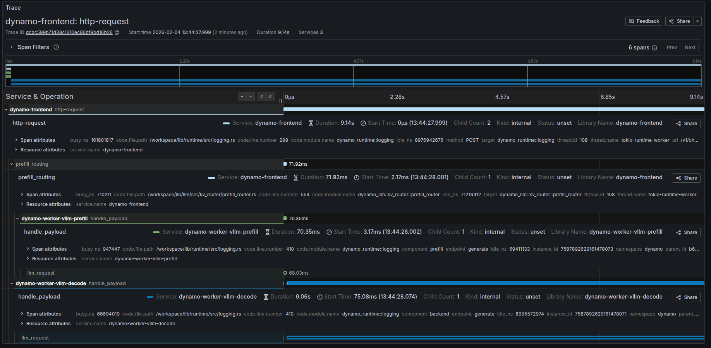

## Overview

Dynamo provides structured logging in both text as well as JSONL. When
JSONL is enabled, logs support `trace_id` and `span_id` fields for
distributed tracing. Span creation and exit events can be optionally
enabled via the `DYN_LOGGING_SPAN_EVENTS` environment variable.

## Environment Variables

| Variable | Description | Default | Example |
|----------|-------------|---------|---------|
| `DYN_LOGGING_JSONL` | Enable JSONL logging format | `false` | `true` |
| `DYN_LOGGING_SPAN_EVENTS` | Enable span entry/close event logging (`SPAN_FIRST_ENTRY`, `SPAN_CLOSED` messages) | `false` | `true` |
| `DYN_LOG` | Log levels per target `<default_level>,<module_path>=<level>,<module_path>=<level>` | `info` | `DYN_LOG=info,dynamo_runtime::system_status_server:trace` |
| `DYN_LOG_USE_LOCAL_TZ` | Use local timezone for timestamps (default is UTC) | `false` | `true` |
| `DYN_LOGGING_CONFIG_PATH` | Path to custom TOML logging configuration | none | `/path/to/config.toml` |
| `VLLM_LOGGING_LEVEL` | vLLM backend log level (independent of `DYN_LOG`) | `INFO` | `DEBUG` |
| `TLLM_LOG_LEVEL` | TensorRT-LLM backend log level (independent of `DYN_LOG`) | `INFO` | `DEBUG` |
| `DYN_SKIP_SGLANG_LOG_FORMATTING` | Disable Dynamo's SGLang log configuration | `false` | `true` |
| `OTEL_SERVICE_NAME` | Service name for trace and span information | `dynamo` | `dynamo-frontend` |
| `OTEL_EXPORT_ENABLED` | Enable OTLP export of both traces and logs | `false` | `true` |
| `OTEL_EXPORTER_OTLP_TRACES_ENDPOINT` | OTLP gRPC endpoint for traces | `http://localhost:4317` | `http://tempo:4317` |
| `OTEL_EXPORTER_OTLP_LOGS_ENDPOINT` | OTLP gRPC endpoint for logs (defaults to `OTEL_EXPORTER_OTLP_TRACES_ENDPOINT` if not set) | same as traces endpoint | `http://localhost:4317` |

## OTLP Log Export

When `OTEL_EXPORT_ENABLED=true`, Dynamo exports both **traces and logs** via OTLP. Logs are sent to an OpenTelemetry Collector which routes them to Grafana Loki for aggregation and querying.

By default, logs are exported to the same endpoint as traces (`OTEL_EXPORTER_OTLP_TRACES_ENDPOINT`). To send logs to a different endpoint, set `OTEL_EXPORTER_OTLP_LOGS_ENDPOINT`:

```bash
export OTEL_EXPORT_ENABLED=true
export OTEL_EXPORTER_OTLP_TRACES_ENDPOINT=http://localhost:4317
# Optional: send logs to a different endpoint
# export OTEL_EXPORTER_OTLP_LOGS_ENDPOINT=http://localhost:4317
```

The local observability stack (see [Getting Started](README.md#getting-started-quickly)) includes an OpenTelemetry Collector that receives OTLP on `localhost:4317` and routes traces to Tempo and logs to Loki. In Grafana, the Loki datasource is pre-configured with a derived field that links `trace_id` labels to Tempo, so you can jump directly from a log line to its corresponding trace.

## Getting Started Quickly

### Start Observability Stack

For collecting and visualizing logs with Grafana Loki, or viewing trace context in logs alongside Grafana Tempo, start the observability stack. See [Observability Getting Started](README.md#getting-started-quickly) for instructions. The stack includes Loki, an OpenTelemetry Collector, and Tempo — all pre-wired together.

### Enable Structured Logging

Enable structured JSONL logging:

```bash
export DYN_LOGGING_JSONL=true
export DYN_LOG=debug

# Start your Dynamo components (default port 8000, override with --http-port or DYN_HTTP_PORT env var)
python -m dynamo.frontend &
python -m dynamo.vllm --model Qwen/Qwen3-0.6B --enforce-eager &
```

Logs will be written to stderr in JSONL format with trace context.

## Available Logging Levels

| **Logging Levels (Least to Most Verbose)** | **Description**                                                                 |
|-------------------------------------------|---------------------------------------------------------------------------------|
| **ERROR**                                 | Critical errors (e.g., unrecoverable failures, resource exhaustion)              |
| **WARN**                                  | Unexpected or degraded situations (e.g., retries, recoverable errors)           |
| **INFO**                                  | Operational information (e.g., startup/shutdown, major events)                 |
| **DEBUG**                                 | General debugging information (e.g., variable values, flow control)            |
| **TRACE**                                 | Very low-level, detailed information (e.g., internal algorithm steps)           |

## Example Readable Format

Environment Setting:

```
export DYN_LOG="info,dynamo_runtime::system_status_server:trace"
export DYN_LOGGING_JSONL="false"
```

Resulting Log format:

```
2025-09-02T15:50:01.770028Z  INFO main.init: VllmWorker for Qwen/Qwen3-0.6B has been initialized
2025-09-02T15:50:01.770195Z  INFO main.init: Reading Events from tcp://127.0.0.1:21555
2025-09-02T15:50:01.770265Z  INFO main.init: Getting engine runtime configuration metadata from vLLM engine...
2025-09-02T15:50:01.770316Z  INFO main.get_engine_cache_info: Cache config values: {'num_gpu_blocks': 24064}
2025-09-02T15:50:01.770358Z  INFO main.get_engine_cache_info: Scheduler config values: {'max_num_seqs': 256, 'max_num_batched_tokens': 2048}
```

## Example JSONL Format

Environment Setting:

```
export DYN_LOG="info,dynamo_runtime::system_status_server:trace"
export DYN_LOGGING_JSONL="true"
```

Resulting Log format:

```
{"time":"2025-09-02T15:53:31.943377Z","level":"INFO","target":"log","message":"VllmWorker for Qwen/Qwen3-0.6B has been initialized","log.file":"/opt/dynamo/venv/lib/python3.12/site-packages/dynamo/vllm/main.py","log.line":191,"log.target":"main.init"}
{"time":"2025-09-02T15:53:31.943550Z","level":"INFO","target":"log","message":"Reading Events from tcp://127.0.0.1:26771","log.file":"/opt/dynamo/venv/lib/python3.12/site-packages/dynamo/vllm/main.py","log.line":212,"log.target":"main.init"}
{"time":"2025-09-02T15:53:31.943636Z","level":"INFO","target":"log","message":"Getting engine runtime configuration metadata from vLLM engine...","log.file":"/opt/dynamo/venv/lib/python3.12/site-packages/dynamo/vllm/main.py","log.line":220,"log.target":"main.init"}
{"time":"2025-09-02T15:53:31.943701Z","level":"INFO","target":"log","message":"Cache config values: {'num_gpu_blocks': 24064}","log.file":"/opt/dynamo/venv/lib/python3.12/site-packages/dynamo/vllm/main.py","log.line":267,"log.target":"main.get_engine_cache_info"}
{"time":"2025-09-02T15:53:31.943747Z","level":"INFO","target":"log","message":"Scheduler config values: {'max_num_seqs': 256, 'max_num_batched_tokens': 2048}","log.file":"/opt/dynamo/venv/lib/python3.12/site-packages/dynamo/vllm/main.py","log.line":268,"log.target":"main.get_engine_cache_info"}
```

## Logging of Trace and Span IDs

When `DYN_LOGGING_JSONL` is enabled, all logs include `trace_id` and `span_id` fields, and spans are automatically created for requests. This is useful for short debugging sessions where you want to examine trace context in logs without setting up a full tracing backend and for correlating log messages with traces.

The trace and span information uses the OpenTelemetry format and libraries, which means the IDs are compatible with OpenTelemetry-based tracing backends like Tempo or Jaeger if you later choose to enable trace export.

**Note:** This section has overlap with [Distributed Tracing with Tempo](tracing.md). For trace visualization in Grafana Tempo and persistent trace analysis, see [Distributed Tracing with Tempo](tracing.md).

### Configuration for Logging

To see trace information in logs:

```bash
export DYN_LOGGING_JSONL=true
export DYN_LOG=debug  # Set to debug to see detailed trace logs

# Start your Dynamo components (e.g., frontend and worker) (default port 8000, override with --http-port or DYN_HTTP_PORT env var)
python -m dynamo.frontend &
python -m dynamo.vllm --model Qwen/Qwen3-0.6B --enforce-eager &
```

This enables JSONL logging with `trace_id` and `span_id` fields. Traces appear in logs but are not exported to any backend.

### Example Request

Send a request to generate logs with trace context:

```bash
curl -H 'Content-Type: application/json' \
-H 'x-request-id: test-trace-001' \
-d '{
  "model": "Qwen/Qwen3-0.6B",
  "max_completion_tokens": 100,
  "messages": [
    {"role": "user", "content": "What is the capital of France?"}
  ]
}' \
http://localhost:8000/v1/chat/completions
```

Check the logs (stderr) for JSONL output containing `trace_id`, `span_id`, and `x_request_id` fields.

## Trace and Span Information in Logs

This section shows how trace and span information appears in JSONL logs. These logs can be used to understand request flows even without a trace visualization backend.

### Example Disaggregated Trace in Grafana

When viewing the corresponding trace in Grafana, you should be able to see something like the following:


### Trace Overview

Dynamo creates distributed traces that span across multiple services in a disaggregated serving setup. The following sections describe the key spans you'll see in Grafana when viewing traces for chat completion requests.

#### Available Spans in Disaggregated Mode

When running Dynamo in disaggregated mode, a typical request creates the following spans:

##### 1. `http-request` (Frontend - Root Span)

The root span for the entire request lifecycle, created in the **dynamo-frontend** service.

**Key Attributes:**
- **Service**: `dynamo-frontend`
- **Operation**: Handles the HTTP request from client to completion
- **Duration**: Total end-to-end request time (includes prefill + decode)
- **Method**: HTTP method (typically `POST`)
- **URI**: Request endpoint (e.g., `/v1/chat/completions`)
- **Status**: Request completion status
- **Children**: Typically 2-3 child spans (routing span + worker spans)

This span represents the complete request flow from when the frontend receives the HTTP request until the final response is sent back to the client.

##### 2. `prefill_routing` (Frontend - Routing Span)

A child span of `http-request`, created in the **dynamo-frontend** service during the routing phase.

**Key Attributes:**
- **Service**: `dynamo-frontend`
- **Operation**: Routes the prefill request to an appropriate prefill worker
- **Duration**: Time spent selecting and the span of prefill.
- **Parent**: `http-request` span

This span captures the routing logic and decision-making process and the request sent to the prefill worker.

##### 3. `handle_payload` (Prefill Worker Span)

A child span of `http-request`, created in the **dynamo-worker-vllm-prefill** service.

**Key Attributes:**
- **Service**: `dynamo-worker-vllm-prefill` (or `dynamo-worker-sglang-prefill` for SGLang)
- **Operation**: Processes the prefill phase of generation
- **Duration**: Time to compute prefill (typically milliseconds to seconds)
- **Component**: `prefill`
- **Endpoint**: `generate`
- **Parent**: `http-request` span

This span represents the actual prefill computation on a prefill-specialized worker, including prompt processing and initial KV cache generation.

##### 4. `handle_payload` (Decode Worker Span)

A child span of `http-request`, created in the **dynamo-worker-vllm-decode** service.

**Key Attributes:**
- **Service**: `dynamo-worker-vllm-decode` (or `dynamo-worker-sglang-decode` for SGLang)
- **Operation**: Processes the decode phase of generation
- **Duration**: Time to generate all output tokens (typically seconds)
- **Component**: `decode` or `backend`
- **Endpoint**: `generate`
- **Parent**: `http-request` span

This span represents the iterative token generation phase on a decode-specialized worker, which consumes the KV cache from prefill and produces output tokens.


#### Understanding Span Metrics

Each span provides several useful metrics:

| Metric | Description |
|--------|-------------|
| **Duration** | Total time from span start to end |
| **Busy Time** | Time actively processing (excluding waiting) |
| **Idle Time** | Time spent waiting (e.g., for network, other services) |
| **Start Time** | When the span began |
| **Child Count** | Number of direct child spans |

The relationship **Duration = Busy Time + Idle Time** helps identify where time is spent and potential bottlenecks.

## Custom Request IDs in Logs

You can provide a custom request ID using the `x-request-id` header. This ID will be attached to all spans and logs for that request, making it easier to correlate traces with application-level request tracking.

### Example Request with Custom Request ID

```sh
curl -X POST http://localhost:8000/v1/chat/completions \
  -H 'Content-Type: application/json' \
  -H 'x-request-id: 8372eac7-5f43-4d76-beca-0a94cfb311d0' \
  -d '{
    "model": "Qwen/Qwen3-0.6B",
    "messages": [
      {
        "role": "user",
        "content": "Explain why Roger Federer is considered one of the greatest tennis players of all time"
      }
    ],
    "stream": false,
    "max_tokens": 1000
  }'
```

All spans and logs for this request will include the `x_request_id` attribute with value `8372eac7-5f43-4d76-beca-0a94cfb311d0`.

### Frontend Logs with Custom Request ID

Notice how the `x_request_id` field appears in all log entries, alongside the `trace_id` (`80196f3e3a6fdf06d23bb9ada3788518`) and `span_id`:

```
{"time":"2025-10-31T21:06:45.397194Z","level":"DEBUG","file":"/opt/dynamo/lib/runtime/src/pipeline/network/tcp/server.rs","line":230,"target":"dynamo_runtime::pipeline::network::tcp::server","message":"Registering new TcpStream on 10.0.4.65:41959","method":"POST","span_id":"f7e487a9d2a6bf38","span_name":"http-request","trace_id":"80196f3e3a6fdf06d23bb9ada3788518","uri":"/v1/chat/completions","version":"HTTP/1.1","x_request_id":"8372eac7-5f43-4d76-beca-0a94cfb311d0"}
{"time":"2025-10-31T21:06:45.418584Z","level":"DEBUG","file":"/opt/dynamo/lib/llm/src/kv_router/prefill_router.rs","line":232,"target":"dynamo_llm::kv_router::prefill_router","message":"Prefill succeeded, using disaggregated params for decode","method":"POST","span_id":"f7e487a9d2a6bf38","span_name":"http-request","trace_id":"80196f3e3a6fdf06d23bb9ada3788518","uri":"/v1/chat/completions","version":"HTTP/1.1","x_request_id":"8372eac7-5f43-4d76-beca-0a94cfb311d0"}
{"time":"2025-10-31T21:06:45.418854Z","level":"DEBUG","file":"/opt/dynamo/lib/runtime/src/pipeline/network/tcp/server.rs","line":230,"target":"dynamo_runtime::pipeline::network::tcp::server","message":"Registering new TcpStream on 10.0.4.65:41959","method":"POST","span_id":"f7e487a9d2a6bf38","span_name":"http-request","trace_id":"80196f3e3a6fdf06d23bb9ada3788518","uri":"/v1/chat/completions","version":"HTTP/1.1","x_request_id":"8372eac7-5f43-4d76-beca-0a94cfb311d0"}
```


## Backend Engine Log Levels

Dynamo's `DYN_LOG` environment variable controls Dynamo's own logging. Each
inference backend has its own log level control that is **independent** of
`DYN_LOG`.

### vLLM

vLLM log level is controlled by the `VLLM_LOGGING_LEVEL` environment variable.
It defaults to `INFO` and is completely independent of `DYN_LOG`.

```bash
# Set vLLM to debug while keeping Dynamo at info
export DYN_LOG=info
export VLLM_LOGGING_LEVEL=DEBUG
```

Valid values: `DEBUG`, `INFO`, `WARNING`, `ERROR`, `CRITICAL`.

### TensorRT-LLM

TensorRT-LLM log level is controlled by the `TLLM_LOG_LEVEL` environment
variable. It defaults to `INFO` and is completely independent of `DYN_LOG`.

```bash
# Set TRT-LLM to info while keeping Dynamo at warn
export DYN_LOG=warn
export TLLM_LOG_LEVEL=INFO
```

Valid values: `TRACE`, `DEBUG`, `INFO`, `WARNING`, `ERROR`, `INTERNAL_ERROR`.

**Note:** `TLLM_LOG_LEVEL` is read once at TensorRT-LLM import time. It must
be set before the process starts.

### SGLang

SGLang logging is currently configured through Dynamo and follows the
`DYN_LOG` level by default. To disable Dynamo's SGLang log configuration
and manage it independently, set:

```bash
export DYN_SKIP_SGLANG_LOG_FORMATTING=true
```

Alternatively, pass the `--log-level` argument to the SGLang worker
command to set the SGLang engine's log level directly (e.g.
`--log-level DEBUG`). This is independent of `DYN_LOG`.

## Related Documentation

- [Distributed Tracing with Tempo](tracing.md)
- [Log Aggregation in Kubernetes](../kubernetes/observability/logging.md)
- [Observability Getting Started](README.md)
- [Distributed Runtime Architecture](../design-docs/distributed-runtime.md)
- [Dynamo Architecture Overview](../design-docs/architecture.md)
- [Backend Guide](../development/backend-guide.md)
