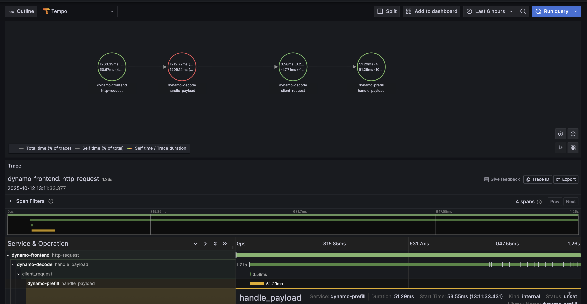

## Overview

Dynamo supports OpenTelemetry-based distributed tracing for visualizing request flows across Frontend and Worker components. Traces are exported to Tempo via OTLP (OpenTelemetry Protocol) and visualized in Grafana.

**Requirements:** Set `DYN_LOGGING_JSONL=true` and `OTEL_EXPORT_ENABLED=true` to export traces to Tempo.

**Note:** When OTLP export is enabled, Dynamo exports both **traces and logs**. Traces are sent to Tempo and logs are sent to Loki (via the OpenTelemetry Collector). To send logs to a separate endpoint, set `OTEL_EXPORTER_OTLP_LOGS_ENDPOINT`; otherwise it defaults to the traces endpoint. See [Logging](logging.md#otlp-log-export) for details.

This guide covers single GPU demo setup using Docker Compose. For Kubernetes deployments, see [Kubernetes Deployment](#kubernetes-deployment).

**Note:** This section has overlap with [Logging of OpenTelemetry Tracing](logging.md) since OpenTelemetry has aspects of both logging and tracing. The tracing approach documented here is for persistent trace visualization and analysis. For short debugging sessions examining trace context directly in logs, see the [Logging](logging.md) guide.

## Environment Variables

| Variable | Description | Default | Example |
|----------|-------------|---------|---------|
| `DYN_LOGGING_JSONL` | Enable JSONL logging format (required for tracing) | `false` | `true` |
| `OTEL_EXPORT_ENABLED` | Enable OTLP trace export | `false` | `true` |
| `OTEL_EXPORTER_OTLP_TRACES_ENDPOINT` | OTLP gRPC endpoint for traces | `http://localhost:4317` | `http://tempo:4317` |
| `OTEL_EXPORTER_OTLP_LOGS_ENDPOINT` | OTLP gRPC endpoint for logs (defaults to traces endpoint) | same as traces | `http://localhost:4317` |
| `OTEL_SERVICE_NAME` | Service name for identifying components | `dynamo` | `dynamo-frontend` |

## Getting Started Quickly

### 1. Start Observability Stack

Start the observability stack (Prometheus, Grafana, Tempo, exporters). See [Observability Getting Started](README.md#getting-started-quickly) for instructions.

### 2. Start Dynamo Components (Single GPU)

For a simple single-GPU deployment, run the aggregated tracing launch script. This script enables tracing, sets per-component service names, and starts a frontend with a single vLLM worker:

```bash
cd examples/backends/vllm/launch
./agg_tracing.sh
```

To override the Tempo endpoint (default `http://localhost:4317`):

```bash
export OTEL_EXPORTER_OTLP_TRACES_ENDPOINT=http://tempo:4317
./agg_tracing.sh
```

This runs a single aggregated worker on one GPU, providing a simpler setup for testing tracing.

### Alternative: Disaggregated Deployment (2 GPUs)

For a disaggregated deployment with tracing, run the disaggregated tracing launch script. This script sets up tracing and launches a frontend, a decode worker on GPU 0, and a prefill worker on GPU 1:

```bash
cd examples/backends/vllm/launch
./disagg_tracing.sh
```

This separates prefill and decode onto different GPUs for better resource utilization.

### 3. Generate Traces

Send requests to the frontend to generate traces (works for both aggregated and disaggregated deployments). The launch scripts print an example `curl` command on startup with the correct model name.

**Tip:** Add an `x-request-id` header to easily search for a specific trace in Grafana:

```bash
curl -H 'Content-Type: application/json' \
-H 'x-request-id: test-trace-001' \
-d '{
  "model": "<MODEL>",
  "max_completion_tokens": 100,
  "messages": [
    {"role": "user", "content": "What is the capital of France?"}
  ]
}' \
http://localhost:8000/v1/chat/completions
```

### 4. View Traces in Grafana Tempo

1. Open Grafana at `http://localhost:3000`
2. Login with username `dynamo` and password `dynamo`
3. Navigate to **Explore** (compass icon in the left sidebar)
4. Select **Tempo** as the data source (should be selected by default)
5. In the query type, select **"Search"** (not TraceQL, not Service Graph)
6. Use the **Search** tab to find traces:
   - Search by **Service Name** (e.g., `dynamo-frontend`)
   - Search by **Span Name** (e.g., `http-request`, `handle_payload`)
   - Search by **Tags** (e.g., `x_request_id=test-trace-001`)
7. Click on a trace to view the detailed flame graph

#### Example Trace View

Below is an example of what a trace looks like in Grafana Tempo:



### 5. Stop Services

When done, stop the observability stack. See [Observability Getting Started](README.md#getting-started-quickly) for Docker Compose commands.

---

## Kubernetes Deployment

For Kubernetes deployments, ensure you have a Tempo instance deployed and accessible (e.g., `http://tempo.observability.svc.cluster.local:4317`).

### Modify DynamoGraphDeployment for Tracing

Tracing-enabled variants of the example deployments are provided:

- **Aggregated:** `examples/backends/vllm/deploy/agg_tracing.yaml`
- **Disaggregated:** `examples/backends/vllm/deploy/disagg_tracing.yaml`

These add the [Environment Variables](#environment-variables) to the base `agg.yaml` / `disagg.yaml` deployments. To override the Tempo endpoint, edit `OTEL_EXPORTER_OTLP_TRACES_ENDPOINT` in the YAML.

Apply a tracing-enabled deployment:

```bash
kubectl apply -f examples/backends/vllm/deploy/disagg_tracing.yaml
```

Traces will now be exported to Tempo and can be viewed in Grafana.

