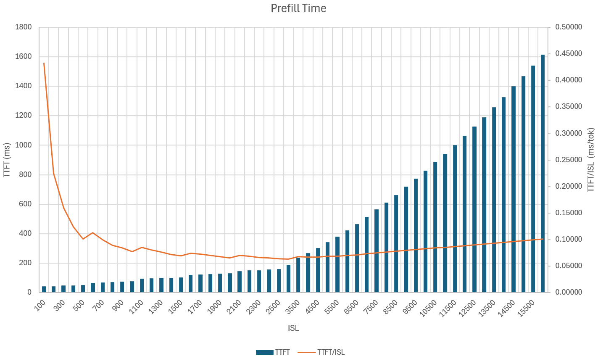

Disaggregation gains performance by separating the prefill and decode into different engines to reduce interferences between the two.
However, performant disaggregation requires careful tuning of the inference parameters.
Specifically, there are three sets of parameters that needs to be tuned:

  1. Engine configuration and options (e.g. parallelization mapping, maximum number of tokens, etc.).
  2. Disaggregated router configuration and options.
  3. Number of prefill and decode engines.

This guide describes the process of tuning these parameters.

## Engine Configuration and Tuning

The most important engine configuration to tune is the parallelization mapping.
For most dense models, the best setting is to use TP within node and PP across nodes.
For example, for Llama-405b w8a8 on H100, TP8 on a single node or TP8PP2 on two nodes is usually the best choice.
The next thing to decide is how many numbers of GPU to serve the model.
Typically, the number of GPUs vs the performance follows the following pattern:

| Number of GPUs                                      | Performance
| :-------------------------------------------------- | :---------------------------------------------------------------------------------------- |
| Cannot hold weights in VRAM                         | OOM                                                                                       |
| (Barely hold weights in VRAM)                       | (KV cache is too small to maintain large enough sequence length or reasonable batch size) |
| Minimum number with fair amount of KV cache         | Best overall throughput/GPU, worst latency/user                                           |
| Between minimum and maximum                         | Tradeoff between throughput/GPU and latency/user                                          |
| Maximum number limited by communication scalability | Worst overall throughput/GPU, best latency/user                                           |
| More than maximum                                   | Communication overhead dominates, poor performance                                        |

> [!Note]
> for decode-only engines, sometimes larger number of GPUs has to larger KV cache per GPU and more decoding requests running in parallel, which leads to both better throughput/GPU and better latency/user.
>
> For example, for Llama-3.3-70b NVFP4 quantization on B200 in vLLM with 0.9 free GPU memory fraction:

| TP Size | KV Cache Size (GB) | KV Cache per GPU (GB) | Per GPU Improvement over TP1 |
| ------: | -----------------: | --------------------: | ---------------------------: |
|       1 |                113 |                   113 |                        1.00x |
|       2 |                269 |                   135 |                        1.19x |
|       4 |                578 |                   144 |                        1.28x |

The best number of GPUs to use in the prefill and decode engines can be determined by running a few fixed ISL/OSL/concurrency test using [AIPerf](https://github.com/ai-dynamo/aiperf/tree/main) and compare with the SLA.
AIPerf is pre-installed in the dynamo container.

> [!Tip]
> If you are unfamiliar with AIPerf, please see this helpful [tutorial](https://github.com/ai-dynamo/aiperf/blob/main/docs/tutorial.md) to get you started.

Besides the parallelization mapping, other common knobs to tune are maximum batch size, maximum number of tokens, and block size.
For prefill engines, usually a small batch size and large `max_num_token` is preferred.
For decode engines, usually a large batch size and medium `max_num_token` is preferred.
For details on tuning the `max_num_token` and max_batch_size, see the next section.

For block size, if the block size is too small, it leads to small memory chunks in the P->D KV cache transfer and poor performance.
Too small block size also leads to memory fragmentation in the attention calculation, but the impact is usually insignificant.
If the block size is too large, it leads to low prefix cache hit ratio.
For most dense models, we find block size 128 is a good choice.

### GPU Memory Fraction

Each engine backend has its own CLI flag to control what fraction of GPU memory is reserved for the KV cache (after model weights and activation buffers are allocated):

| Engine  | CLI flag                         | Engine-specific env var                    | Default
|---------|----------------------------------|--------------------------------------------|--------
| vLLM    | `--gpu-memory-utilization`       | —                                          | 0.9
| SGLang  | `--mem-fraction-static`          | —                                          | 0.88
| TRT-LLM | `--free-gpu-memory-fraction`    | `DYN_TRTLLM_FREE_GPU_MEMORY_FRACTION`      | 0.9

Dynamo launch scripts use absolute KV cache overrides for deterministic, parallel-safe GPU memory control. For vLLM, `_PROFILE_OVERRIDE_VLLM_KV_CACHE_BYTES` maps to `--kv-cache-memory-bytes`. For SGLang, `_PROFILE_OVERRIDE_SGLANG_MAX_TOTAL_TOKENS` maps to `--max-total-tokens`. These are set by `tests/utils/profile_pytest.py` during binary-search profiling and by `tests/utils/pytest_parallel_gpu.py` at runtime.

Setting a lower memory fraction leaves more headroom for other CUDA allocations (e.g. activation buffers, NCCL buffers) at the cost of a smaller KV cache. Setting it higher allows more concurrent requests but risks OOM from non-KV-cache allocations. Typical production values are 0.85-0.95.

> [!Important]
> In vLLM, when `--kv-cache-memory-bytes` is set to an explicit value (not None), it **overrides and ignores** `--gpu-memory-utilization` for KV cache sizing ([vLLM CacheConfig docs](https://docs.vllm.ai/en/stable/api/vllm/config/cache/)). This is exactly why we use `--kv-cache-memory-bytes` for parallel-safe allocation: it provides a deterministic, absolute KV cache cap that is immune to profiling races.

## Disaggregated Router

Disaggregated router decides whether to prefill a request in the remote prefill engine or locally in the decode engine using chunked prefill.
For most frameworks, when chunked prefill is enabled and one forward iteration gets a mixture of prefilling and decoding request, three kernels are launched:

  1. The attention kernel for context tokens (context_fmha kernel in TRTLLM).

  2. The attention kernel for decode tokens (xqa kernel in TRTLLM).

  3. Dense kernel for the combined active tokens in prefills and decodes.

### Prefill Engine

In the prefill engine, the best strategy is to operate at the smallest batch size that saturates the GPUs so that the average time to first token (TTFT) is minimized.
For example, for Llama3.3-70b NVFP4 quantization on B200 TP1 in vLLM, the below figure shows the prefill time with different isl (prefix caching is turned off):

For isl less than 1000, the prefill efficiency is low because the GPU is not fully saturated.
For isl larger than 4000, the prefill time per token increases because the attention takes longer to compute with a longer history.

Currently, prefill engines in Dynamo operate at a batch size of 1.
To make sure prefill engine is saturated, users can set `max-local-prefill-length` to the saturation point to make sure prefill engine is optimal.

### Decode Engine

In the decode engine, maximum batch size and maximum number of tokens affects the size of intermediate tensors.
With a larger batch size and number of tokens, the size of intermediate tensors increases and the size of KV cache decreases.
TensorRT-LLM (TRTLLM) has a good [summary](https://nvidia.github.io/TensorRT-LLM/reference/memory.html) on the memory footprint where similar ideas also applies to other LLM frameworks.

With chunked prefill enabled, the maximum number of tokens controls the longest prefill that can be piggybacked to decode and control the inter-token latency (ITL).
For the same prefill requests, a large maximum number of tokens leads to fewer but longer stalls in the generation, while a small maximum number of tokens leads to more but shorter stalls in the generation.
However, chunked prefill is currently not supported in Dynamo (vLLM backend).
Hence, the current best strategy is to set the maximum batch size to the optimized KV cache size and set the maximum number of tokens to the maximum local prefill length + maximum batch size (since one decode request has one active token).

## Number of Prefill and Decode Engines

The best dynamo knob choices depends on the operating condition of the model.
Based on the load, we define three operating conditions:

  1. **Low load**:
     The endpoint is hit by a single user (single-stream) most of the time.

  2. **Medium load**:
     The endpoint is hit by multiple users, but the KV cache of the decode engines is never fully utilized.

  3. **High load**:
     The endpoint is hit by multiple users and the requests are queued up due to no available KV cache in the decode engines.

At low load, disaggregation would not benefit much as prefill and decode are usually computed separately.
It is usually better to use a single monolithic engine.

At medium load, disaggregation allows better ITL compared with prefill-prioritized and chunked prefill engines and better TTFT compared with chunked prefill engine and decode-only engine for each user.
Dynamo users can adjust the number of prefill and decode engines based on TTFT and ITL SLA.

At high load where KV cache capacity is the bottleneck, disaggregation has the following effect on the KV cache usage in the decode engines:

  * Increase the total amount of KVcache:

    * Being able to use greater TP values in decode engines leads to more KV cache per GPU and higher prefix cache hit rate.

    * When the requests is prefilled remotely, the decode engine does not need to maintain its KV cache (currently not implemented in Dynamo).

    * Lower ITL reduces the decode time and allow the same amount of KV cache to serve more requests.

  * Decrease the total amount of KV cache:

    * Some GPUs are configured as prefill engines whose KV cache is not used in the decode phase.

Since Dynamo currently allocates the KV blocks immediately when the decode engine get the requests,
it is advisable to use as few prefill engines as possible (even no prefill engine) to maximize the available KV cache in decode engines.
To prevent queueing at prefill engines, users can set a large `max-local-prefill-length` and piggyback more prefill requests at decode engines.
