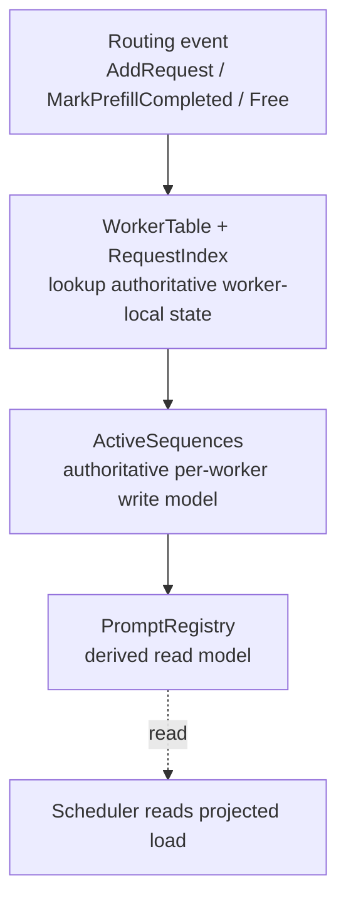

# Sequence State Model

This directory implements the router's active-sequence state for local request routing and replica sync.

For the local, non-remote path, the model is intentionally organized as a one-way write pipeline:

## Source of truth

- `topology.rs` owns `WorkerTable`, which maps a worker identity to its slot.
- `request_maps.rs` owns `RequestIndex`, which maps `request_id -> worker`.
- `single.rs` owns `ActiveSequences`, the authoritative per-worker request, prefill, and block state.
- `prompt_registry.rs` owns `PromptRegistry`, which is not a source of truth. It is a derived routing view.

The local orchestrator in `multi_worker.rs` reads `WorkerTable` and `RequestIndex`, mutates the chosen worker's `ActiveSequences`, then projects the resulting membership/load delta into `PromptRegistry`.

## Why this is a DAG

Within a single local mutation, data moves in one direction:

`event -> authoritative state -> derived read model -> scheduler`

`PromptRegistry` does not write back into `ActiveSequences`, so there is no write-back loop inside the local mutation path.

At runtime there is still a control loop over time, because the scheduler reads the derived view and later emits the next `AddRequest`. That is a system feedback loop, not cyclic state ownership.

## Torn reads are intentional

`PromptRegistry` is allowed to be only eventually consistent with `ActiveSequences`.

That means a reader may temporarily observe:

- a worker-load snapshot from one moment
- prompt membership from another moment
- a combined view that never existed atomically

This is an intentional tradeoff. The derived read model is optimized for lower contention and higher concurrency, not perfect snapshot consistency.

The important safety boundary is:

- lifecycle and ownership invariants live in the write model (`WorkerTable`, `RequestIndex`, `ActiveSequences`)
- scheduling quality lives in the read model (`PromptRegistry`)

So a stale or torn read can lead to a suboptimal routing choice, but it should not cause catastrophic invariant breakage such as losing request ownership or corrupting block membership.

## Eventual consistency contract

- Local writes update `ActiveSequences` first.
- `PromptRegistry` is projected from that authoritative state afterward.
- Replica sync and scheduler decisions may lag behind temporarily.
- The system accepts this lag because the read side is advisory.

This is the core design: a strict local write DAG with an eventually consistent read projection.
